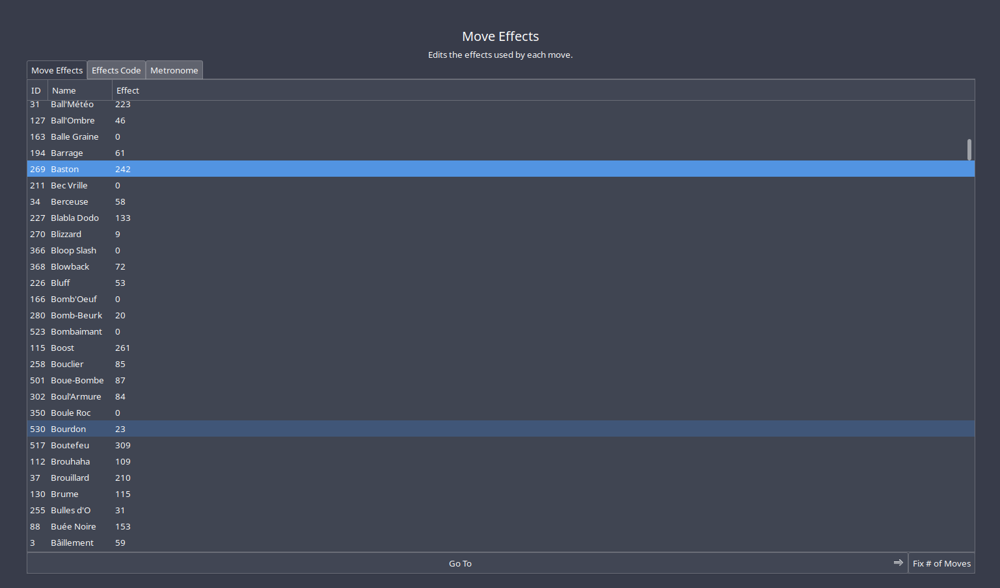

Title: news about mystery dungeon rom-hacking from 22/02/2021 to 10/03/2021
Date: 2021-03-10
Description: hacks, change moves and items effects, translation, new randomizer version...

from marius851000: I think I'll try to add more image, to make this a bit less... text wall like.
note from marius851000: I should made something that could track git commit in many repo...

## rescue team DX hacking
- [tech-ticks started working on a tool to implement custom hooks in rescue team DX](https://github.com/tech-ticks/hyperbeam), based upon starlight.

## explorer hacking
### hacks
- [explorer of alpha was added to the list of hacks in skytemple](https://hacks.skytemple.org/h/alpha)
- [Pokémon Mystery Dungeon: Dark Destiny was added to the list of hacks (WIP)](https://hacks.skytemple.org/h/darkdestiny)
- [Explorers of Skies was added to the list of mod (WIP)](https://hacks.skytemple.org/h/skies)
- [Pokémon Mystery Dungeon: Exploradores dos Céus was added to the list of mods (translation in Brazilian Portuguese)](https://hacks.skytemple.org/h/exploradores)
  - [dede6giu and Wangaloide being a bit slow, they published a WIP patch](https://cdn.discordapp.com/attachments/769498453126283274/817802479160524860/patch_03-06-2021.xdelta). It include some of the early game text, including the full chapter 1, as well as some chapter 2 and 3.
- [chapter 7](https://youtu.be/Gi5lQMh7h3Y) and [chapter 8](https://youtu.be/xCUhWnIaH2s) of PMD Retold were published.
- [babou created a personal discord, where he will post update to Pokemon Mystery Dungeon: Explorer of Hell, as well as unrelated talking/playing](https://discord.gg/vYR2TaAwMU)
  - [he also shared a twitter post showing some progress in the form of screenshot](twitter.com/babouzzz/status/1366475655605583874?s=21).
  
- [skyhard now have a dedicated server](https://discord.gg/JpZGSYwVz2).

### skytemple
Note: too minor change are ignored

- the server now have a channel per language for translation effort (for spanish, deutch, french and chinese).
- a bunch of typos has been fixed.
- [you can now delete icon](https://github.com/SkyTemple/skytemple/pull/214).
.
- [you can now edit, change and inject binary code for move and object effect](https://github.com/SkyTemple/skytemple/pull/200). This also allow to edit possible metronome's moves.

  Keep in mind that custom effect need to be written in assembly, a difficult, really low level programming language.
- [you can now import a spritesheet stored in a zip file](https://github.com/SkyTemple/skytemple/pull/226)

- [SkyTemple should now be able to run on 32 bits (x86) computer](https://github.com/SkyTemple/skytemple/commit/82f6d924b175548085913a75257e49fa1e4c8508)

### skytemple-randomizer
- [Aegis cave are no longer randomized](https://github.com/SkyTemple/skytemple-randomizer/commit/5d7f6ef9fdc22d9ecc3832c7408ad1521e669c12)
- [seed information are displayed on top menu screen (of the game)](https://github.com/SkyTemple/skytemple-randomizer/commit/93395708cc47242b39e2f01216db75168691e5e7)
- [release candidate 1 for version 1.0.6 has been release](https://github.com/SkyTemple/skytemple-randomizer/commit/ca9f38078beb2cd13a306cf906a97e2d408c3d92)
- [a new NPC has been added containing information about the randomized game](https://github.com/SkyTemple/skytemple-randomizer/commit/445b583419b9f2d8233d30a53018cbe27c420680). [see this reddit post for a video visualisation](https://www.reddit.com/r/MysteryDungeon/comments/lre7gr/next_update_of_the_randomizer/)
- [fixed some chapter name not being randomized](https://github.com/SkyTemple/skytemple-randomizer/commit/b503fc250bd23f9b08708cb74aea40d926fdcc3c)
- [a portrait debugger has been added](https://github.com/SkyTemple/skytemple-randomizer/commit/39f440d7947e77908819d5bb79122652d491957b)

- version 1.0.6 has been released. Official changelog
  - New features:
    - The version and seed is now shown on the title screen
    - On the Crossroads map two NPCs give your additional information about the settings used
  and provide credits for artists and patch creators (#29, #30).
    - Complete Team Control patch by @Jirt added: Manually control your teammates in dungeons!
  Has to be manually enabled.

  - Fixes and Improvements:
    - New compression algorithm for portraits and other optimizations to hopelfully allow more
  custom portraits to work (by @Irdkwia)
    - Shaymin no longer spawns in Sky Peak (#28)
    - Aegis Cave is no longer randomized by default (#26)
    - Press CTRL+Space to get debugging information about portrait downloads

- version 1.0.7 was also released, fixing a crash at the end of the randomization that often occurred under Windows.

### SpriteCollab
#### change/addition in SpriteCollab
(that's indeed 140 changes...)

- Emmuffin [added 16 portraits for Sandygast Shiny](https://github.com/PMDCollab/SpriteCollab/commit/0f5b57874b3bca65b67d51b4628ff52c33eca3a3).
- Emmuffin [added 15 portraits and changed the normal portrait for Sandygast](https://github.com/PMDCollab/SpriteCollab/commit/11dda83b6684945028c5412b821a1219ca9748ba).
- Emmuffin [added 15 portraits and changed the normal portrait for Nuzleaf Shiny](https://github.com/PMDCollab/SpriteCollab/commit/3fe5c3cf6a945ab3ff63687681d97ecc807a5f51).
- Emmuffin [added 15 portraits and changed the normal portrait for Nuzleaf](https://github.com/PMDCollab/SpriteCollab/commit/d061b4300967d7c81e98f630e51edbdb732c28fd).
- [Fable](https://twitter.com/fabledpainter) [added 16 portraits and changed the normal portrait for Porygon_Z Shiny](https://github.com/PMDCollab/SpriteCollab/commit/c2fe7c2a8fbf5becac96bb01685f0c06194df613).
- [Fable](https://twitter.com/fabledpainter) [added 16 portraits and changed the normal portrait for Porygon_Z](https://github.com/PMDCollab/SpriteCollab/commit/84be7ff3ce788ed58865b73d923942dd5b1d3045).
- CryptoIllogical [changed the crying, pain, sigh, stunned and surprised portraits for Furret](https://github.com/PMDCollab/SpriteCollab/commit/5c8f53a204818cf7167d1654ef8a7d5aa66e213f).
- CamusZekeSirius [added the normal portrait for Arceus Steel](https://github.com/PMDCollab/SpriteCollab/commit/8c97f0402142dc1779ad69a3a1cf4431cfa781bc).
- CamusZekeSirius [added the normal portrait for Arceus Fairy](https://github.com/PMDCollab/SpriteCollab/commit/17dc41da02034b1daa32b29c3a6a8ffd9d422dd6).
- CamusZekeSirius [added the normal portrait for Arceus Water](https://github.com/PMDCollab/SpriteCollab/commit/eba6851ce03f80f82d56fa817e1e341cc97a94e2).
- CamusZekeSirius [added the normal portrait for Arceus Rock](https://github.com/PMDCollab/SpriteCollab/commit/f75eddf389bb02a4ed372c6c17736b305e8a7d0c).
- CamusZekeSirius [added the normal portrait for Arceus Psychic](https://github.com/PMDCollab/SpriteCollab/commit/47d91dde21be2c61cdfda12d6128f13d5b3fd9fb).
- CamusZekeSirius [added the normal portrait for Arceus Ghost](https://github.com/PMDCollab/SpriteCollab/commit/05d656e47a947c8bf953f28ff1fc52b653bbea27).
- CamusZekeSirius [added the normal portrait for Arceus Ice](https://github.com/PMDCollab/SpriteCollab/commit/05d656e47a947c8bf953f28ff1fc52b653bbea27).
- CamusZekeSirius [added the normal portrait for Arceus Poison](https://github.com/PMDCollab/SpriteCollab/commit/4e75d9df614fcd8eb331af491c40a50387178687).
- CamusZekeSirius [added the normal portrait for Arceus Ground](https://github.com/PMDCollab/SpriteCollab/commit/f3e4e14cd8248af1c344ee3c3a9882dfd244ad02).
- CamusZekeSirius [added the normal portrait for Arceus Grass](https://github.com/PMDCollab/SpriteCollab/commit/431b5f90e4acc6abb4dd0bb76ad34d693c6aa74f).
- CamusZekeSirius [added the normal portrait for Arceus Flying](https://github.com/PMDCollab/SpriteCollab/commit/687ec5d6bc824f8630d6e400491621ab4612335b).
- CamusZekeSirius [added the normal portrait for Arceus Fire](https://github.com/PMDCollab/SpriteCollab/commit/6719e11a183b1ada57cc6020ee4f319e00eca5cb).
- CamusZekeSirius [added the normal portrait for Arceus Fighting](https://github.com/PMDCollab/SpriteCollab/commit/6c23d5999b308016d53fb3316d87bb10d7777948).
- CamusZekeSirius [added the normal portrait for Arceus Electric](https://github.com/PMDCollab/SpriteCollab/commit/7f80ff4b65be6791579e20ecbe663f76772b4574).
- CamusZekeSirius [added the normal portrait for Arceus Dragon](https://github.com/PMDCollab/SpriteCollab/commit/ac46493349ef6808a427defa49dd75ff9f646f94).
- CamusZekeSirius [added the normal portrait for Arceus Dark](https://github.com/PMDCollab/SpriteCollab/commit/d1f38612cc2c7a20cb2b657d6201f4dd43d4580b).
- CamusZekeSirius [added the normal portrait for Arceus Bug](https://github.com/PMDCollab/SpriteCollab/commit/2be39f40b41f16db795fd267456676a60b586553).
- CryptoIllogical [added 17 portraits and changed the normal portrait for Furret](https://github.com/PMDCollab/SpriteCollab/commit/ac3fb70964345fc727e1837ec205e92793297f88).
- Emmuffin [added 30 portraits and changed the normal and normal^ portraits for Cherrim Shiny](https://github.com/PMDCollab/SpriteCollab/commit/38aeb2095615a5c9f72a28e7961da8ea52f5a1a2).
- Emmuffin [added 30 portraits and changed the normal and normal^ portraits for Cherrim](https://github.com/PMDCollab/SpriteCollab/commit/1b04154652beef8d1d7f81947cbf010239dd67c2).
- Emmuffin [added 15 portraits and changed the normal portrait for Cherrim Sunshine Shiny](https://github.com/PMDCollab/SpriteCollab/commit/615af289bc7b0de45c1248fcc3b6217cdcd311d9).
- Emmuffin [added 15 portraits and changed the normal portrait for Cherrim Sunshine](https://github.com/PMDCollab/SpriteCollab/commit/26965150085146b6569fa1d5e18a4e5f5b1b15fc).
- [DonkinDo](https://twitter.com/DonkinDo) [added 99 sprites for Mienfoo](https://github.com/PMDCollab/SpriteCollab/commit/dee54e6d7dc37d0b046c8deb72705b3588362156).
- Emmuffin [added 15 portraits and changed the normal portrait for Spoink Shiny](https://github.com/PMDCollab/SpriteCollab/commit/7edcc16ba4c87595e612b8a08f69490ac0675974).
- Emmuffin [added 15 portraits and changed the normal portrait for Spoink](https://github.com/PMDCollab/SpriteCollab/commit/e6c6339f9c37c005d08a1eed3b1725ef21a299bc).
- Emmuffin [added 15 portraits for Spheal Shiny](https://github.com/PMDCollab/SpriteCollab/commit/e0f7812c81bd5982e05c5a0fc13628e98e041c8f).
- Emmuffin [added 15 portraits and changed the normal portrait for Spheal](https://github.com/PMDCollab/SpriteCollab/commit/b4e124dfccc5bb0be1a10c9a2fc7969d7925b4e0).
- [Nooga](https://www.deviantart.com/ubernooga) [added 16 portraits for Terrakion Shiny](https://github.com/PMDCollab/SpriteCollab/commit/7d74498a03c5e1ce0df7496fa4680798f8a72fcf).
- [Nooga](https://www.deviantart.com/ubernooga) [added 15 portraits and changed the normal portrait for Terrakion](https://github.com/PMDCollab/SpriteCollab/commit/241fd0e8dfadbeb3d43b2d700cadc0c68695f191).
- [Nooga](https://www.deviantart.com/ubernooga) [added 13 portraits for Kecleon Purple Shiny](https://github.com/PMDCollab/SpriteCollab/commit/7b1e6e2ac78bdcf005ed4ea68e7472b53f4cbffd).
- [Nooga](https://www.deviantart.com/ubernooga) [added the determined, dizzy, sigh and stunned portraits for Cubone Shiny](https://github.com/PMDCollab/SpriteCollab/commit/88c230ac86ea583281611a6627a74379e0cd0db7).
- [Nooga](https://www.deviantart.com/ubernooga) [added 15 portraits for Camerupt Shiny](https://github.com/PMDCollab/SpriteCollab/commit/0e5fcd5278c06b270b7df778653a67be1a99f3c8).
- [Nooga](https://www.deviantart.com/ubernooga) [added 13 portraits for Kecleon Purple](https://github.com/PMDCollab/SpriteCollab/commit/fee6b00957473a953bbad5c114c4e29d46817a28).
- [Nooga](https://www.deviantart.com/ubernooga) [added 13 portraits for Kecleon Shiny](https://github.com/PMDCollab/SpriteCollab/commit/5119827031fbfe1a87d086fe1411cf5a88afbe3e).
- [Nooga](https://www.deviantart.com/ubernooga) [added 15 portraits for Vibrava Shiny](https://github.com/PMDCollab/SpriteCollab/commit/856ec8914163b3e4c1b59bd8e198434d598a24ea).
- [Nooga](https://www.deviantart.com/ubernooga) [added 7 portraits and changed 10 portraits for Shaymin Shiny](https://github.com/PMDCollab/SpriteCollab/commit/be3a93d32d1451d2fd0ffb0706d0873d393bbdba).
- [Nooga](https://www.deviantart.com/ubernooga) [added the angry, determined, dizzy, inspired, joyous and pain portraits for Wigglytuff Shiny](https://github.com/PMDCollab/SpriteCollab/commit/db83444aae206fc4c508fafed4ee647814affb08).
- [Nooga](https://www.deviantart.com/ubernooga) [added 15 portraits for Ditto Shiny](https://github.com/PMDCollab/SpriteCollab/commit/b2cbf78058eff2040997aec164a672fd3b31fbda).
- [Nooga](https://www.deviantart.com/ubernooga) [added 15 portraits and changed the normal portrait for Voltorb Shiny](https://github.com/PMDCollab/SpriteCollab/commit/57712463c7f9fe4de224bea214c633bebd75ed3d).
- [Nooga](https://www.deviantart.com/ubernooga) [added the determined, dizzy, sigh and stunned portraits and changed 8 portraits for Psyduck Shiny](https://github.com/PMDCollab/SpriteCollab/commit/9c939470f80501cdebad7e35be6a637d8e1a1b35).
- [Nooga](https://www.deviantart.com/ubernooga) [added 14 portraits and changed the surprised portrait for Nidoking Shiny](https://github.com/PMDCollab/SpriteCollab/commit/bb013884e7884d945ef97864dfce98168efe8f50).
- [DonkinDo](https://twitter.com/DonkinDo) [changed 7 portraits for Nidoking](https://github.com/PMDCollab/SpriteCollab/commit/a9783e48aa306a14cfca392a38a4adcab35dbd00).
- [Nooga](https://www.deviantart.com/ubernooga) [added 16 portraits for Virizion Shiny](https://github.com/PMDCollab/SpriteCollab/commit/9141474df4486fb571741bacd429ce7df0797c06).
- [Nooga](https://www.deviantart.com/ubernooga) [added 16 portraits for Cobalion Shiny](https://github.com/PMDCollab/SpriteCollab/commit/d5b9c56198295f398305dd6e2b8f3f64d21dc76e).
- Emmuffin [added 15 portraits and changed the normal portrait for Butterfree Shiny](https://github.com/PMDCollab/SpriteCollab/commit/43d6005c55d121ab0a1833fc694aee435cdf5ac5).
- [Nooga](https://www.deviantart.com/ubernooga) [added 15 portraits and changed the normal portrait for Cobalion](https://github.com/PMDCollab/SpriteCollab/commit/2334581ad21ff489335dd2f60d3d2f2ea30634af).
- Emmuffin [added 15 portraits and changed the normal portrait for Butterfree](https://github.com/PMDCollab/SpriteCollab/commit/9936a7d6c33ab5b55d574289d706160a0005d493).
- Emmuffin [added 17 portraits for Rowlet Shiny](https://github.com/PMDCollab/SpriteCollab/commit/9aca408cee3c0e2e17ce10d0aea0880a36905606).
- Emmuffin [added 17 portraits for Rowlet](https://github.com/PMDCollab/SpriteCollab/commit/9eb9c769d2b6c2e8d7b0d55276c490d16ad38f32).
- the user with the discord id <@!589906152708505648> [changed 19 portraits for Magmortar](https://github.com/PMDCollab/SpriteCollab/commit/e20043bd542e7f8c9b673f437c319a4379a4d976).
- CamusZekeSirius [added the special1 portrait and changed the teary-eyed portrait for Rayquaza Shiny](https://github.com/PMDCollab/SpriteCollab/commit/63684ce1986e3288569622bb844bd7704d08ab08).
- CamusZekeSirius [added the special1 portrait and changed 14 portraits for Rayquaza](https://github.com/PMDCollab/SpriteCollab/commit/da2ec85a253ebf9f1efd6b0f636dd5abab2b3e9a).
- the user with the discord id <@!276175146304405514> [added 15 portraits and changed the normal portrait for Venusaur](https://github.com/PMDCollab/SpriteCollab/commit/0ee81363f6bac0696ad96f754a9d8cb63fd60974).
- Emmuffin [added 15 portraits and changed the normal portrait for Numel Shiny](https://github.com/PMDCollab/SpriteCollab/commit/e15520dff950aa26a5a4360c8528593f8e9da849).
- Emmuffin [added 15 portraits and changed the normal portrait for Numel](https://github.com/PMDCollab/SpriteCollab/commit/a2ea50809475b370dcf48cd6e423d49d3641932b).
- the user with the discord id <@!474262233442942995> [added 16 portraits for Gabite Female Shiny](https://github.com/PMDCollab/SpriteCollab/commit/39ca42918e5abfdcf5ce47dcc832f9567b55899d).
- the user with the discord id <@!474262233442942995> [added 15 portraits and changed the normal portrait for Gabite Shiny](https://github.com/PMDCollab/SpriteCollab/commit/de5c4a9ab21ed415e3dac362e879fdeb8ee9a3f4).
- Emmuffin [added 15 portraits for Shuckle Shiny](https://github.com/PMDCollab/SpriteCollab/commit/44838afa0976bac846b53db324ae8515e0cb69e4).
- the user with the discord id <@!474262233442942995> [added 16 portraits for Gabite Female](https://github.com/PMDCollab/SpriteCollab/commit/15d71702a82869f632a231f52db9c7669a577776).
- the user with the discord id <@!474262233442942995> [added 15 portraits and changed the normal portrait for Gabite](https://github.com/PMDCollab/SpriteCollab/commit/c1f1bda63ffde2e8e974b80fe9e146de6bb80f84).
- Emmuffin [added 17 portraits for Appletun Shiny](https://github.com/PMDCollab/SpriteCollab/commit/84e9e772db0c22b099d7f1fe1efd4a489568656f).
- Emmuffin [added 15 portraits and changed the normal portrait for Shuckle](https://github.com/PMDCollab/SpriteCollab/commit/654e5b98851e49235ca1a8bc7e4388e8b2de3aa4).
- dede6giu [added 17 portraits for Meltan Shiny](https://github.com/PMDCollab/SpriteCollab/commit/b184ac0bb75c8129949c8a2f6bf9d32225201260).
- dede6giu [added 16 portraits and changed the normal portrait for Meltan](https://github.com/PMDCollab/SpriteCollab/commit/5a74d8272f534d1a0c2299ddeceee71f49d56e13).
- [DonkinDo](https://twitter.com/DonkinDo) [added 15 portraits and changed the normal portrait for Glalie Shiny](https://github.com/PMDCollab/SpriteCollab/commit/bbb47cfc5d8bf2a8f43d2cec6b18df00535ab5ad).
- [Nooga](https://www.deviantart.com/ubernooga) [added 15 portraits and changed the normal portrait for Blaziken Shiny Female](https://github.com/PMDCollab/SpriteCollab/commit/285e90ea9a65ecb337021ee61496ab885184e65d).
- [Nooga](https://www.deviantart.com/ubernooga) [added 15 portraits and changed the normal portrait for Blaziken Shiny](https://github.com/PMDCollab/SpriteCollab/commit/b66ffe72abeed27305a0b0830329e361ef1eab7e).
- [Nooga](https://www.deviantart.com/ubernooga) [added 15 portraits and changed the normal portrait for Blaziken Female](https://github.com/PMDCollab/SpriteCollab/commit/817b2999e5402ff9eea80ee2cfbbe810b4eccde3).
- [Nooga](https://www.deviantart.com/ubernooga) [added 15 portraits and changed the normal portrait for Blaziken](https://github.com/PMDCollab/SpriteCollab/commit/d8303327a7e8e8f59e90994e7c397c6839602ee3).
- [DonkinDo](https://twitter.com/DonkinDo) [added 15 portraits and changed the normal portrait for Glalie](https://github.com/PMDCollab/SpriteCollab/commit/78b53f0e9d7819e2651872eae83dc835e123fbb3).
- [DonkinDo](https://twitter.com/DonkinDo) [added 15 portraits and changed the normal portrait for Machoke Shiny](https://github.com/PMDCollab/SpriteCollab/commit/d8715b1edf2dc02b006069d92a07e1a80cac9076).
- [DonkinDo](https://twitter.com/DonkinDo) [added 16 portraits for Mienfoo Shiny](https://github.com/PMDCollab/SpriteCollab/commit/c3e5dd03e12c1b36d4353198d320e045a8d167aa).
- Emmuffin [added 15 portraits and changed the normal portrait for Swablu Shiny](https://github.com/PMDCollab/SpriteCollab/commit/06b59d280fd7ed69234007a2e4f38cc025f26e1a).
- [DonkinDo](https://twitter.com/DonkinDo) [added 15 portraits and changed the normal portrait for Ledian](https://github.com/PMDCollab/SpriteCollab/commit/048e73816d7b7ee184f02e07e1c49adfa0b857e3).
- [Nooga](https://www.deviantart.com/ubernooga) [added the normal portrait for Toxtricity](https://github.com/PMDCollab/SpriteCollab/commit/a64fdce2001028342cdfa4de9389fc3e73209df3).
- [Fable](https://twitter.com/fabledpainter) [added 15 portraits and changed the normal portrait for Beedrill](https://github.com/PMDCollab/SpriteCollab/commit/42da6c5b8b660027d207719d3301f14aa1f91985).
- Emmuffin [added 15 portraits and changed the normal portrait for Swablu](https://github.com/PMDCollab/SpriteCollab/commit/4849053e2ab2c4d72cd278a6b7e76dbf846698ba).
- Emmuffin [added 18 portraits for Togedemaru Shiny](https://github.com/PMDCollab/SpriteCollab/commit/4daba19f9a89c5137f5f43b177dcaf31b8e51b85).
- [Nooga](https://www.deviantart.com/ubernooga) [added the normal portrait for Toxtricity Lowkey](https://github.com/PMDCollab/SpriteCollab/commit/d2a7e76143223b5353e470d07cf917bc21c1508c).
- Emmuffin [added 18 portraits for Togedemaru](https://github.com/PMDCollab/SpriteCollab/commit/71be3b0ca94cfd9b5ede55cd2c92c3ce9abc30c5).
- the user with the discord id <@!589906152708505648> [changed 32 portraits for Beldum](https://github.com/PMDCollab/SpriteCollab/commit/93da44ed20f2719c5743ad400b2775c014d622fc).
- the user with the discord id <@!436940337865293834> [added 16 portraits and changed the normal portrait for Flaaffy](https://github.com/PMDCollab/SpriteCollab/commit/6fc24cba884d2f417dbeabb96c430f54af3acbd2).
- Frostdrop1 [added 15 portraits and changed the normal portrait for Anorith](https://github.com/PMDCollab/SpriteCollab/commit/0ebf777b067652ebf9e22abd40ce2cdbcdb91310).
- the user with the discord id <@!589906152708505648> [changed 32 portraits for Beldum](https://github.com/PMDCollab/SpriteCollab/commit/7e643917d8a2ab0593b76c9026e53a90952b3b62).
- C_Pariah [changed 16 portraits for Raichu Shiny](https://github.com/PMDCollab/SpriteCollab/commit/b2770013ab1df106750150f729b81484dc7addcb).
- Emmuffin [added 15 portraits and changed the normal portrait for Gulpin Shiny](https://github.com/PMDCollab/SpriteCollab/commit/2da1eac5605d65f3d3ff7156cf0b3e9314bb3e82).
- [0palite](https://zeropalart.tumblr.com/) [added the surprised portrait and changed the normal portrait for Kadabra](https://github.com/PMDCollab/SpriteCollab/commit/201d349c2067b138ab1d60f45dfea76d7b48aecf).
- Emmuffin [added 15 portraits and changed the normal portrait for Gulpin](https://github.com/PMDCollab/SpriteCollab/commit/b91ceee5dc4074adaaad123c8bcd66f4487fae10).
- C_Pariah [changed 16 portraits for Raichu](https://github.com/PMDCollab/SpriteCollab/commit/a966dc91b39374ef85ee23bc3ee91dccf2907b13).
- the user with the discord id <@!436940337865293834> [added 32 portraits and changed the normal and normal^ portraits for Togekiss](https://github.com/PMDCollab/SpriteCollab/commit/bab7fe0c7caf41fc28ac2a720a6792d153cea382).
- the user with the discord id <@!299261889169588246> [changed 16 portraits for Meowth Shiny](https://github.com/PMDCollab/SpriteCollab/commit/212526c2e9c84dbb67a371c90c7aed800f9283ee).
- [0palite](https://zeropalart.tumblr.com/) [added the normal portrait for Solgaleo](https://github.com/PMDCollab/SpriteCollab/commit/7eec31e0559e5dd18b1e2f98ad9b3c89b180f171).
- [0palite](https://zeropalart.tumblr.com/) [added the normal portrait for Lunala](https://github.com/PMDCollab/SpriteCollab/commit/ddf9eb60eb9c5b3a6350a7713332e0980dc262b4).
- [DonkinDo](https://twitter.com/DonkinDo) [added 15 portraits and changed the normal portrait for Mienfoo](https://github.com/PMDCollab/SpriteCollab/commit/dd19dce6ab5c5c366d02cb78d2a099b5ee6830b1).
- [Nooga](https://www.deviantart.com/ubernooga) [added 19 portraits for Cramorant Shiny](https://github.com/PMDCollab/SpriteCollab/commit/e3d7555593d6cc6ae0fec5a5ef0de623907509fa).
- Emmuffin [added 15 portraits for Leafeon Shiny](https://github.com/PMDCollab/SpriteCollab/commit/f2868c0c9bada0f2bd11352e51856b2e764c5804).
- [Nooga](https://www.deviantart.com/ubernooga) [added 16 portraits for Cramorant](https://github.com/PMDCollab/SpriteCollab/commit/1f137ac9dd93b29d8b286638e31b5a5f7d167194).
- Emmuffin [added 15 portraits and changed the normal portrait for Leafeon](https://github.com/PMDCollab/SpriteCollab/commit/4d38ab604ec0c6ed1ac4c8d7e5f675dfc3d12209).
- [Noivern](https://twitter.com/notarealnoivern) [changed the happy, normal and pain portraits for Noibat](https://github.com/PMDCollab/SpriteCollab/commit/cb2f29abbfae4ee01fbc4936d78e095076ed7645).
- [0palite](https://zeropalart.tumblr.com/) [added the normal and normal^ portraits for Necrozma](https://github.com/PMDCollab/SpriteCollab/commit/a1f5454ed77ce82df22f512f6b85c5f386f864f8).
- [0palite](https://zeropalart.tumblr.com/) [added the normal portrait for Dracovish](https://github.com/PMDCollab/SpriteCollab/commit/c44e4f9e1a0ffb99e59e280ba6cadaa2e2c62a39).
- CamusZekeSirius [added 16 portraits and changed the normal portrait for Registeel Shiny](https://github.com/PMDCollab/SpriteCollab/commit/3f82674ed95b3365084ebb21f8202360255a3030).
- CamusZekeSirius [added 16 portraits and changed the normal portrait for Registeel](https://github.com/PMDCollab/SpriteCollab/commit/e3ae5181f00c8d97545bdfe446e31d0413fb1b5e).
- C_Pariah [added the normal portrait for Froakie](https://github.com/PMDCollab/SpriteCollab/commit/434597ecd4b706b92829c45f25879155ec1c490d).
- the user with the discord id <@!433058189240696835> [added 11 portraits and changed the normal and surprised portraits for Grovyle Shiny](https://github.com/PMDCollab/SpriteCollab/commit/b96580b8ba43fa498ebe5ccb4978a015f8e41fa0).
- [Nooga](https://www.deviantart.com/ubernooga) [added the determined, normal and special1 portraits for Cramorant](https://github.com/PMDCollab/SpriteCollab/commit/3197b1196aa007c2ff909c020f40e735f9818fdc).
- [Fable](https://twitter.com/fabledpainter) [added 16 portraits and changed the normal portrait for Gible Female](https://github.com/PMDCollab/SpriteCollab/commit/c45cb203ba47aa16e91cba99570bab08c8c75c96).
- [0palite](https://zeropalart.tumblr.com/) [changed the normal portrait for Type_Null](https://github.com/PMDCollab/SpriteCollab/commit/61f97a94649853ef4928dfa46f4bd294ad40a0c3).
- [0palite](https://zeropalart.tumblr.com/) [added the normal portrait for Silvally](https://github.com/PMDCollab/SpriteCollab/commit/b45b533b081952ef1f546b26fc82ac12c3864ba8).
- [Fable](https://twitter.com/fabledpainter) [added 12 portraits and changed the joyous, normal, pain, sigh and teary-eyed portraits for Azurill Shiny](https://github.com/PMDCollab/SpriteCollab/commit/79d6d0749f1e3e5e58e04445f6b685b6dfd37a10).
- [Fable](https://twitter.com/fabledpainter) [added 12 portraits and changed the joyous, normal, pain, sigh and teary-eyed portraits for Azurill](https://github.com/PMDCollab/SpriteCollab/commit/f7bbd3d8ae8cc36d88349a103c5a5fcff5966635).
- [DonkinDo](https://twitter.com/DonkinDo) [added 13 portraits and changed the angry, normal and pain portraits for Slugma Shiny](https://github.com/PMDCollab/SpriteCollab/commit/19ede89f4061da5dc6f8ea2ddf75f527df641de1).
- [DonkinDo](https://twitter.com/DonkinDo) [added 17 portraits for Vanillite Shiny](https://github.com/PMDCollab/SpriteCollab/commit/1fc21e5be375e4e56cde92d13fcb687ea3078444).
- [DonkinDo](https://twitter.com/DonkinDo) [added 32 portraits and changed the normal and normal^ portraits for Roselia Shiny](https://github.com/PMDCollab/SpriteCollab/commit/5c3c0f723d88efc5a70cb82695d8cfd5fdb8a346).
- [Nooga](https://www.deviantart.com/ubernooga) [changed the sad^ and teary-eyed^ portraits for Farfetch_d Galar](https://github.com/PMDCollab/SpriteCollab/commit/971906f398241c1af2d0f66e60454674d0ee8eaa).
- [Nooga](https://www.deviantart.com/ubernooga) [changed the sad^ and teary-eyed^ portraits for Farfetch_d Galar Shiny](https://github.com/PMDCollab/SpriteCollab/commit/6cf535a1939950479592adda0d1ec331b64d8572).
- [DonkinDo](https://twitter.com/DonkinDo) [added 16 portraits for Joltik Shiny](https://github.com/PMDCollab/SpriteCollab/commit/4562062d37eb25c198f40ffbddd4b1361c63b130).
- [DonkinDo](https://twitter.com/DonkinDo) [added 16 portraits and changed the normal portrait for Metang Shiny](https://github.com/PMDCollab/SpriteCollab/commit/c03c79b126145d42e12dd8416810e64e2715ccaa).
- [DonkinDo](https://twitter.com/DonkinDo) [added 17 portraits and changed the normal portrait for Vespiquen Shiny](https://github.com/PMDCollab/SpriteCollab/commit/a45f21088b21310b2cfbc5d487da9453553c6abc).
- C_Pariah [added 30 portraits and changed the normal and normal^ portraits for Croconaw Shiny](https://github.com/PMDCollab/SpriteCollab/commit/61ad39b156087c7a7586a3abaf39f20769bc9567).
- C_Pariah [changed 32 portraits for Croconaw](https://github.com/PMDCollab/SpriteCollab/commit/cc5e2f521cd7e5e270e70ae12c1d434111734210).
- [EzerArt](https://twitter.com/EzerArt_) [added the normal portrait for Dragapult](https://github.com/PMDCollab/SpriteCollab/commit/0f39ee26875328d0598730bdb6e94256b5a0f3bf).
- [DonkinDo](https://twitter.com/DonkinDo) [added 32 portraits and changed the normal and normal^ portraits for Roselia](https://github.com/PMDCollab/SpriteCollab/commit/a29d7f8fcb53e0e2843687251c002be0119c8de2).
- [Nooga](https://www.deviantart.com/ubernooga) [added 32 portraits for Farfetch_d Galar Shiny](https://github.com/PMDCollab/SpriteCollab/commit/4f49b1603816a6f801cf82635e4a323b64424ebe).
- [Nooga](https://www.deviantart.com/ubernooga) [added 30 portraits for Farfetch_d Galar](https://github.com/PMDCollab/SpriteCollab/commit/895ba587fbc75ed457b903b9e2aae817389e2640).
- the user with the discord id <@!120852359676035072> [changed 16 portraits for Growlithe](https://github.com/PMDCollab/SpriteCollab/commit/f4636c7214a4bef0ad68c82530b47564b2722511).
- [0palite](https://zeropalart.tumblr.com/) [added the normal portrait for Type_Null](https://github.com/PMDCollab/SpriteCollab/commit/b56ed293cf40158b91b7c126b4d37751b8b4acd9).
- [DonkinDo](https://twitter.com/DonkinDo) [added 15 portraits and changed the normal portrait for Froslass](https://github.com/PMDCollab/SpriteCollab/commit/628ef0f6bc7a02e79f7cdde347b9ac9ef2fed393).
- [DonkinDo](https://twitter.com/DonkinDo) [added 33 sprites for Indeedee Female](https://github.com/PMDCollab/SpriteCollab/commit/c7619084706fa73f7046e191e51e712bf729f745).
- [0palite](https://zeropalart.tumblr.com/) [added 15 portraits and changed the normal portrait for Empoleon](https://github.com/PMDCollab/SpriteCollab/commit/f6e10a04455514aeecde5415cf85003239611329).
- the user with the discord id <@!604644469685354526> [added the normal portrait for Thievul Shiny](https://github.com/PMDCollab/SpriteCollab/commit/0b48539dfe550fccd98aa3816f626de2291a4b82).
- the user with the discord id <@!604644469685354526> [added the normal portrait for Thievul](https://github.com/PMDCollab/SpriteCollab/commit/34e5b8a144dfdf6f6ad1683147e356679b611853).
