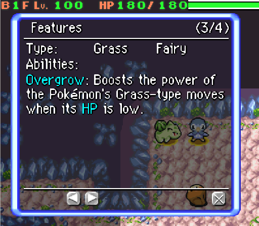

Title: news about mystery dungeon rom-hacking from 10/03/2021 to 16/03/2021
Date: 2021-03-16
Description: hyperbeam, fairy type, skytemple translation, 32bit randomizer...

## rescue team DX hacking
### hyperbeam
- logging via TCP has been added
- additional headers has been added
- a file system API has been added
- fixed preset teams are read from a file
- actor database is read from a file
- starters are read from a file

## explorer hacking
### hacks
- [Babou shared progress on Explorer of Hell](twitter.com/babouzzz/status/1370127753203351552#m)

    - [also, his discord account got hacked](https://nitter.42l.fr/babouzzz/status/1371576927060946945)

### Vidéos
- [Parakoopa released a (gource) visualisazion of change in the Skytemple project](https://www.youtube.com/watch?v=dJ79vPUN4wk)

### skytemple
- [Text about fixed room have been enhanced](https://github.com/SkyTemple/skytemple-files/pull/91)
- [Game menu name can now be translated](https://github.com/SkyTemple/skytemple-files/commit/cf610ad5c8ae2ffb29d402be41c616dad31afa35)
- Translation was updated...
- The editor has been fully translated in German and Spanish.
- [irdkwia implemented fairy type and gummy](https://github.com/SkyTemple/skytemple-files/pull/92). This patch also add the possibility to extract the Spinda bar content.

- [skytemple-files (the code related to reading and writing game file of skytemple) has been updated to version 1.1.6](https://github.com/SkyTemple/skytemple-files/commit/3c8ee720eadfc465034894d60294ab5076cef61d)
- [the included version of pmd_wan (used to read pokemon sprite and other wan files) has been updated to 1.2.0, with mostly internal change](https://github.com/SkyTemple/skytemple-rust/pull/2)

#### bug fixes
- [Parakoopa fixed a crash when using "save as](https://github.com/SkyTemple/skytemple/commit/31b7ad65f54122b202b0793fc0193f0eae4955d1)
- [End45 made so that special entity ids for fixed room can't be accidentaly added via the "Fixed Rooms" menu](https://github.com/SkyTemple/skytemple/pull/233)
- [A crash was fixed when trying to save settings when no theme are installed](https://github.com/SkyTemple/skytemple/pull/232)
- [The complete team control patch has been fixed to only increment the wind counter (that take you out of dungeon if you spend too much time on the same floor) to increment once per full turn rather than once an action was made](https://github.com/SkyTemple/skytemple-files/pull/93)

### skytemple-randomizer
- version 1.0.8 was released :
 - Fixes a crash related to the "Temporal Pinnacle" music track
 - Fixed wrong script handling related to the background scrolling command. This hopefully fixes a crash that can occur in the first cut-scene Grovyle shows up.
- [support for 32 bit is added in the randomizer](https://github.com/SkyTemple/skytemple-randomizer/commit/cac0941d084746b880cd8e9cc32e4113722e500d)

### SpriteCollab

- [DonkinDo](https://twitter.com/DonkinDo) [added 30 portraits and changed the normal and normal^ portraits for Magcargo](https://github.com/PMDCollab/SpriteCollab/commit/6007ad3738454b538ba4ff2fa2131331df44d00f).
- [DonkinDo](https://twitter.com/DonkinDo) [added the special1 portrait for Breloom](https://github.com/PMDCollab/SpriteCollab/commit/ec897bb6031ac775455b6fc9366dbd3cbee928e4).
- [Noivern](https://twitter.com/notarealnoivern) [added 13 portraits and changed 7 portraits for Feraligatr Alternate](https://github.com/PMDCollab/SpriteCollab/commit/26c3dfd7cec37c61eb3b918885556bf113522ba0).
- [DonkinDo](https://twitter.com/DonkinDo) [added 15 portraits for Mewtwo Mega_Y](https://github.com/PMDCollab/SpriteCollab/commit/c43bf6ff53fe8dbcf1a4a75a66242893330e67e3).
- [EzerArt](https://twitter.com/EzerArt_) [added the happy, normal and pain portraits for Grimmsnarl](https://github.com/PMDCollab/SpriteCollab/commit/f9a248bd5846823c13f97eee9b40d39182e7e34b).
- [Nooga](https://www.deviantart.com/ubernooga) [added the normal portrait for Chespin](https://github.com/PMDCollab/SpriteCollab/commit/acb1d7a009200850eacd5f51a294aea49cfb32ab).
- Emmuffin [added 32 portraits for Morelull Shiny](https://github.com/PMDCollab/SpriteCollab/commit/c0fb945ac0e1b053a3ddfe0c2a7732318a4390e6).
- Emmuffin [added 32 portraits for Morelull](https://github.com/PMDCollab/SpriteCollab/commit/03153a197f4f35170c5facde0e4328a84f10b102).
- [Smalusion](https://twitter.com/Smalusion) [added 67 sprites for Poochyena](https://github.com/PMDCollab/SpriteCollab/commit/05090e6a33c4e383d79801b4e2885bfe96a18072).
- CamusZekeSirius [changed 14 portraits for Regigigas](https://github.com/PMDCollab/SpriteCollab/commit/d6f8c3f47eb46165a79c1f0de8f6ec243b4f1f2f).
- CamusZekeSirius [added 16 portraits and changed the normal portrait for Regigigas Shiny](https://github.com/PMDCollab/SpriteCollab/commit/9a90505a2dc6a8d37d2d4fa66a09a8951f0eeb09).
- CamusZekeSirius [added 16 portraits and changed the normal portrait for Regigigas](https://github.com/PMDCollab/SpriteCollab/commit/379bbb052cfbd08502b603694386401df9d04045).
- [XxWindpawxX](<@!192118698859954178>) [added the normal portrait for Poipole Shiny](https://github.com/PMDCollab/SpriteCollab/commit/cb7a6b756870e878083ccbe1a226281509c583c2).
- [XxWindpawxX](<@!192118698859954178>) [added the normal portrait for Poipole](https://github.com/PMDCollab/SpriteCollab/commit/e1ead07e5a20426b3fdf01997e873d9d4087ebb0).
- Emmuffin [added 30 portraits and changed the normal and normal^ portraits for Azumarill Shiny](https://github.com/PMDCollab/SpriteCollab/commit/fda269b72bb575fffa2e73ef8f619d0b735013f6).
- Emmuffin [added 30 portraits and changed the normal and normal^ portraits for Azumarill](https://github.com/PMDCollab/SpriteCollab/commit/e8cbf7071167c361ed1fb089c0013a0fb893e7b8).
- [Fable](https://twitter.com/fabledpainter) [added 16 portraits for Dedenne Shiny](https://github.com/PMDCollab/SpriteCollab/commit/7ad6aedb84df79fb9a2a1b9f14e02a128afab6ba).
- [Fable](https://twitter.com/fabledpainter) [added 16 portraits for Dedenne](https://github.com/PMDCollab/SpriteCollab/commit/2a85f22ec096935b997e71f21b195cffb1c1b898).
- Emmuffin [added 16 portraits for Skiddo Shiny](https://github.com/PMDCollab/SpriteCollab/commit/74840d170e0f088ba849da8affcfb2bfaef1284c).
- Emmuffin [added 16 portraits for Skiddo](https://github.com/PMDCollab/SpriteCollab/commit/6da28e9542b2f7c277d0746cf99378f982c5ca5f).
- the user with the discord id <@!544245909639397378> [added 25 portraits and changed 14 portraits for Darkrai](https://github.com/PMDCollab/SpriteCollab/commit/12bd58b9acf0b48930523a6dc39476cbc558e0b5).
- CamusZekeSirius [added the normal portrait for Arceus Fire Shiny](https://github.com/PMDCollab/SpriteCollab/commit/12bd58b9acf0b48930523a6dc39476cbc558e0b5).
- CamusZekeSirius [added the normal portrait for Arceus Fairy Shiny](https://github.com/PMDCollab/SpriteCollab/commit/e5bfc7f6eb93a0d2bebc7b3774fa8076a9cb2e4b).
- CamusZekeSirius [added the normal portrait for Arceus Steel Shiny](https://github.com/PMDCollab/SpriteCollab/commit/f9f108e2d429639b5c58d3ccad1f26ec8fbe3292).
- CamusZekeSirius [added the normal portrait for Arceus Water Shiny](https://github.com/PMDCollab/SpriteCollab/commit/f9f108e2d429639b5c58d3ccad1f26ec8fbe3292).
- CamusZekeSirius [added the normal portrait for Arceus Rock Shiny](https://github.com/PMDCollab/SpriteCollab/commit/29fd3f48e3656843ffefce4954cdf89c697a8800).
- CamusZekeSirius [added the normal portrait for Arceus Psychic Shiny](https://github.com/PMDCollab/SpriteCollab/commit/1a69c6a120a5a8b4567dde309d00e6ac79bdd877).
- CamusZekeSirius [added the normal portrait for Arceus Ice Shiny](https://github.com/PMDCollab/SpriteCollab/commit/c0712cb74838c92eb3609c95b260738687ef2506).
- CamusZekeSirius [added the normal portrait for Arceus Poison Shiny](https://github.com/PMDCollab/SpriteCollab/commit/c0712cb74838c92eb3609c95b260738687ef2506).
- CamusZekeSirius [added the normal portrait for Arceus Grass Shiny](https://github.com/PMDCollab/SpriteCollab/commit/07ac3c2f58a7e305821caea6645753aa1b3788b8).
- CamusZekeSirius [added the normal portrait for Arceus Ground Shiny](https://github.com/PMDCollab/SpriteCollab/commit/07ac3c2f58a7e305821caea6645753aa1b3788b8).
- CamusZekeSirius [added the normal portrait for Arceus Ghost Shiny](https://github.com/PMDCollab/SpriteCollab/commit/f03a1c1067a264acf64addfec1703b2dab9b1eda).
- CamusZekeSirius [added the normal portrait for Arceus Flying Shiny](https://github.com/PMDCollab/SpriteCollab/commit/5e87fefb80013d9bbca9e1940e283ce72693b9e8).
- CamusZekeSirius [added the normal portrait for Arceus Fighting Shiny](https://github.com/PMDCollab/SpriteCollab/commit/ce1ed7760cb7834be5d01d1ab988999eb56f67db).
- CamusZekeSirius [added the normal portrait for Arceus Dragon Shiny](https://github.com/PMDCollab/SpriteCollab/commit/882edd6df00262e4e3489222ce347f6b3463cf14).
- CamusZekeSirius [added the normal portrait for Arceus Electric Shiny](https://github.com/PMDCollab/SpriteCollab/commit/882edd6df00262e4e3489222ce347f6b3463cf14).
- CamusZekeSirius [added the normal portrait for Arceus Dark Shiny](https://github.com/PMDCollab/SpriteCollab/commit/e7b48029a1c46ddc775d38a3d91b7d2ac1b2d8bc).
- CamusZekeSirius [added the normal portrait for Arceus Bug Shiny](https://github.com/PMDCollab/SpriteCollab/commit/81c77bf3a7636b6ce17453e80121086770cf1a1d).
- [Noivern](https://twitter.com/notarealnoivern) [added 7 portraits for Feraligatr Alternate](https://github.com/PMDCollab/SpriteCollab/commit/f8d5b345e31fccc9d751490c92926db83820a442).
- the user with the discord id <@!544245909639397378> [added the special2 portrait and changed 17 portraits for Ninetales](https://github.com/PMDCollab/SpriteCollab/commit/5ded25d8d273dce7c73fdc9a5fb2a56b99f59380).
