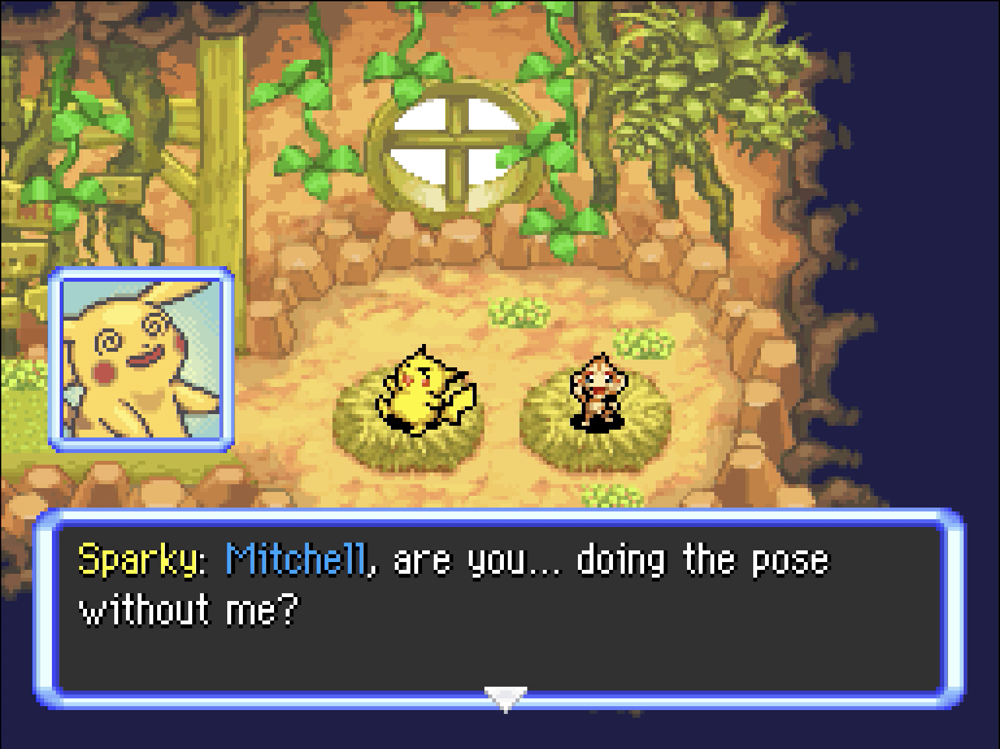
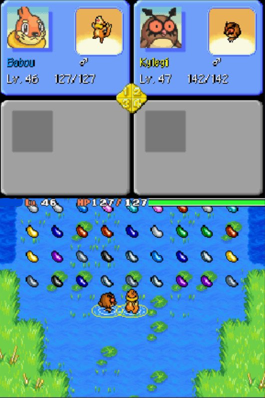
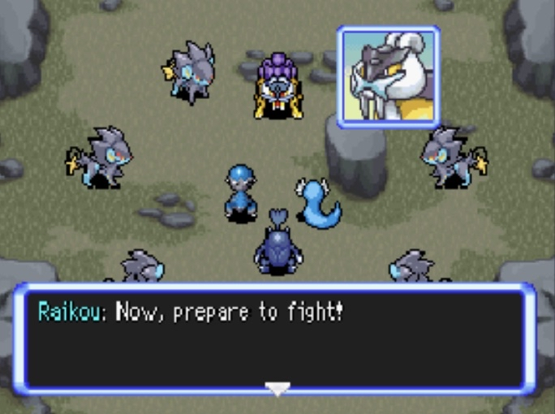

Title: news about mystery dungeon rom-hacking from 23/03/2021 to 28/03/2021
Date: 2021-03-28
Description: rrt decompilation, many hack progress, skip the initial quiz patch, and, as always, portraits and sprites.

Did I missed anything ? feel free to [open a github issue](https://github.com/marius851000/pmd_hack_weekly/issues), contact me on discord at ``marius851000#2522``, send me a mail at ``mariusdavid@laposte.net``, or send me a message from an activitypub compatible service (mastodon) at ``marius851000@framapiaf.org``.

## pokemon rumble
*while this is not a mystery dungeon game, I still decided to include it, as it's a really interessing one, including reference to mystery dungeon*
- AbsolBlogsPokemon [made a video sharing how he was able to add gen 2 and 3 pokemon into pokemon rumble](https://youtu.be/AYdxhqd1RLg).

## rescue team
### [red RRT decompilation](https://github.com/pret/pmd-red)
*for those who don't know decompilation, it is the idea to recreate part of the source of the game based on the released game*
- [Miscellaneous Work (Again)](https://github.com/pret/pmd-red/pull/31)
  - some data moved to src. About a 0.02% jump
  - Document rescue team name/points and funcs
  - Decomp more wonder mail
  - Split some more data up (dungeon stuff is slowly getting pruned to different files)
  - Combined personality_test files into one

## explorer hacking
### hacks
#### [explorer of skies](https://hacks.skytemple.org/h/skies)
*v1.0.6 was made avalaible. Here is the short changelog.*

Here's Skies 1.0.6! This update changes the buying and selling values of all consumables, throwables, evolution items and treasures! 

- Complete Item and Kecleon Shop overhaul! All items have a new buying and selling value (documented in the changelog) and the Treasure Town Kecleon Shops offer a wider variety of items (Vitamins, Ginsengs, Nectar, Joy Seeds, Evolutionary Items, etc. Specifics are documented in the changelog)
- Changed Alolan Vulpix/Ninetails names from A.Vulpix/Ninetails to just Vulpix/Ninetails. I figured having an alolan/galar distinction in the name isn't needed. 
- Buffed Steam Groudon
- Slightly buffed the Luxio Tribe
- Buffed Mespirit
- Buffed Grovyle
- Buffed Spiritomb
- Buffed Kabutops and Omastars
- Added some easter eggs...

*download link and a* **big** *changelog can be found on the [project pokemon page](https://projectpokemon.org/home/forums/topic/58401-pokemon-mystery-dungeon-explorers-of-skies/)*

#### [pmd retold](https://hacks.skytemple.org/h/retold)
- [a discord server was opened](https://discord.gg/zAAVS7Kd).
- progress on chapter 10 is ongoing

### explorer of hell
*copy of the discord announcement, with minor change*

Hi everyone, here is some news about Pokemon Mystery Dungeon Explorers of Hell! First of all I'd like to thank beta testers who tested and are currently testing the first demo of the game. If you want the role, don't hesitate to ask me (on the discord server)! And now, let's have some news and screenshots : 

- You will have access to "farms" dungeons with the spinda coffee. You will be able to farm the IQ, money, and get some importants items like the Friend Bow. 

- Some pokemon abilities have been changed or added. I won't spoil everything, but for example, Cranidos gets Rock Head, Ninetales gets Drought, Ponyta and Rapidash get Quick Feet instead of Run Away etc... 

- The puzzles in the Aegis Cave will be much easier to do, the stones will take less time to find, for example the Ice Aegis Cave will only have Unown I, C and E.

More news incoming! Thank you to those who support the project!

[image of a fight with legendaries pokemon (click, no preview)](./images/05-hell-3.jpg)

### skytemple
- parakoopa made progress on the android port of skytemple randomizer, where he was able to compile all native library for android.
- irdkwia [made a patch that allow to skip the initial quiz](https://github.com/SkyTemple/skytemple-files/pull/96)

[a video where the player only answer the gender question, as well as select partner/player pokemon, and the partner name](https://cdn.discordapp.com/attachments/712343594568253512/824325703729938482/FastPass.mp4)

### skytemple-randomizer
- Parakoopa [added a method to check if the randomizer is up to date](https://github.com/SkyTemple/skytemple-randomizer/commit/a5901e51cebacf9b667fc3462569db809920fa69).

### SpriteCollab
*Sorry, no picture for change yet... But I made progress in it, including rewriting the code in rust.*

- [DonkinDo](https://twitter.com/DonkinDo) [changed 9 portraits for Lopunny](https://github.com/PMDCollab/SpriteCollab/commit/d35efeca33fe4dfa1780c92fe4f61d1c490b0232).
- Emmuffin [added 16 portraits for Pyukumuku Shiny](https://github.com/PMDCollab/SpriteCollab/commit/5600f75eede81a20f9094830c21847b954e2950f).
- Emmuffin [added 16 portraits for Pyukumuku](https://github.com/PMDCollab/SpriteCollab/commit/59344a28bdad6d9c880a987335f63d2805568c13).
- [DonkinDo](https://twitter.com/DonkinDo) [added the normal portrait for Steenee](https://github.com/PMDCollab/SpriteCollab/commit/9cf7afde210a860f60db7778c5bb6bdf4e2dd1c7).
- [NeroIntruder](https://twitter.com/NeroIntruder) [added 102 sprites for Vulpix Alola](https://github.com/PMDCollab/SpriteCollab/commit/40720e371f777e6453e14d136fe17ae7593cf118).
- [NeroIntruder](https://twitter.com/NeroIntruder) [added 45 sprites for Ninetales Alola](https://github.com/PMDCollab/SpriteCollab/commit/dd58006ae54baab6d47f3311d494d75e4ccf283a).
- [DonkinDo](https://twitter.com/DonkinDo) [added 16 portraits for Pheromosa Shiny](https://github.com/PMDCollab/SpriteCollab/commit/ee04d5751c809cfd04bedebabb0ea0b5f613d253).
- [NeroIntruder](https://twitter.com/NeroIntruder) [added 36 sprites for Serperior](https://github.com/PMDCollab/SpriteCollab/commit/399468fa42269287c25e217db037a119e9e5b792).
- [NeroIntruder](https://twitter.com/NeroIntruder) [added 33 sprites for Servine](https://github.com/PMDCollab/SpriteCollab/commit/f752c4989c389d57123eab3830a15aa09e88cae7).
- the user with the discord id <@!560672735957614642> [added 13 portraits and changed the happy, inspired, normal and teary-eyed portraits for Floatzel](https://github.com/PMDCollab/SpriteCollab/commit/59c92245b140d0bdce94042265dd5d10d61e3736).
- [DonkinDo](https://twitter.com/DonkinDo) [added 16 portraits for Pheromosa](https://github.com/PMDCollab/SpriteCollab/commit/9b3066dd395f9a022e4e5b612b965c6675acf26c).
- Emmuffin [added 15 portraits for Dragonair Shiny](https://github.com/PMDCollab/SpriteCollab/commit/6d49a57295200aa9ecf2014ff2e1f78d97bf95ce).
- Emmuffin [added 15 portraits and changed the normal portrait for Dragonair](https://github.com/PMDCollab/SpriteCollab/commit/6b673f7ea7f79cc9547a1b2178f377e1b2d25313).
- Emmuffin [added 17 portraits for Corsola Galar Shiny](https://github.com/PMDCollab/SpriteCollab/commit/7c6a3b56d58863cd41298fa9f44cbe8146616d17).
- Emmuffin [added 15 portraits for Dratini Shiny](https://github.com/PMDCollab/SpriteCollab/commit/1ff5f51cd7ed9a5c69c0c8c17fc2f91e768d89a6).
- someone [added 17 portraits for Corsola Galar](https://github.com/PMDCollab/SpriteCollab/commit/99a41c3c379300aefa42f95568b658c3b9986057).
- cyboy_bit [added the special1, special2 and special3 portraits and changed the angry, determined, inspired and normal portraits for Trubbish](https://github.com/PMDCollab/SpriteCollab/commit/99a41c3c379300aefa42f95568b658c3b9986057).
- the user with the discord id <@!237814999634935808> [added 24 portraits and changed 8 portraits for Budew](https://github.com/PMDCollab/SpriteCollab/commit/2d2cdbb7adc167dfcf3174dee9f0b707cb288b19).

