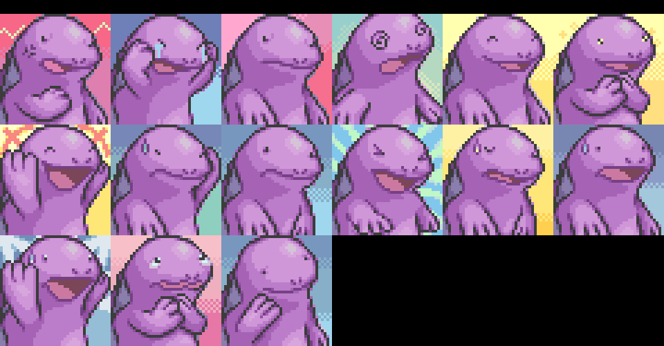
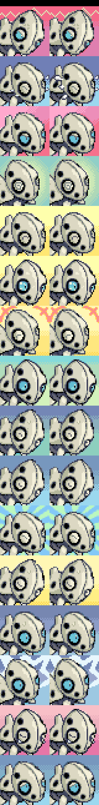

Title: news about mystery dungeon rom-hacking from 29/03/2021 to 04/04/2021
Date: 2021-04-04
Description: PSMD translation, april joke, EOS enhancement, randomizer 1.2.0 with FUN, asmeditor, documentation for sprites creation, portrait changes visualised, and some art for free.

Did I missed anything ? feel free to [open a github issue](https://github.com/marius851000/pmd_hack_weekly/issues), contact me on discord at ``marius851000#2522``, send me an email at ``mariusdavid@laposte.net``, or send me a message from an activitypub compatible service (mastodon) at ``marius851000@framapiaf.org``.

*Also, I figured I was much more permissive on what I put here this week. I'll see if I continue like this the next time*
# Super Mystery Dungeon hacking
- marius851000 [released a command line tool](https://github.com/marius851000/pmdtranslate) that allow to translate PSMD texts. *working on font replacement now*.

# explorer hacking
## hacks
### [pmd retold](https://www.youtube.com/channel/UCZQvdMRXAbkIvsvLUX3RTkg)
- For the 1st april, [a special comical video has been shared](https://youtu.be/1bkErOonjTs).

### skyhard
- Version 1.0.1 [has been released](https://www.mediafire.com/file/ugnaff4azabu8pp/SkyHard_1.0.1.zip/file).

### [Explorers of the azure sky](https://hacks.skytemple.org/h/azuresky)
*new entry into hack list, with a demo avalaible. Here is the description from the discord announcement:*

Howdy everyone! I've been working on a kind of enhancement romhack for Explorers of Sky, and the demo of it is now complete! I present to you all: Pokemon Mystery Dungeon: Explorers of the Azure Sky! It has been my dream to play and eventually make PMD romhacks, and now that dream has come true. This is very much a personal project of mine, so many of the changes listed below are based on my own personal preferences.

This hack will feature:

- New movesets, abilities, and typings for EVERY Pokemon. Some have even had their IQ groups changed.
- A new take on the story of Explorers of Sky, staying faithful to the original while also featuring a far more active
   player role. There are also rewrites of other characters(looking at you, Chatot!) and some more characterization
   of the player and partner.
- Eevee has replaced Phanpy as a male player option, and Growlithe has replaced it as a partner. Sorry to anyone 
   who likes Phanpy!
- A Friend Bow is given to you at the beginning of the game, to help recruitment!
- The move shortcut, tip disabling, and the same-type partner patches made by End45!
- Plenty of more stuff as the hacking scene evolves!

For now, the demo features all of these, but the story has only been changed up until Chapter 5: The First Official Exploration. After that, the game will still be playable, but there will not be any more changes to the story(as of yet). I also want to note this was made using the XenoPhobia rom of EoS. I can't provide that, but I'm not sure how it will behave when patched with other roms, so forewarning. You can use Parakoopa's patch in #community-patches to switch the two for now. Also, you'll need xDelta to patch EoAS!

If you'd like to check it out, please let me know if you find any grammar/text line errors! Also, there's no documentation, but I might write one up eventually Idk. If you wanna follow my progress on this, I'll probably wind up posting here in the SkyTemple Discord, so keep an eye out!

*[here is the youtube channel](https://www.youtube.com/channel/UCJoi57TuJWyEHDAFI92-0uw)*

*[here is the download link](https://cdn.discordapp.com/attachments/769498453126283274/827641128621703228/Pokemon_Mystery_Dungeon_-_Explorers_of_the_Azure_Sky.zip)*

## skytemple-files
*skytemple-files is a common tool both used by skytemple-randomizer and skytemple. It contain most of the code to read and write files*

- MkTr [made a funny commit message](https://github.com/SkyTemple/skytemple-files/pull/98).

- Parakoopa [made so that environment variable](https://github.com/SkyTemple/skytemple-files/commit/05961a89e2463c731bbc169e427a6d358156eb82) can be used to configure armips.
- Parakoopa [added better error message for the patcher](https://github.com/SkyTemple/skytemple-files/commit/4cc5f0f480a4fdc4a3744a85a84404996ad5cbd2).
- version 1.2.0 was released

## skytemple-randomizer
*copy of the announcement from discord*
### SkyTemple Randomizer 1.2.0
Download: [https://projectpokemon.org/home/files/file/4235-skytemple-randomizer](https://projectpokemon.org/home/files/file/4235-skytemple-randomizer)

This release improves a lot of things by introducing a lot more fun! Everyone should try it out.

New:

- Android version! (beta) You can download the APK installer from Project Pokémon.
- A Windows 32bit version is now available. We only recommend using this, if you can not run the 64bit version.
- Settings for the personality test: You can now skip it entirely and choose your starter directly or have an option where you are asked after the test if you want to change it! Thank you @Irdkwia!

Fixes and Improvements:

- Overworld music randomization is now disabled by default since it is still unstable.
- Updated Complete Team Control patch to 1.2.3
- Added a text that shows up when you are running an outdated version and prompts you to update.
- Added more fun.

*note of marius851000 :*
*What this "fun" effect does is replace some portrait with more comical ones.*

*Only active the april 1st. This fonctionallity can be set by setting the environment variable ``SKYTEMPLE_FUN`` to ``1`` otherwise. Don't ask me how to do that on windows.*

*thougt you can still change the system clock to be on that date.*

*You can see [all portrait on github](https://github.com/SkyTemple/skytemple-randomizer/tree/c7b99e936bd4103e380cd4a008c047c7fa98c505/skytemple_randomizer/data/fun).*

*screenshot by Tales/Сказки, portrait by reppamon*

## [asmeditor](https://asmeditor.skytemple.org/)
*ASMeditor describe itself as a "graphical editor for generating isolated pieces of Assembly code for PMD: Explorers of Sky. [...]*

- code ownership has seemingly been moved to the SkyTemple github organisation.
### asmeditor has been updated to 0.2.0 :

New features

- Support for user-defined variables
- Support for string literals and functions that take strings as arguments
- Allows creating item effects
- Projects can now be exported to and imported from JSON files for easy sharing

Fixes and improvements

- The output of the "If" block now omits unnecessary code if the "Otherwise" subgraph is empty
- Fixed a bug where the internal linked list would get corrupted on drag-and-drop in subgraphs, causing blocks to disappear

asmeditor is in an early and experimental state, so please report errors and let us know if there are any features you'd like to see.
I'm taking a bit of a risk with this release since I didn't test anything in-game (the current nightly is broken on my OS and I was too lazy to set it up on Windows). The output should at least compile though.

## Various stuff
- Irdkwia [shared a video](./videos/06-NothingHappened) showcasing a custom attack cutscene.

<video controls>
  <source src="./videos/06-NothingHappened.mp4" type="video/mp4">
</video>

## SpriteCollab
### general
- The skytemple server took the decision to grant 10 [guild point](https://hacks.skytemple.org/guildpoints) for new sprite as a way to encourage new sprites.
- Nooga [made a guide](https://docs.google.com/presentation/d/e/2PACX-1vSx2rZC0lkUro1YigF0mol-yfIb5AhV6_myxrlpYdgiZUZ_Zk5VHE7oa0f4VceEOeQeDCI1cHce21hA/pub?start=false&loop=false&delayms=60000) on how to use blender for portrait reference.
- Audino [made a guide](https://docs.google.com/document/d/1KR3Dag-fN3omDJXDXZS-6SPf6b7ARqGCfGnjCRbbJ1M/edit#) for how to use his PMDC tool ([windows](https://www.mediafire.com/file/c0i4ganc03q3fjh/PMDC-win.zip/file), [mac](https://www.mediafire.com/file/zxs4db0bwbqe3wa/PMDC-osx.zip/file), [linux](https://www.mediafire.com/file/akclbo4dbf7ewmp/PMDC-linux.zip/file)) to edit sprites.

### new sprites and portrait
*yes, we now have portrait change visualisation ! It's still unfinished, and doesn't display sprite change, but it's still better than what was used before*

- Emmuffin added 16 portrait for Raichu Alola

- Emmuffin added 16 portrait for Raichu Alola Shiny

- [jackolanternjackalope](https://www.instagram.com/jackolanternjackalope/) added 30 and changed the Normal and Normal^ portraits for Clefable

- [Audino](https://github.com/audinowho) added 34 sprite kind for Vulpix Alola Shiny
- [Audino](https://github.com/audinowho) changed 16 portrait for Vulpix Alola Shiny

- [Audino](https://github.com/audinowho) added 15 sprite kind for Ninetales Alola Shiny
- [Audino](https://github.com/audinowho) added the Normal portrait for Ninetales Alola Shiny

- [jackolanternjackalope](https://www.instagram.com/jackolanternjackalope/) added 15 and changed the Normal portraits for Paras

- Emmuffin added the Determined, Dizzy, Sigh and Stunned portrait for Machop  Shiny

- Someone with the (discord) id <@!299261889169588246> added 15 portrait for Mew  Shiny

- [DonkinDo](https://twitter.com/DonkinDo) added 15 portrait for Ledian  Shiny

- [DonkinDo](https://twitter.com/DonkinDo) changed the Joyous, Normal, Sigh, Teary-Eyed and Worried portrait for Marill

- [DonkinDo](https://twitter.com/DonkinDo) added 12 portrait for Marill  Shiny

- Emmuffin changed 16 portrait for Quagsire

- Emmuffin added 15 portrait for Quagsire  Shiny

- [Smalusion](https://twitter.com/Smalusion) added the Eat, EventSleep, Float and Laying sprite kind for Murkrow
- [Smalusion](https://twitter.com/Smalusion) added the Eat, EventSleep, Float and Laying sprite kind for Murkrow  Shiny
- Emmuffin added 13 portrait for Snubbull  Shiny

- [DonkinDo](https://twitter.com/DonkinDo) added 12 sprite kind for Corsola Galar
- [DonkinDo](https://twitter.com/DonkinDo) added 11 portrait for Gardevoir  Shiny

- [DonkinDo](https://twitter.com/DonkinDo) added 15 portrait for Nosepass  Shiny

- Someone with the (discord) id <@!589906152708505648> changed 16 portrait for Aron

- Someone with the (discord) id <@!299261889169588246> added 15 portrait for Aron  Shiny

- Someone with the (discord) id <@!299261889169588246> added 7 portrait for Bidoof  Shiny

- [DonkinDo](https://twitter.com/DonkinDo) added 12 sprite kind for Vanillish
- [mucrush](https://www.deviantart.com/mucrush) changed the Normal portrait for Vanillish

- [LornaWR](https://twitter.com/LornaWR_) added 16 and changed the Normal portraits for Emolga

- [DonkinDo](https://twitter.com/DonkinDo) added 11 sprite kind for Joltik  Shiny
- [DonkinDo](https://twitter.com/DonkinDo) added 11 sprite kind for Galvantula
- baronessfaron added 16 portrait for Floette

- [Noivern](https://twitter.com/notarealnoivern) changed the Happy, Normal and Pain portrait for Noibat  Shiny

- XModxGodX added 16 portrait for Rockruff  Shiny

- Emmuffin added 15 and changed the Normal portraits for Fomantis

- [DonkinDo](https://twitter.com/DonkinDo) added the Angry, Happy, Pain and Worried and changed the Normal portraits for Steenee

- baronessfaron added 15 and changed the Normal portraits for Tapu_Lele

- [DonkinDo](https://twitter.com/DonkinDo) added 12 sprite kind for Cramorant

# decided to end this with some art this time
*Some pmd related image that was shared on the skytemple discord. Don't know if I'll also include this the next week*...
*also, this should take a insane (that is 10MiB) of storage on git... should take care...*

[illustration for a TTRPG by charbust](reddit.com/r/MysteryDungeon/comments/mi6c55/art_by_charburst_i_commissioned_for_our_pmd/)

Two nice painting (I think it's painting) and a sculpture NightmareKing shared on the discord. Also known as [moonsetterillustrations](https://www.instagram.com/moonsetterillustrations/) on instagram ([here is a mirror, with no account required to view images](https://bibliogram.nixnet.services/u/moonsetterillustrations/)).

A [fanart of pmd: retold by Hawktalon07](https://www.deviantart.com/hawktalon07/art/Igniting-the-spark-875158560).

Remukko shared this drawing, titled "just a remukko".

[Happy world rat day](https://twitter.com/eon_exists/status/1378653401567784964) by eon.

Pure Psychic Staryu and Starmie by Sewiwey
