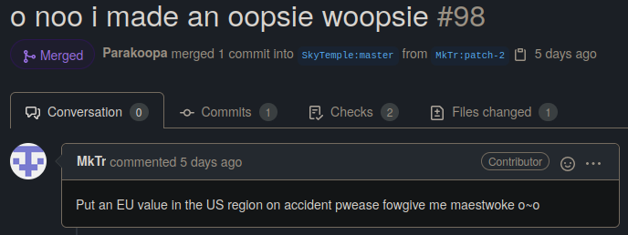
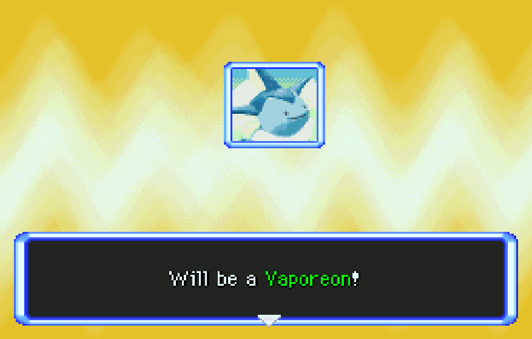
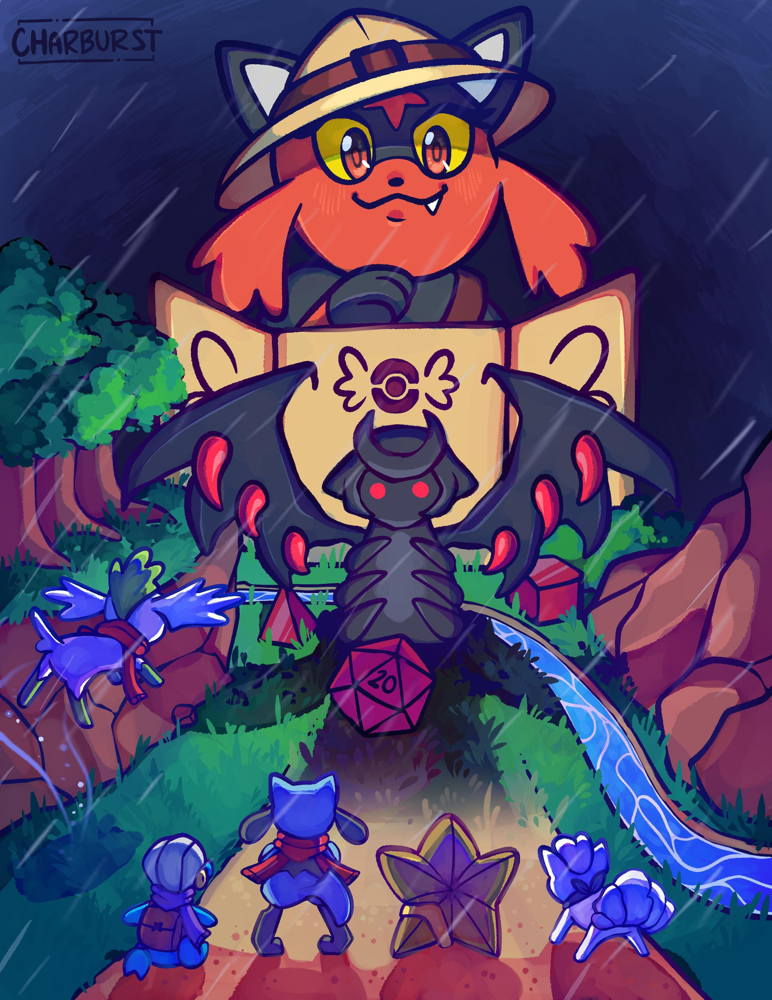
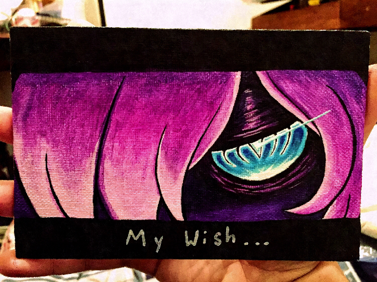

Title: news about mystery dungeon rom-hacking from dd/mm/yyyy to dd/mm/yyyy
Date: yyyy-mm-dd
Description: ...

Did I missed anything ? feel free to [open a github issue](https://github.com/marius851000/pmd_hack_weekly/issues), contact me on discord at ``marius851000#2522``, send me a mail at ``mariusdavid@laposte.net``, or send me a message from an activitypub compatible service (mastodon) at ``marius851000@framapiaf.org``.

## Super Mystery Dungeon hacking
- marius851000 [released a command line tool](https://github.com/marius851000/pmdtranslate) that allow to translate PSMD. *working on font replacement now*.

## explorer hacking
### hacks
#### [pmd retold](https://www.youtube.com/channel/UCZQvdMRXAbkIvsvLUX3RTkg)
- For the 1st april, [a special comical video has been shared](https://youtu.be/1bkErOonjTs).

#### [skyhard](https://skytemple.org/...)
- Version 1.0.1 [has been released](https://www.mediafire.com/file/ugnaff4azabu8pp/SkyHard_1.0.1.zip/file).

### skytemple-files
*skytemple-files is a common tool both used by skytemple-randomizer and skytemple. It contain most of the code to read and write files*
- MkTr [made a funny](https://github.com/SkyTemple/skytemple-files/pull/98) error message.

- Parakoopa [made so that environment variable](https://github.com/SkyTemple/skytemple-files/commit/05961a89e2463c731bbc169e427a6d358156eb82) can be used to configure armips.
- Parakoopa [added better error message for the patcher](https://github.com/SkyTemple/skytemple-files/commit/4cc5f0f480a4fdc4a3744a85a84404996ad5cbd2).
- version 1.2.0 was released
### skytemple
- ...

### skytemple-randomizer
*copy of the announcement from discord*
#### SkyTemple Randomizer 1.2.0
Download: https://projectpokemon.org/home/files/file/4235-skytemple-randomizer

This release improves a lot of things by introducing a lot more fun! Everyone should try it out.

New:
- Android version! (beta) You can download the APK installer from Project Pokémon.
- A Windows 32bit version is now available. We only recommend using this, if you can not run the 64bit version.
- Settings for the personality test: You can now skip it entirely and choose your starter directly or have an option where you are asked after the test if you want to change it! Thank you @Irdkwia!

Fixes and Improvements:
- Overworld music randomization is now disabled by default since it is still unstable.
- Updated Complete Team Control patch to 1.2.3
- Added a text that shows up when you are running an outdated version and prompts you to update.
- Added more fun.

*here are some random unrelated filler (by Tales/Сказки)*

### [asmeditor](https://asmeditor.skytemple.org/)
*ASMeditor describe itself as a "graphical editor for generating isolated pieces of Assembly code for PMD: Explorers of Sky. Currently only supports editing moves."*

- code ownership has seemingly been moved to the SkyTemple github organisation.
#### asmeditor has been updated to 0.2.0 :

New features
- Support for user-defined variables
- Support for string literals and functions that take strings as arguments
- Allows creating item effects
- Projects can now be exported to and imported from JSON files for easy sharing

Fixes and improvements
- The output of the "If" block now omits unnecessary code if the "Otherwise" subgraph is empty
- Fixed a bug where the internal linked list would get corrupted on drag-and-drop in subgraphs, causing blocks to disappear

asmeditor is in an early and experimental state, so please report errors and let us know if there are any features you'd like to see.
I'm taking a bit of a risk with this release since I didn't test anything in-game (the current nightly is broken on my OS and I was too lazy to set it up on Windows). The output should at least compile though.

### Various stuff
- Irdkwia [shared a video](./videos/06-NothingHappened) showcasing a custom attack cutscene.

### SpriteCollab
#### general
- The skytemple server took the decision to grant 10 [guild point](https://hacks.skytemple.org/guildpoints) for new sprite as a way to encourage new sprites.
- Nooga [made a guide](https://docs.google.com/presentation/d/e/2PACX-1vSx2rZC0lkUro1YigF0mol-yfIb5AhV6_myxrlpYdgiZUZ_Zk5VHE7oa0f4VceEOeQeDCI1cHce21hA/pub?start=false&loop=false&delayms=60000) on how to use blender for portrait reference.
- Audino [made a guide](https://docs.google.com/document/d/1KR3Dag-fN3omDJXDXZS-6SPf6b7ARqGCfGnjCRbbJ1M/edit#) for how to use his PMDC tool ([windows](https://www.mediafire.com/file/c0i4ganc03q3fjh/PMDC-win.zip/file), [mac](https://www.mediafire.com/file/zxs4db0bwbqe3wa/PMDC-osx.zip/file), [linux](https://www.mediafire.com/file/akclbo4dbf7ewmp/PMDC-linux.zip/file)) to edit sprites.

#### new sprites and portrait

## decided to end this with some art this time
*picture presented here are what 1. I know about and 2. what I think is particularely nice. This is personal opinion. Also, I don't know of any image board dedicated to pokemon mystery dungeon*.

[illustration for a TTRPG by charbust](reddit.com/r/MysteryDungeon/comments/mi6c55/art_by_charburst_i_commissioned_for_our_pmd/)

A nice painting (I think) NightmareKing shared on the discord
