Title: news about mystery dungeon rom-hacking from 05/04/2021 to 11/04/2021
Date: 2021-04-11
Description: explor abridge, of skies, of hell and of sunlight, new sprite guide, new portraits and sprites, and an audio drama.

Did I missed anything ? feel free to [open a github issue](https://github.com/marius851000/pmd_hack_weekly/issues), contact me on discord at ``marius851000#2522``, send me a mail at ``mariusdavid@laposte.net``, or send me a message from an activitypub compatible service (mastodon) at ``marius851000@framapiaf.org``.

*also, decided to not post (too much) unrelated art this time. This take some time. Thought I keep the possibility to put some if I think they are significant/really good*.

# explorer hacking
## hacks
### [Explorers Abridged](https://hacks.skytemple.org/h/abridged)
*New hack shared on discord by Decimeter. Description from the skytemple site:*

A work in progress hack that follows the same set path of the original game, except rated M. Also, I lied.

Demo includes Chapters 1-3, higher difficulty as well.
Roughly 1 hour of content.

[project pokemon page](https://projectpokemon.org/home/forums/topic/58707-pok%C3%A9mon-mystery-dungeon-explorers-abridged/)

[google drive down page](https://drive.google.com/file/d/1_SNNDhxAxDh_-OIZGKDE36-GcXrKC5JT/view?usp=sharing)

[discord server](https://discord.gg/ca9FfcJ2Wg)

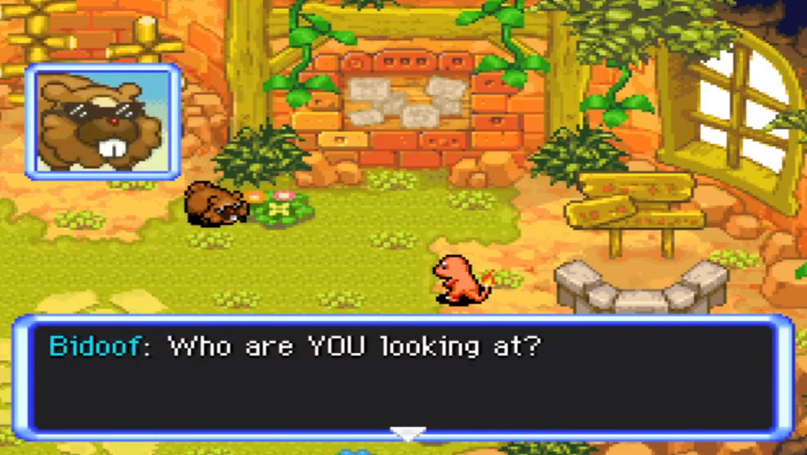

### Explorer of death
- A link for the [discord server about explorer of death](https://discord.gg/rJy9T4ureE), where FireFox6 develop his romhacked based on the creepypasta, has been shared.

### Skyhard
*from discord*

Just to reiterate, skyhard 1.0.1 is an april fools hack, the real one is found here : [https://www.mediafire.com/file/vuy9agn8efukqe2/skyhard_thing.zip/file](https://www.mediafire.com/file/vuy9agn8efukqe2/skyhard_thing.zip/file)

*marius851000: version 1.0.1 can be found [here](https://www.mediafire.com/file/ugnaff4azabu8pp/SkyHard_1.0.1.zip/file)*

### [explorer of skies](https://hacks.skytemple.org/h/skies)
*from discord*

Hello all! This is the biggest update Skies has recieved yet -- The Arceus Update! 

This update adds:
- A recruitable Arceus (with an actual sprite) at the top of Destiny Tower. 
- An Exp. Share system that distributes Exp to off-roster teammates.
- Complete Team Control, you can temporarily control the turns of your partner and team members.
- Non-gender specific quiz questions. 
- The ability to select what starter you want if you don't like the Personality Quiz results.
- A SkyTemple watermark.
- Fairy Type/Gummis.
- Bug fixes! 

and more!

Please report any bugs/issues in the #deleted-channel *[sic]* channel!

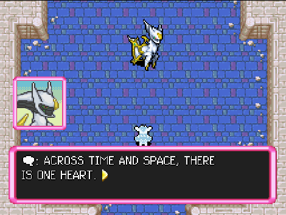

Since some people outside of my Discord are having trouble patching, here's some instructions:

1. Skies uses a U.S Xenophobe ROM dump as the base ROM. That means to patch Skies to a game you will need that specific ROM. I can not legally distribute ROMs, but I can give out a patch that will convert clean copies of North American U.S Explorers of Sky to the Xenophobe dump. You can find this patch here: 
https://www.dropbox.com/s/y62fstq47i1u5gm/clean_to_xeno.xdelta?dl=1

2. You will need a special version of an updated xDelta to patch Skies. You can find this specific xDelta at:
https://www.dropbox.com/s/3a6wxvmpyn452cx/xdelta.zip?dl=1

Alternatively, you can *try*:
https://hack64.net/tools/patcher.php

3. If you don't have a US Xenophobe Dump, you'll need to use the updated xDelta or the hack64 patcher found in step #2 (If you do have a US Xenophobe dump you can skip this step). Apply the Xeno patch to the clean ROM.

4. Open your software and choose the US Xenophobe Explorers Of Sky ROM as the base, and the Skies Patch as the patch, choose an output destination and name, and you're all ready to play! You'll know this will have worked if the intro sequence is changed.

#### second announcement

Yo! Here's another new update with a quick rundown:

- Added Sylveon -- Evolves from Eevee with using a Beauty Scarf during evolution. Has Cute Charm and Synchronize as its abilities.
- Updated all Pokemon to have their correct Gen 6 typings. (Distributed Fairy type to all Fairy types.)
- Added Fairy Gummis to Kecleon Shops and fixed their pricing.
- Fixed the corrupt kaomado file (again) so now ROM Hackers using Skies as a base can import new portraits to existing Pokemon.
- Bug fixes.

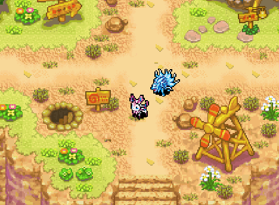

[download link](https://projectpokemon.org/home/applications/core/interface/file/attachment.php?id=48723)

[complete changelog (384 lines)](https://projectpokemon.org/home/applications/core/interface/file/attachment.php?id=48724)

### [Explorers of the azure sky](https://hacks.skytemple.org/h/azuresky)
*Mr. L on Discord*

Quick hotfix here! Turns out there was an issue with part of the female protagonist dialogue in chapter 2 that was causing a crash. This should fix it!
Thank you to @Shammywolf363 for pointing that out!

[download link](https://cdn.discordapp.com/attachments/820426779004108820/829484014632173568/EoAS_Hotfix.xdelta)

### Explorers of hell
*[discord invite link for the server](https://discord.gg/sDeP4KUR).*

*Babou on Discord*

Hi! Here is some new news for Pokemon Mystery Dungeon: Explorers of Hell! Thank you for following the project, I'm glad to see that! Here is some informations about the progress of the game! 

- V0.2 should be available at the end of April, the dialogues will be modified until the end of the expedition. 

- A new dungeon : Tower of God. The ultimate dungeon, no recruitment, level 100 pokemon and huge bosses every 20 floors (example below). 

- When you recruit a Legendary Pokemon, they will be either level 85 or level 95.

- 5 dungeons "The Hell", all with different characteristics (For example, The Hell North will be the succession of all the bosses with "rest room" between 3 bosses) but an extreme difficulty. 

- The Tiny Woods from Pokemon Mystery Dungeon: Red/Blue Rescue Team is back with the unlocked dungeons from Spinda's Café.

- Some characters from these games are also back.... 

Thanks to those who are following the project, an approximate release date should be announced soon, I hope this news will continue to hype you up! 

*marius851000: whoa, including emoticon in markdown isn't that easy*

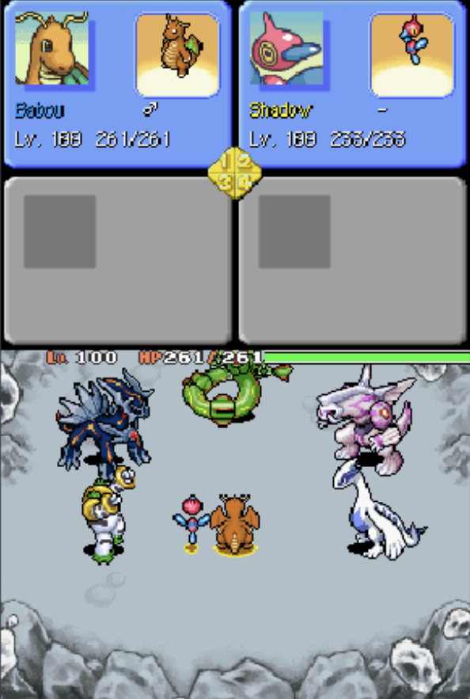)

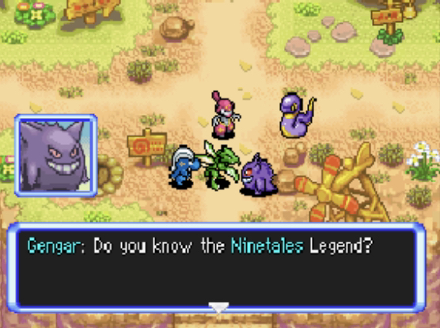

### Pokémon Mystery Dungeon: Explorers of Sunlight!
*from the Discord announcement, fixed a typo and changed presentation*

I've been in this Community since Skytemple first public release, since then i was expecting in doing a Romhack, specially one that is a bit different from the rest. So there you go! Pokémon Mystery Dungeon: Explorers of Sunlight!

This Romhack features:

- Some quality of life patches, mainly the MoveShortcuts and SametypePartner by End45.
- Some new Pokémon, Sprites made by me.
- A new story, starts a bit vanilla. Don't fix what is not broken, i guess :P
- A bit more challenging, still not hard.
- New places (Coming Soon)
- A whole new starter roster, not as big as the original but include 

new Pokémons
- Starters:
  - Player Male
    - Yanma
    - Cranidos
    - Monferno
  - Player Female
    - Staravia
    - Marill
    - Mienfoo
- Partners:
  - Partner Male
    - Cacnea
    - Marshtomp
    - Joltik
  - Partner Female
    - Kirlia
    - Roselia
    - Galarian Ponyta

This demo just last till after Chapter 3, but yet more to come of course!

[link to the demo](https://cdn.discordapp.com/attachments/769498453126283274/830681962461003816/PMDExplorersOfSunlightDEMO.zip)

## skytemple
- [Some restructuration](https://github.com/SkyTemple/skytemple/commit/b663f18975e5fca114419dbda0b65ffcafb8cb0e) of the moves/items editing code.
- Translation updated, as usual.
- [Added dummy controllers for moves and items](https://github.com/SkyTemple/skytemple/commit/a8396065d24144d6902a473dab793abccd39e934). *don't know what it mean*.
- You can now [edit the category of a pokemon](https://github.com/SkyTemple/skytemple/commit/1dc1ccee354623cff99e864e959de8fccaedd04a).
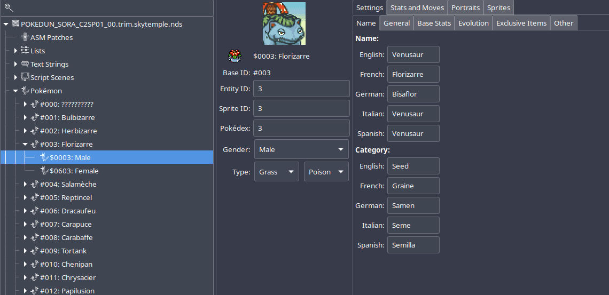
- [Glade UI for Moves ](https://github.com/SkyTemple/skytemple/commit/767ca99bfe564bf1872953e7129cf229126030be) and for [items](https://github.com/SkyTemple/skytemple/commit/8d41a679d98565db355f0b72d7dd0dc40002a63b) (unimplemented).
- [Update Monster UI](https://github.com/SkyTemple/skytemple/pull/242). Update description of evolution parameters, chest drop rates and can throw items.
- [Update level_up.py](https://github.com/SkyTemple/skytemple/pull/243). Rebuild correct lists when items for egg moves and HM/TM moves are removed/added.
- [Added localization for palette editor](https://github.com/SkyTemple/skytemple/commit/997a00bcd5c1e79a3126da7bfd196edc420612d6).

## skytemple-files
- [Improved move settings](https://github.com/SkyTemple/skytemple-files/commit/755ac879af3d2a112fccd7dc0358ad1f6965d44f). 
- [Update Monster Attributes](https://github.com/SkyTemple/skytemple-files/pull/101).

## SpriteCollab
### general
- Cyboy_bit [shared a guide](https://drive.google.com/file/d/12V5yPdjOkccKWePuUu6tJlVRXEGJNMDw/view) on how to do sprite for those who don't know how to do those.

### new sprites and portrait
- Someone with the (discord) id <@!828520880299966525> added 15 and changed the Normal portraits for Feebas

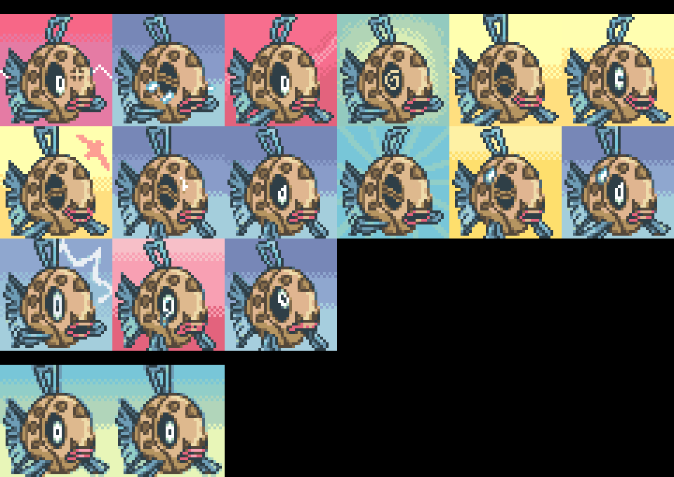
- Someone with the (discord) id <@!523152081805115403> added 16 and changed the Normal portraits for Deoxys

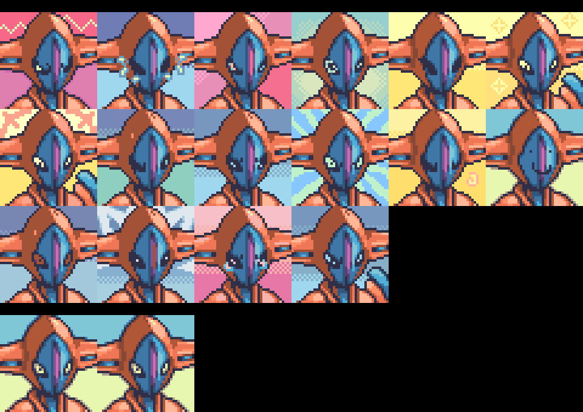
- Someone with the (discord) id <@!523152081805115403> added 16 and changed the Normal portraits for Deoxys Defense

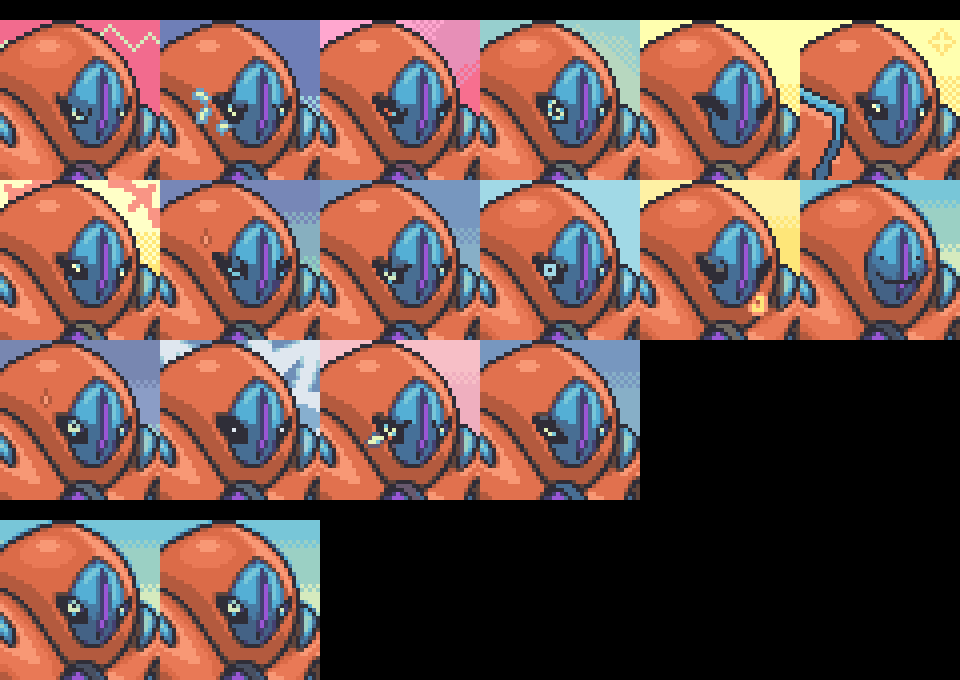
- Someone with the (discord) id <@!523152081805115403> added 20 and changed the Normal portraits for Deoxys Speed

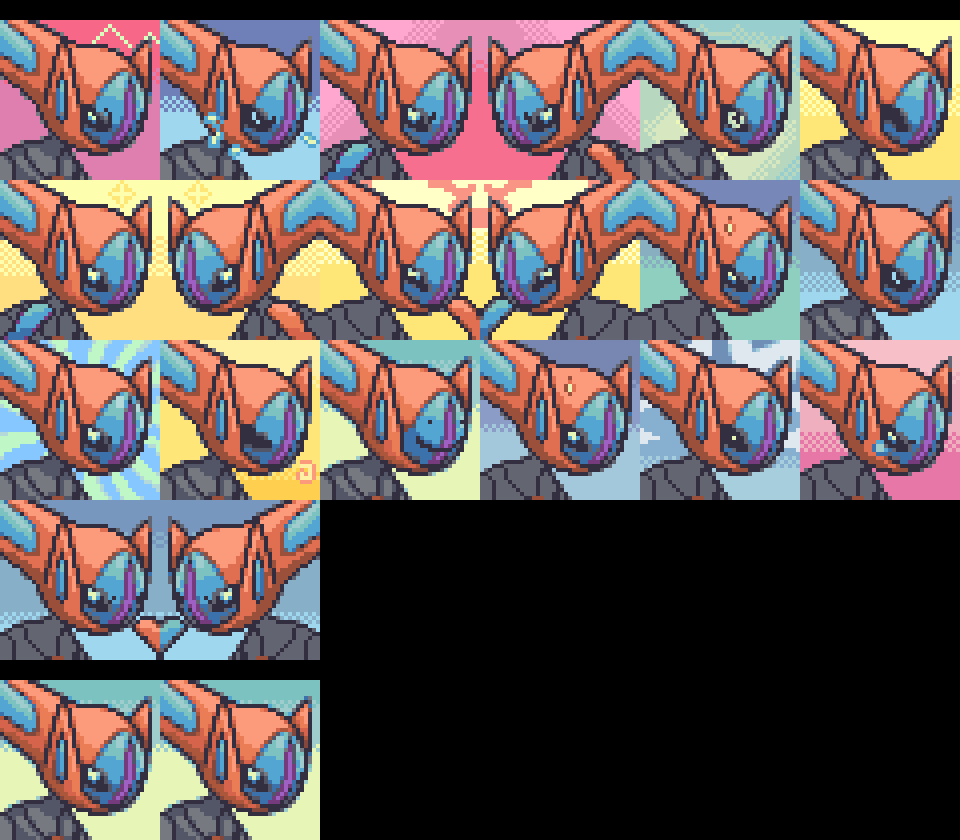
- [DonkinDo](https://twitter.com/DonkinDo) added 12 sprite kind for Probopass Beta
- Emmuffin added 8 and changed 9 portraits for Manaphy

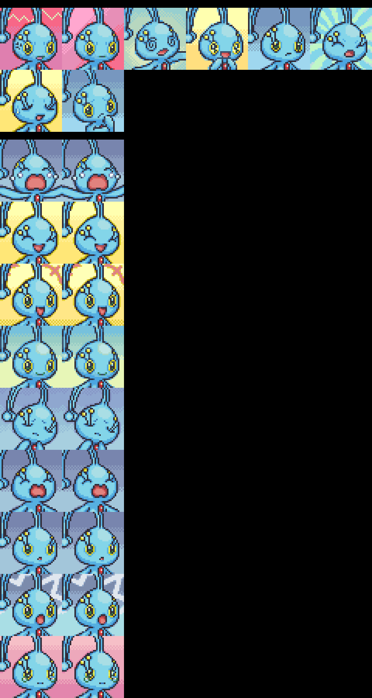
- Emmuffin added 8 portrait for Manaphy  Shiny

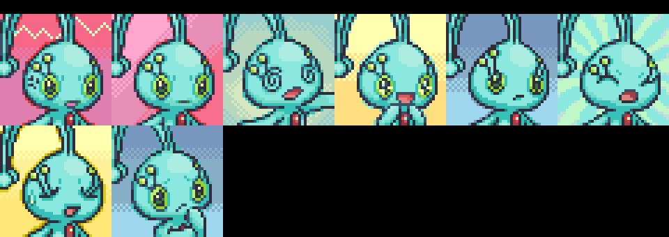
- [DonkinDo](https://twitter.com/DonkinDo) added 12 sprite kind for Arceus
- [Noivern](https://twitter.com/notarealnoivern) changed the Normal portrait for Tepig

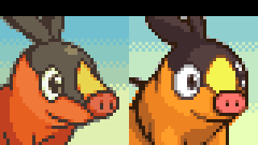
- [Nooga](https://www.deviantart.com/ubernooga) added 9 and changed the Normal portraits for Ducklett

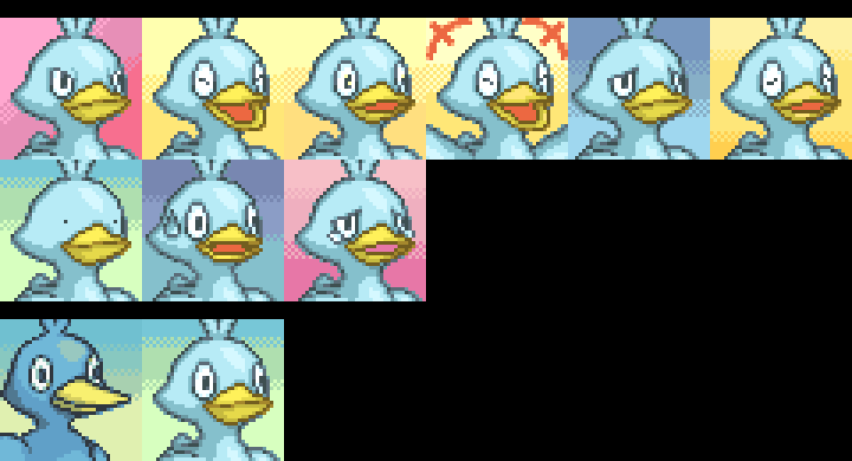
- [LornaWR](https://twitter.com/LornaWR_) added 17 portrait for Emolga  Shiny

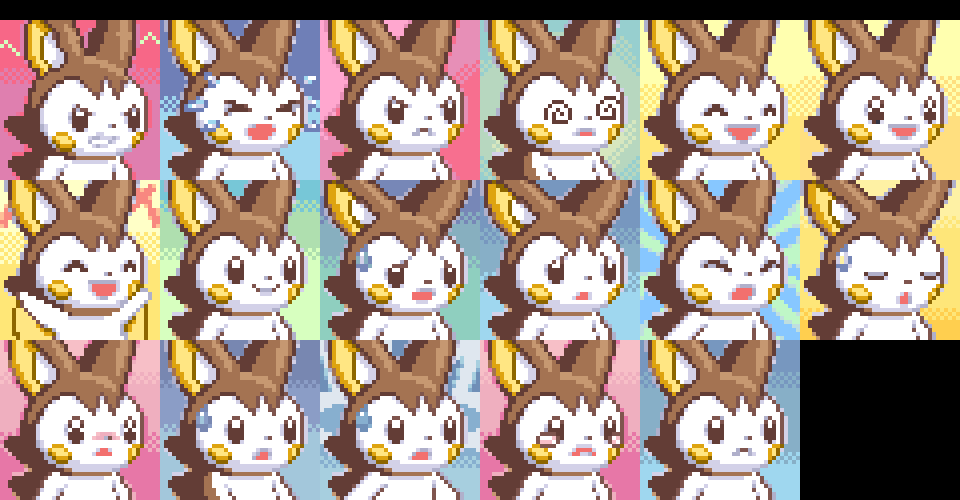
- Emmuffin added 33 sprite kind for Litwick
- Emmuffin added 33 sprite kind for Litwick  Shiny
- Emmuffin added 16 portrait for Fomantis  Shiny

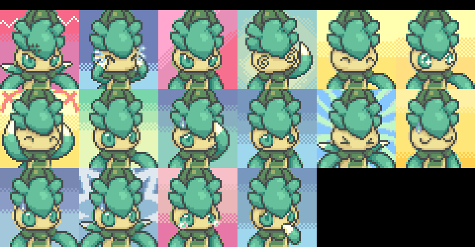
- Someone with the (discord) id <@!340299853345325056> added 15 and changed the Normal portraits for Thievul

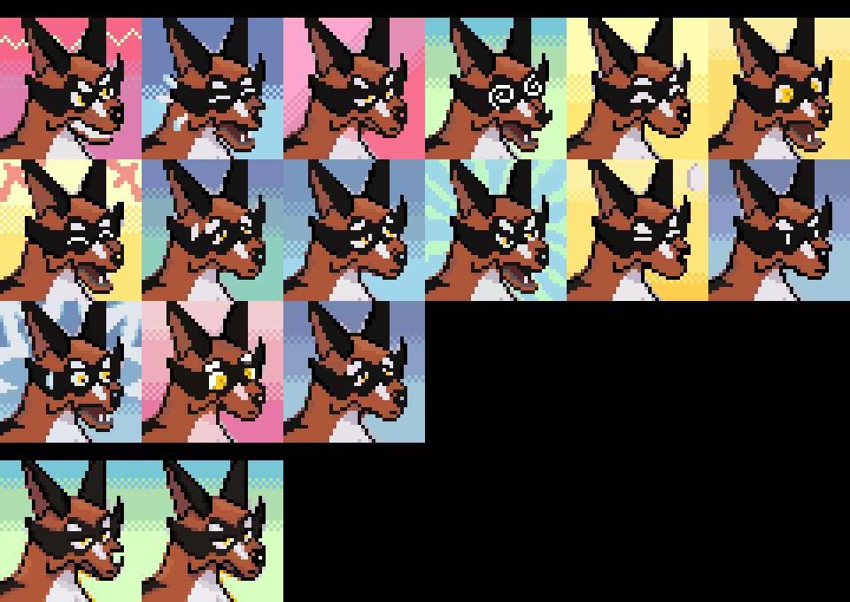
- Someone with the (discord) id <@!340299853345325056> added the Dizzy, Happy, Inspired and Joyous and changed the Normal portraits for Toxtricity

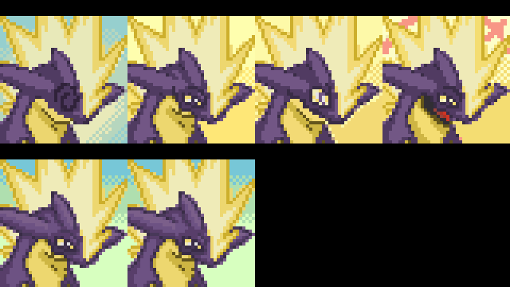

# other PMD art
“Pokémon Mystery Dungeon: Arceus’s Wish”

An audio drama by the Underground Media Group

Transformed into a pokemon overnight, Kyle must embark on a search for answers in a parallel world where humans don’t exist, and rediscover himself and his past -- all while trying to rid both worlds from the unspeakable evil which threatens to consume them whole.

A burden on his shoulders and a strange adaptation period ahead of him, can young Kyle still prove himself worthy of this quest? Can he discover the true meaning of his arrival into the Mystery Dungeon world and unearth the secret to victory?

[youtube link to the trailer video](https://www.youtube.com/watch?v=paah2-Rd4AA)
