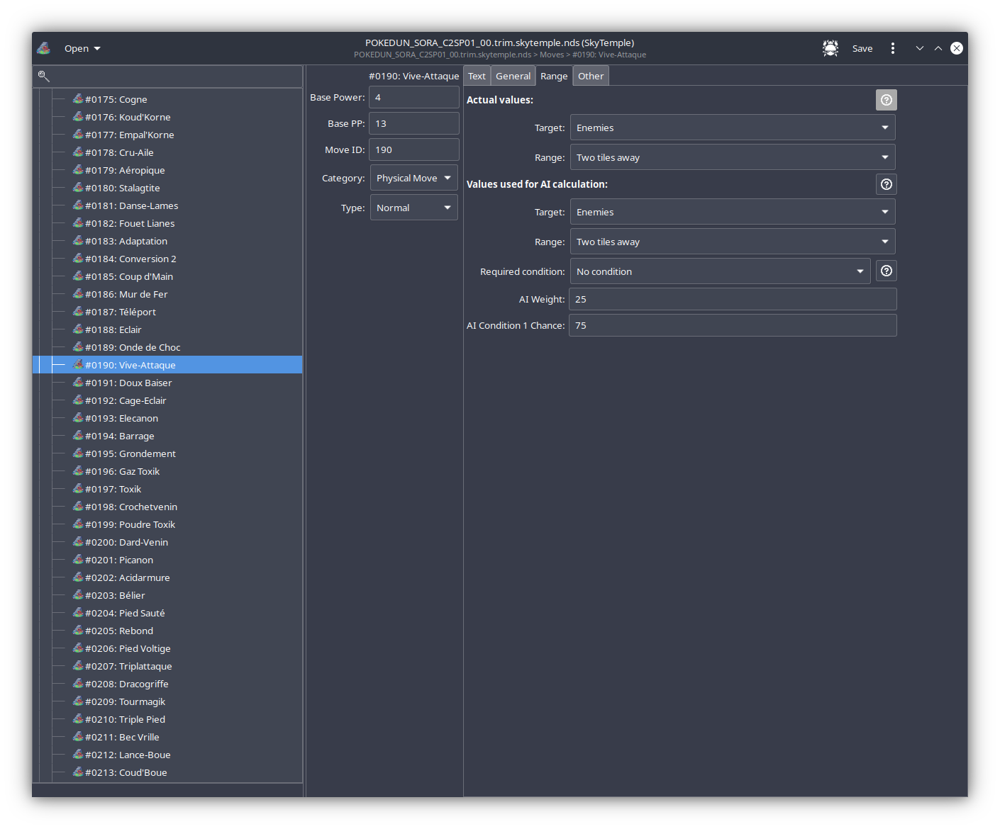
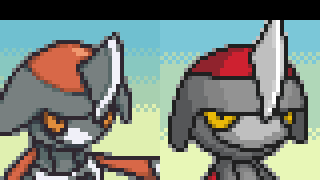
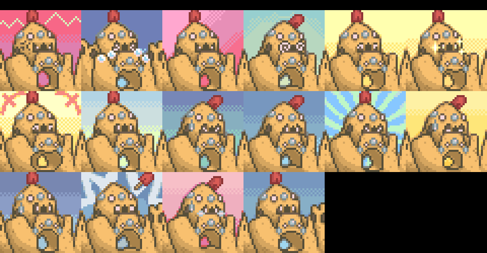
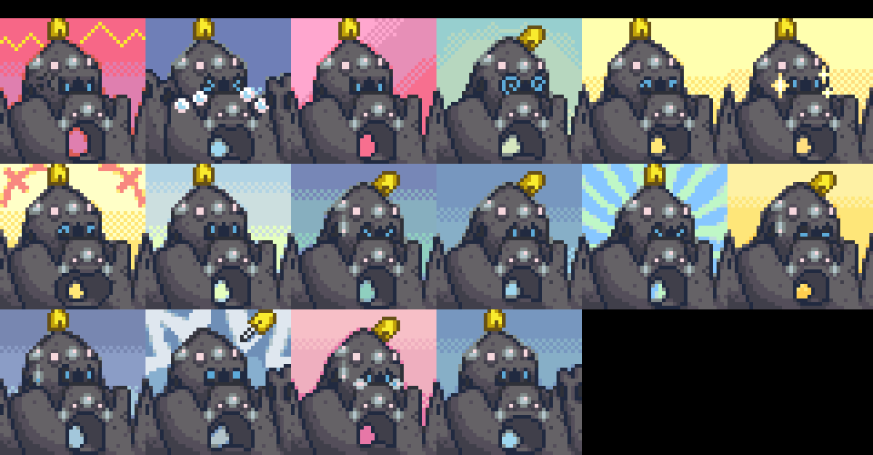
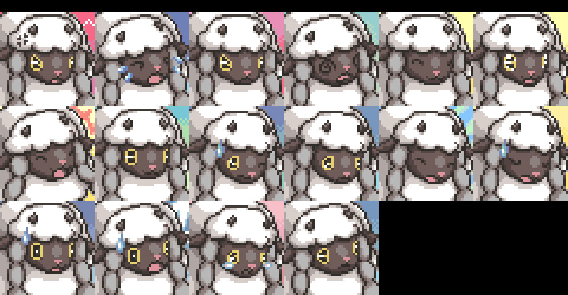
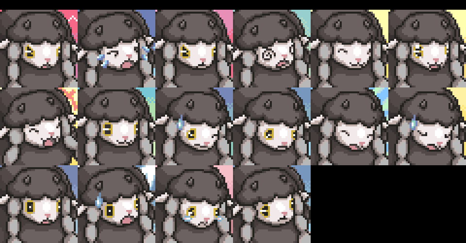

Title: news about mystery dungeon rom-hacking from 12/04/2021 to 18/04/2021
Date: 2021-04-18
Description: new pmd retold, move editing, new sprites & portraits...

Did I missed anything ? feel free to [open a github issue](https://github.com/marius851000/pmd_hack_weekly/issues), contact me on discord at ``marius851000#2522``, send me a mail at ``mariusdavid@laposte.net``, or send me a message from an activitypub compatible service (mastodon) at ``marius851000@framapiaf.org``.

## rescue team DX
tech_ticks [reimplemented the Sentry Duty minigame in RT:DX](https://www.reddit.com/r/MysteryDungeon/comments/mq87q5/a_rom_hack_that_adds_the_sentry_duty_minigame_to/)

# explorer hacking
## hacks
### [pmd retold](https://www.youtube.com/channel/UCZQvdMRXAbkIvsvLUX3RTkg)
- [Episode 10](https://www.youtube.com/watch?v=C6sdfE5ptcE) has been published.

## skytemple
- Parakoopa [added an UI for move editing](https://github.com/SkyTemple/skytemple/commit/7bd9262b709312cf1b01e3f1d039df123a653b2d).
.
- Parakoopa [Reworked item lists to read dynamically from config](https://github.com/SkyTemple/skytemple/commit/6f728d471847c3aabe04fd564c10e382651c9bc2).

## skytemple-files
- Parakoopa [made new content translatable](https://github.com/SkyTemple/skytemple-files/commit/2f327c8da5fe32d0401a008b4d0cf5268d3bad91).
- Parakoopa made the change "[moves: Condition 1 check](https://github.com/SkyTemple/skytemple-files/commit/9c1e3ea51b3e030451d2166bc5fd8df3b79179e1)".
- Parakoopa make [fixes for moves](https://github.com/SkyTemple/skytemple-files/commit/83949b2fa457d9a324c6fc39d74a8c165c1a6946)
- Parakoopa [reworked mappa item lists to be able to read from PMD2 config / ROM](https://github.com/SkyTemple/skytemple-files/commit/c07740bc679c2de84e38f6f32bbffd7f563f0ee2)

## skytemple-icons
- Parakoopa added [illustrations for Items and Moves (and updated the discord link) ](https://github.com/SkyTemple/skytemple-icons/commit/8d37a01b17eec6b912880d983ac1b92d9f657fa9)

## SpriteCollab
### general
- Emmuffin and DonkinDo are making a double sprite collab! Help them choose a matching evolutionary line for them to sprite [in this poll](https://strawpoll.com/pvv6daf9k)!

### new sprites and portrait

- [DonkinDo](https://twitter.com/DonkinDo) added 34 sprite kind for Ponyta Galar Shiny
- [DonkinDo](https://twitter.com/DonkinDo) added 14 sprite kind for Emolga
- [Noivern](https://twitter.com/notarealnoivern) changed the Normal portrait for Pawniard

- [Noivern](https://twitter.com/notarealnoivern) added the Normal portrait for Avalugg

- Emmuffin added 16 portrait for Palossand

- Emmuffin added 16 portrait for Palossand  Shiny

- Emmuffin added 13 sprite kind for Togedemaru
- Emmuffin added 13 sprite kind for Togedemaru  Shiny
- [Noivern](https://twitter.com/notarealnoivern) changed the Normal portrait for Nihilego

- Emmuffin added 12 sprite kind for Wooloo
- Emmuffin added 16 portrait for Wooloo

- Emmuffin added 12 sprite kind for Wooloo  Shiny
- Emmuffin added 16 portrait for Wooloo  Shiny

- baronessfaron changed the Normal and Normal^ portrait for Hattrem

- baronessfaron added the Normal and Normal^ portrait for Hattrem

