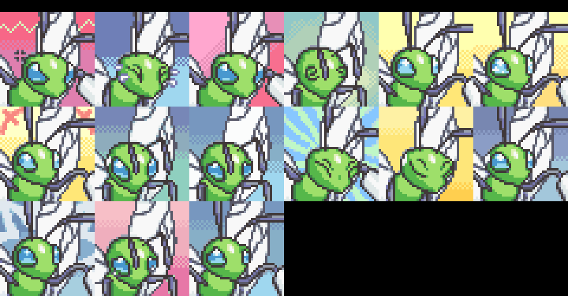
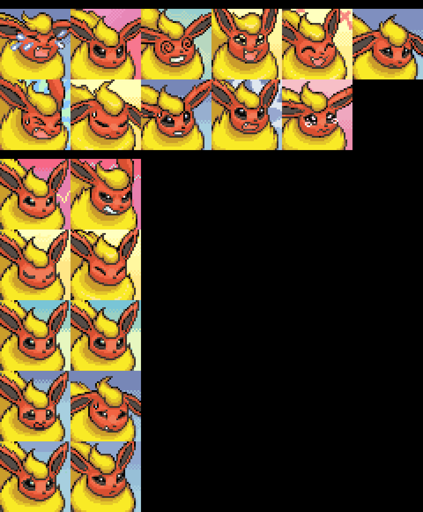
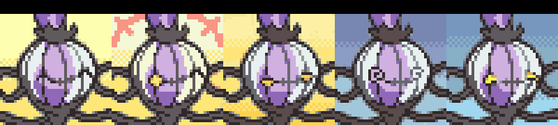

Title: news about mystery dungeon rom-hacking from 19/04/2021 to 25/04/2021
Date: 2021-04-25
Description: explorer of skies, patch for experiences share, new portraits and a lot of sprites

Did I missed anything ? feel free to [open a github issue](https://github.com/marius851000/pmd_hack_weekly/issues), contact me on discord at ``marius851000#2522``, send me a mail at ``mariusdavid@laposte.net``, or send me a message from an activitypub compatible service (mastodon) at ``marius851000@framapiaf.org``.

# explorer hacking
## hacks
### Explorers of sunlight
- Wyvernagon/Serpentriss made a [menu art](twitter.com/DonkinDo/status/1385145682739224578) for the hack. (the full picture can be seen in the linked tweet or [this reddit post](https://www.reddit.com/r/MysteryDungeon/comments/mw0gq8/i_made_an_art_trade_with_a_cool_friend_of_mine/)).

### Skyhard
Update: A special cutscene is almost complete! (legit 2 things left to do)

Work on Post-Game soon to be in progress! (You'll hate love what ideas i've come up with!)

Still missing portraits for: meditite/shuppet/shieldon/ponyta/spearow/combee/seedot... (If some amazing portrait drawers could get work done with that i'd be ever greatful)

### [explorer of skies](https://hacks.skytemple.org/h/skies)
It's been two weeks since the last update and I have a new one ready! This is the biggest mechanically game-changing update yet!

It features:
- New moves with custom animations!
- 10+ new Fairy Type moves
- 7 Brand-Spanking new TMs
- Weather Trio signature moves (Origin Pulse, Precipice Blades and Dragon Ascent)
- Moves from future generations (Bulldoze, Petal Blizzard, High Horsepower, etc.)
- Unused moves like Excavate and Spin Slash.
- Revamped Rank-Up Rewards
- Chikorita, Phanpy and Bulbasaur buffs
- Move buffs, nerfs and changes
- New custom frames
- And bug fixes

I put a lot of time into this update in particular and I hope you enjoy!

*link added by newsletter author*

- [changelog link](https://projectpokemon.org/home/applications/core/interface/file/attachment.php?id=48801) (as long as usual)
- [patch download link](https://projectpokemon.org/home/applications/core/interface/file/attachment.php?id=48802)
- [project pokemon page](https://projectpokemon.org/home/forums/topic/58401-pokemon-mystery-dungeon-explorers-of-skies/)

## skytemple-files
- Irdkwia [fixed the AddExperienceSharePatch](https://github.com/SkyTemple/skytemple-files/pull/109)
  - Prevents the Special Episode team (slots 2 to 4) from gaining exp when not in special episode
  - Joy Seeds / Golden Seeds at Spinda bar now adds 1/5 levels to the actual level the Pokémon should have from its current exp. and levels up the Pokémon to that level instead of just giving plain 1/5 levels and resetting their exp. points to that level

## SpriteCollab
### new sprites and portrait

- Someone with the (discord) id <@!299261889169588246> added 15 portrait for Beedrill  Shiny

- Mojo added 15 portrait for Jigglypuff  Shiny

- baronessfaron added 11 and changed the Angry, Happy, Normal, Pain and Worried portraits for Flareon

- [0palite](https://zeropalart.tumblr.com/) added 15 and changed the Normal portraits for Typhlosion

- [Noivern](https://twitter.com/notarealnoivern) changed the Normal portrait for Wooper Beta

- [Noivern](https://twitter.com/notarealnoivern) added the Normal portrait for Wooper Beta

- [DonkinDo](https://twitter.com/DonkinDo) added 22 and changed 11 sprites kinds for Larvitar
- [Emmuffin](https://twitter.com/Ernmuffin) added 16 and changed the Normal portraits for Larvitar

- [DonkinDo](https://twitter.com/DonkinDo) added 22 and changed 11 sprites kinds for Larvitar  Shiny
- [Emmuffin](https://twitter.com/Ernmuffin) added 16 portrait for Larvitar  Shiny

- Someone with the (discord) id <@!177522243985866754> added 13 sprite kind for Lugia Shadow
- Mr_L added 13 sprite kind for Lugia Shadow Shiny
- [0palite](https://zeropalart.tumblr.com/) added the Happy and Joyous and changed the Normal portraits for Crawdaunt

- [0palite](https://zeropalart.tumblr.com/) added the Happy and Joyous portrait for Crawdaunt  Shiny

- Mojo added 15 and changed the Normal portraits for Happiny

- Mojo added 15 portrait for Happiny  Shiny

- [Wyvernagon](https://twitter.com/Z_Serpentriss) added 11 sprite kind for Stoutland
- [DonkinDo](https://twitter.com/DonkinDo) added 14 sprite kind for Audino
- Someone with the (discord) id <@!340299853345325056> added the Happy, Joyous, Sigh, Stunned and Worried portrait for Chandelure

- baronessfaron added the Normal portrait for Flabebe

- [Emmuffin](https://twitter.com/Ernmuffin) added 34 sprite kind for Skiddo
- [NeroIntruder](https://twitter.com/NeroIntruder) added 35 sprite kind for Espurr
- [NeroIntruder](https://twitter.com/NeroIntruder) added 13 sprite kind for Meowstic
- [NeroIntruder](https://twitter.com/NeroIntruder) added 13 sprite kind for Meowstic Female
- baronessfaron added the Normal portrait for Spritzee

- baronessfaron added the Normal portrait for Diancie

- [DonkinDo](https://twitter.com/DonkinDo) changed 16 portrait for Rockruff

- [Emmuffin](https://twitter.com/Ernmuffin) added 34 sprite kind for Fomantis
- [DonkinDo](https://twitter.com/DonkinDo) added 11 and changed the Angry, Happy, Normal, Pain and Worried portraits for Steenee

- [Emmuffin](https://twitter.com/Ernmuffin) added 10 sprite kind for Sandygast
- [Smalusion](https://twitter.com/Smalusion) added the Attack, Idle and Walk sprite kind for Thievul
- [DonkinDo](https://twitter.com/DonkinDo) added 22 sprite kind for Wooloo
- [DonkinDo](https://twitter.com/DonkinDo) added 11 sprite kind for Applin
- [DonkinDo](https://twitter.com/DonkinDo) added 12 sprite kind for Cursola
