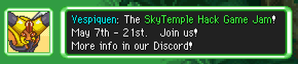
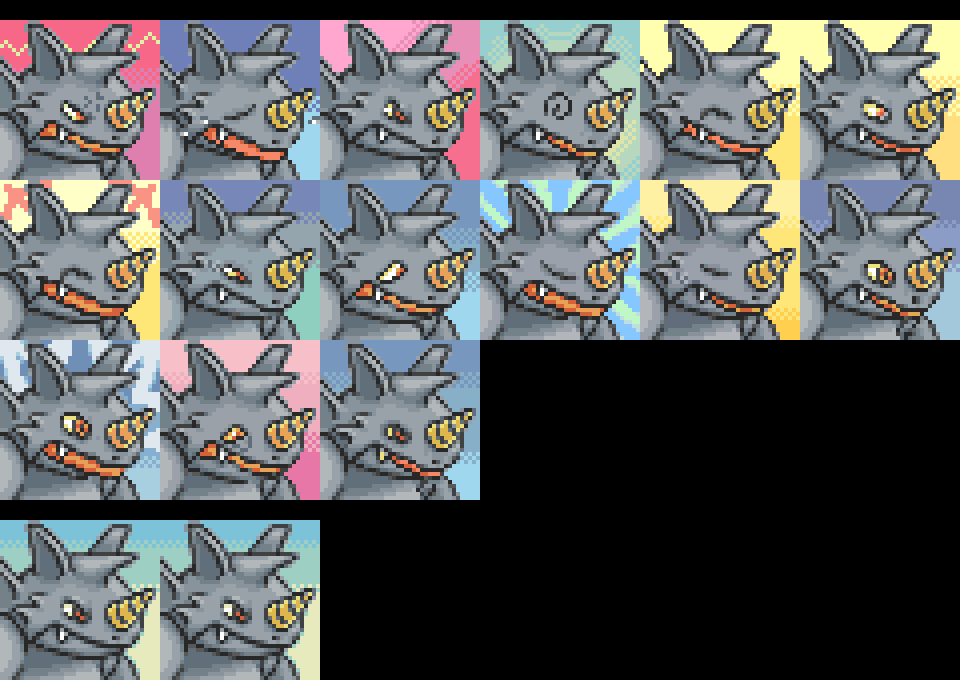
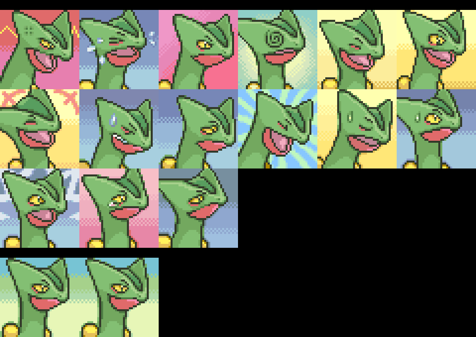
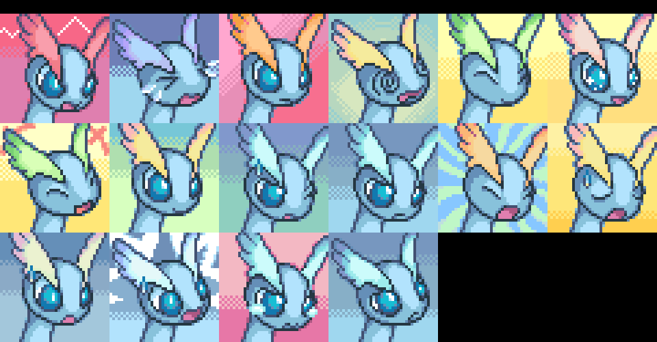
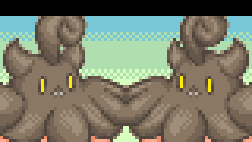

Title: news about mystery dungeon rom-hacking from 25/04/2021 to 02/05/2021
Date: 2021-05-02
Description: skytemple 1.2.0, hack jam, pmd retold, new sprites and portrait

Did I missed anything ? feel free to [open a github issue](https://github.com/marius851000/pmd_hack_weekly/issues), contact me on discord at ``marius851000#2522``, send me a mail at ``mariusdavid@laposte.net``, or send me a message from an activitypub compatible service (mastodon) at ``marius851000@framapiaf.org``.

# explorer hacking
## hacks
### [pmd retold](https://hacks.skytemple.org/h/retold)
- [episode 11 has been shared](https://www.youtube.com/watch?v=i9wzMgus1FM).

### Skyhard
- [a video presenting the WIP final boss cutscene has been shared](https://www.twitch.tv/videos/1000866636).

## skytemple 1.2.0
**New Features :**
- Localization! SkyTemple is now available in German and Spanish and partially in French. Thanks to our translators and thanks to @techticks for Mac fixes!
- There is now a 32-bit version of SkyTemple available. If possible we still recommend using the 64-bit build!
- Added editors for Item and for Move Properties
- Item and move effect ASM importing (thanks to @Irdkwia and to @techticks for the web editor!).

**New ASM Patches:**
- CompleteTeamControl (by @Cipnit). v. 1.2.3: Adds the ability to apply an updated version of "Complete Team Control" (allows you to control your team mates in dungeon) via SkyTemple. Comes with some additional utility patches.
- AddTypes / ImplementFairyGummies / ExtractBarItemList (by @Irdkwia): Patches to add a fairy type (or possibly a custom one) to the game
- ChooseStarter / SkipQuiz (by @Irdkwia): Patches to ask the player for their Pokémon to play as either after the test or instead of the test
- AddExperienceShare (by @Irdkwia): Adds Gates to Infinity-style experience share to the game
- FixEvolutionGlitch (NA only, by @Irdkwia): Fixes the evolution crash glitch on NA ROMs
- ExtraSpace (by @End): Base patch that provides more space for other patches to use
- ExtractDungeonData (by @Irdkwia): Base for editing rank and no mission properies on floors
- ExtractMoveCode / ExtractItemCode (by @Irdkwia): Base patches for item/move ASM importing

Also has a lot of smaller improvements and bugfixes.

Full changelog - with all new features, improvements and bugfixes at:
https://github.com/SkyTemple/skytemple/releases/tag/1.2.0

Download:
https://projectpokemon.org/home/files/file/4193-skytemple-pmd2-rom-edtior/

## skytemple hack jam
### announcement
*Parakoopa on the skytemple Discord*

**THE FIRST SKYTEMPLE HACK JAM!**

It's finally time! Join us in the first (of hopefully many) SkyTemple hack game jam!

It's time to come together to create some hacks - You can join alone or with a team and we can't wait to see what creative hacks you will create!

The jam will have a **topic** your hack has to interpret in a creative way. We will announce that once the jam starts.

**The jam will go two weeks from Friday May 7th 10AM MST to Friday May 21st 10AM MST.**

If you want to be notified of updates on game jams in the future, assign yourself the Hack Jam Update role ( trophy ) in #rules-and-roles  (I won't ping everyone again.)

If you have any questions, we have a new channel #hack-jam-discussion for questions and discussions around the jam.

[a short hack video presenting the event](https://www.youtube.com/watch?v=7ORr-DbBpVs).

### organisation sheet of Glasses Freek Jr

**So** -- hypothetically, if people like me or @Team Fire Spark over here (just realized how much clout he has, goddamn) were to jam it together, roles would still need to be delegated. Ideas will get fledged the fullest if team composition doesn't sway too far in one direction or the other. Can't have a team full of aspiring writers with not a coder or two between them, lol.

Ergo, I've created, like, **a spreadsheet for groups** that would list **members** together, their **areas of expertise**, and **what they're still looking for**. During my brief stint at Smogon Roleplay (yes, that was once a thing), people would make Google Docs for whatever game would be played next. Some of them were very well-formatted, I may add, and they payed dividends with regards to how much fun we had. Until Smogon banned roleplayers. Can't blame 'em.

Unless I've grossly misjudged the slap-together nature of a ROM Hack Game Jam, I figured it would help to be smart about this sort of thing. If this is, like, metagaming or something I'll get rid of it.

[https://docs.google.com/spreadsheets/d/1kdLwc8vDgraoHK5oaPfjeEs8J1e8cNrpM1gmLcb373M/edit?usp=sharing](https://docs.google.com/spreadsheets/d/1kdLwc8vDgraoHK5oaPfjeEs8J1e8cNrpM1gmLcb373M/edit?usp=sharing)

## skytemple
- [some work where made](https://github.com/SkyTemple/skytemple/commit/1ba46b1e80af7e6a0eee50f24bf1800e32654f70) on [locale detection](https://github.com/SkyTemple/skytemple/pull/250)
- [There are now categories for patches](https://github.com/SkyTemple/skytemple/pull/251)
- [some other](https://github.com/SkyTemple/skytemple/pull/252) macos [fixes](https://github.com/SkyTemple/skytemple/pull/253) from tech-ticks
- [a fixe was made for zero check in spawn height](https://github.com/SkyTemple/skytemple/pull/255) by End45.
- [logic to automatically apply dependant patch has been added](https://github.com/SkyTemple/skytemple/commit/18b3cf16137667290dcef20e530bfc13a0166c3c)
- [banner for event are now displayed, like the one for the Jam](https://github.com/SkyTemple/skytemple/commit/40601db8013e113843c59cffb3e610624c41f88c)
- [version is now 1.2.0](https://github.com/SkyTemple/skytemple/commit/4b4199a36e6bd8d54df69c558b6709eda73a3435)

## skytemple-files
- [Inner change, that add categories to patches](https://github.com/SkyTemple/skytemple-files/pull/110)
- [Background change, that would allow to download a banner from internet](https://github.com/SkyTemple/skytemple-files/commit/a950929974c109a14182d5cb999f65ae4918aa96)

## skytemple-ssb-debugger
- [skytemple-ssb-debugger was updated to version 1.2.0 (with no other change, like most of the other version upgrade this week)](https://github.com/SkyTemple/skytemple-ssb-debugger/commit/39729d6626ae1d8f2125069b9bcea078aa35725a)

## skytemple-dtef
- [skytemple-dtef was updated to version 1.1.2](https://github.com/SkyTemple/skytemple-dtef/commit/0a1c21eefc733116b91687ffb80bdc3e85e52514)

## skytemple-icons
- [Some change were made on moves and items icons](https://github.com/SkyTemple/skytemple-icons/commit/c7093d541f179b54f17ff1db7dfad0de21389ca3)
- skytemple-icons went to version 1.2.0

## ExplorerScript
- [The ExplorerScript library version is now 0.1.1](https://github.com/SkyTemple/ExplorerScript/commit/48d260fe363b3e5cf5cab2e9371199324dadb5a4)

## other
- Parakoopa shared his [referal link](https://m.do.co/c/1bff6d6dff1a) for DigitalOcean, where you can get a $100 in credit with the link (should be spent within the first two month) (small web servers, like those he use to host skytemple.org, cost $5/month)
If you have questions about DigitalOcean, you can also ask him via DM (Parakoopa#6987).

## SpriteCollab
### new sprites and portrait
- [DonkinDo](https://twitter.com/DonkinDo) added 11 sprite kind for Farfetch_d Galar
- [DonkinDo](https://twitter.com/DonkinDo) added 15 and changed the Normal portraits for Rhydon   Female

- [0palite](https://zeropalart.tumblr.com/) added 15 and changed the Normal portraits for Sceptile

- [0palite](https://zeropalart.tumblr.com/) added the Normal portrait for Sceptile Mega

- baronessfaron added the Normal and Normal^ portrait for Swirlix

- [Emmuffin](https://twitter.com/Ernmuffin) added 16 portrait for Amaura

- baronessfaron added the Normal portrait for Carbink

- baronessfaron added the Normal portrait for Phantump

- baronessfaron added the Normal and Normal^ portrait for Pumpkaboo

- [Emmuffin](https://twitter.com/Ernmuffin) added 34 sprite kind for Fomantis  Shiny
- [Emmuffin](https://twitter.com/Ernmuffin) added 10 sprite kind for Sandygast  Shiny
- [EzerArt](https://twitter.com/EzerArt_) added the Normal portrait for Cursola

