Title: news about mystery dungeon rom-hacking from 3/05/2021 to 9/05/2021
Date: 2021-05-03
Description: explorers of hell and abridged, hack jam theme, commisions, skytemple 1.2.1, 2 guides, git, new sprites and portraits.

Did I missed anything ? feel free to [open a github issue](https://github.com/marius851000/pmd_hack_weekly/issues), contact me on discord at ``marius851000#2522``, send me a mail at ``mariusdavid@laposte.net``, or send me a message from an activitypub compatible service (mastodon) at ``marius851000@framapiaf.org``.

# explorer hacking
## hacks
### explorers of hell
*by babou on his server*

Hi everyone here is some news about **<u>Pokemon Mystery Dungeon : Explorers of Hell</u>**. The game is progressing very well, the release could be around <u>September</u>.

- The **Fairy type** and the new weaknesses to the steel type from the 6th generation have been added.

- **New Pokemon** : Arceus, Vulpix Alola (starter), Ninetales Alola and Sylveon.

- Some pokemon will be able to appear **shiny** and will be recruitable. They will be available on a single floor of some dungeons. There are **10** : Umbreon, Metagross, Gardevoir, Charizard, Sableye, Flygon, Luxray, Milotic, Magikarp, Gyarados.

- The effect of some attacks has been **changed**. For example, Air Slash hits the whole room, Knock Off deals damage, Howl affects all allies, and many other changes and adjustments.

- The purchase and sale prices of some items have been changed. For example, the Reviver Seed will cost 1200 instead of 800. 

- In some dungeons, if a Pokemon knocks out one of your allies, it will **evolve**.

- You will be able to **freely** change your starter after the personality quiz if you don't like it. 

- A lot of other new features are coming, to follow all this, go to **[the server](https://discord.com/invite/ryT6ZtSBcg)**

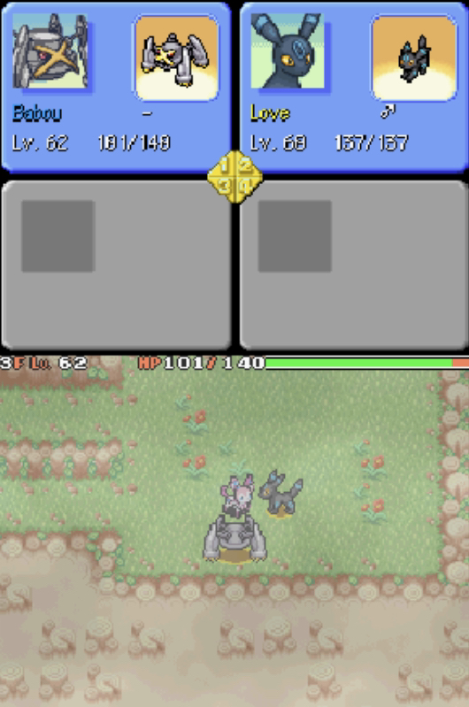

### [Explorers Abridged](https://hacks.skytemple.org/h/abridged)
A [video of the chapter 4](https://www.youtube.com/watch?v=b-yTD8Xhscs) was shared.

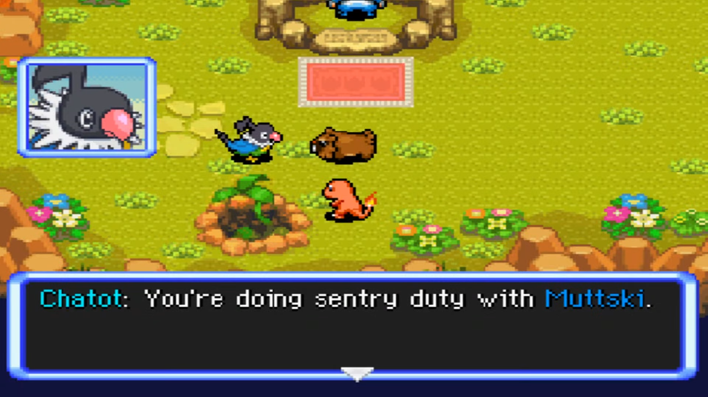

## skytemple community
- There is now a skytemple [tweeter account](https://twitter.com/SkyTemplePMD)

## skytemple hack jam
*TLDR: the topic is **An Unlikely Team** with the gimmick **Have a Pokémon not present in the base game take an important role**.*

Deadline is **May 21st 4pm UTC**.

**Submissions rules**:
- Only submit when you are done. Do not make any changes after submitting.
- Submissions must contain one XDelta patch for the **clean** US ROM (**not 'Xenophobia'!**) or clean EU ROM and must state for which region they are.
- Submissions must have a short description of what the hack is about.
- Submissions must either have one video showcasing the hack or three screenshots.
- Submissions must contain Discord mentions for all people that worked on the hack.
- Each person can only submit one hack.

**General Jam rules**:
- The topic of the jam is **An Unlikely Team**. We need to see this interpreted in your game somehow.
- The gimmick of this jam is **Have a Pokémon not present in the base game take an important role**. You should *really* try to include this in your game.
- There are multiple categories your hack can receive awards for (see below).
- A team of volunteers judges the hacks for each category.
- Hacks must be first submitted for the jam / made for it.
- There is no minimum length, but it must be playable, meaning by selecting "New Game" it starts.
- The games must be in English.

**Award categories**:
- Best Hack
- Best Use of Topic
- Best Use of Gimmick
- Best Gameplay
- Best Narrative
- Best Cutscene
- Best Dungeon Design
- Best Custom Graphics
- Most Unique / Creative

**Prize**:
Each award is worth 30GP; "Best Hack" is worth 60GP.

## commisions

- emmuffin#2837 shared her commision sheet
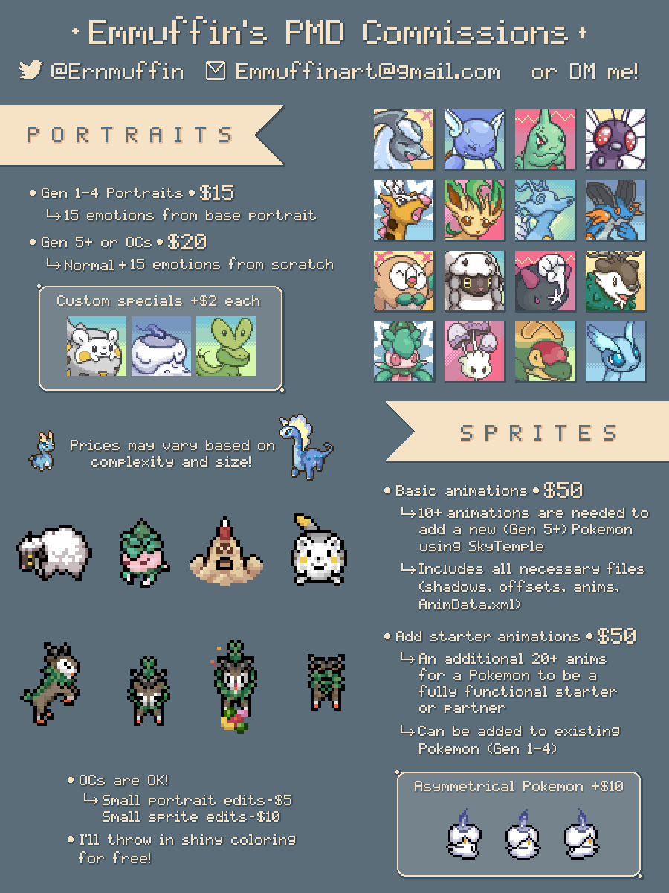

### While I'm here, and paid work is a serious subject, I'll also put older commition sheet :
#### Smalusion#3531
Extra notes:
- Portraits for a Pokemon with an existing Normal portrait are $12 each. 
- Giving an existing Pokemon the full set of animations a normal starter has would be around $300. This includes all 22 animations, offsets, and the xml file. It's a lot of work!
- Questions? Feel free to message me

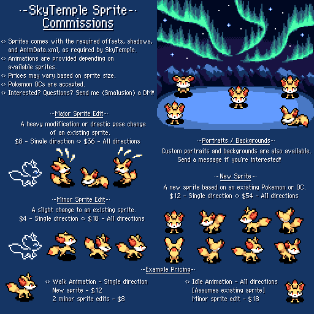

### DunkingDucks#9030 (aka DonkinDo)
Well, i do spriting, i'm more experienced in FE and PMD but if need something else, can help (with reduced price of course, because of the inexperience)
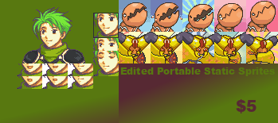
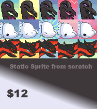
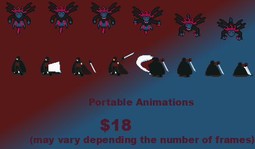

### Wyvernagon#8227 (aka Triss/Wyverna)
PMD Body Sprites 35$/ PMD Portrait Sprites $30
[twitter thread commision link](twitter.com/z_serpentriss/status/1331529371899727875?s=21#m)

*I was unable to find a commision sheet, so instead here you have one of her spritesheet*
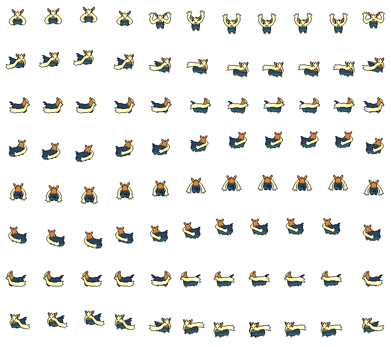

## rom hacking via git
marius851000 (that's me) made a tool that allow you to use git for collaboration on pmd rom-hacking. [youtube video guide](https://www.youtube.com/watch?v=Oj3ehSf2bB8)

## guide
*MaxSchersey made two video guide.*
New tutorials up for the hack jam! Since you'll be adding a new Pokemon to the game in this one, [I made a video on how to do that](https://www.youtube.com/watch?v=ecx8CUkO1rA).

And also [how to create custom start/end points](https://www.youtube.com/watch?v=t6TS441onrI). Very helpful for differentiating from the standard Explorers of Sky boundaries.

## skytemple version 1.2.1 released
Download: [https://projectpokemon.org/home/files/file/4193-skytemple-pmd2-rom-edtior/](https://projectpokemon.org/home/files/file/4193-skytemple-pmd2-rom-edtior/)

**Bugfixes**:
- Fixed corruption of the portrait file when deleting portraits (thanks to @Irdkwia)
- Fixed that the exclusive properties for the first item weren't editable (thanks to @Irdkwia)
- Fixed Discord Presence for Item and Move Editors
- Fixed Poké and Link Boxes not being added correctly to item lists when their categories were added
- Mac: Fixed DeSmuME not working
- Fixed export of floors creating invalid files & copy to other floors not working

*the following librairies where also bumbed:*
- *skytemple-ssb-debugger to 1.2.1*
- *skytemple-files to 1.2.2*

## asmeditor
Asmeditor has been updated to version 0.2.2.
- The type and value range of default values of variables is now validated
- All integer values can now be used as constant inputs (previously, only values that could be represented as bit-shifted intermediates could be used)

## SpriteCollab
### new sprites and portrait
- [Miju](https://mobile.twitter.com/MijumewAndCo) added the Determined, Special0 and Surprised and changed the Angry, Happy, Normal and Pain portraits for Blastoise

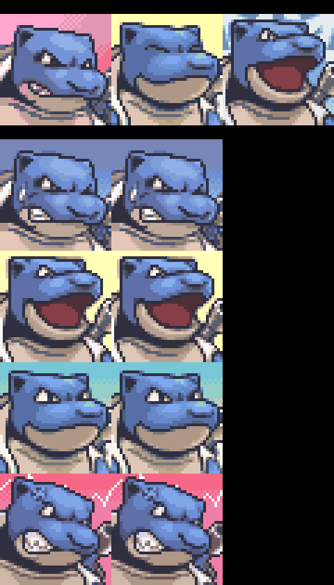
- [DonkinDo](https://twitter.com/DonkinDo) added 22 and changed 11 sprites kinds for Farfetch_d Galar
- [DonkinDo](https://twitter.com/DonkinDo) added 11 sprite kind for Farfetch_d Galar
- [DonkinDo](https://twitter.com/DonkinDo) added 15 and changed the Normal portraits for Rhydon   Female

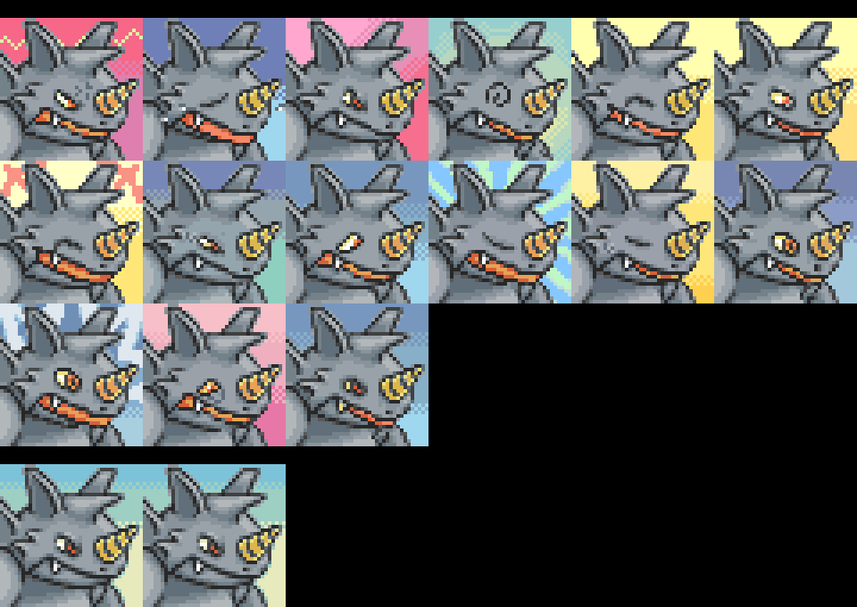
- ["motherhenna(Helen)"](<@!543717476421074945>) added 15 and changed the Normal portraits for Jolteon

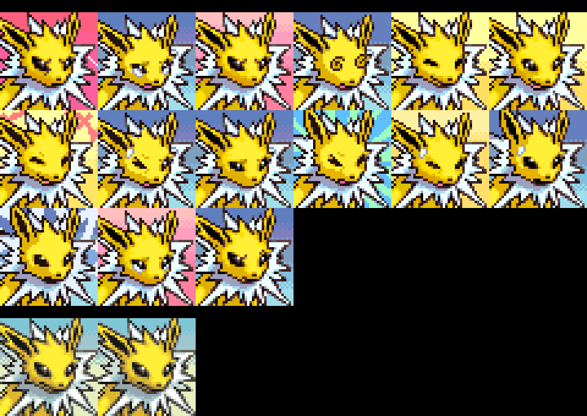
- CamusZekeSirius changed 17 portrait for Ho_Oh  Shiny

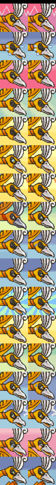
- [0palite](https://zeropalart.tumblr.com/) added 15 and changed the Normal portraits for Sceptile

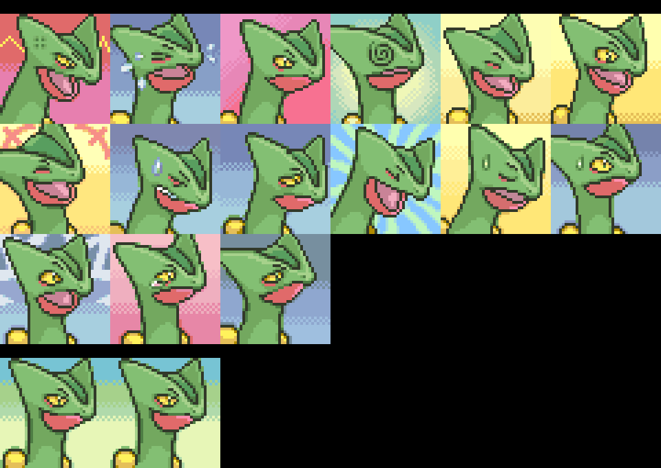
- [0palite](https://zeropalart.tumblr.com/) added the Normal portrait for Sceptile Mega

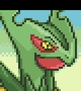
- [CHUNSOFT](https://www.spike-chunsoft.com/) added 21 sprite kind for Dialga Primal
- CamusZekeSirius changed 17 portrait for Giratina  Shiny

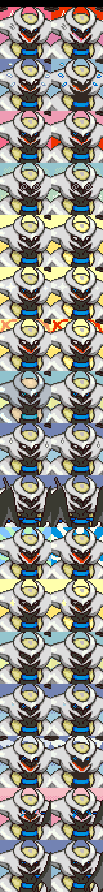
- CamusZekeSirius changed 17 portrait for Giratina Origin Shiny

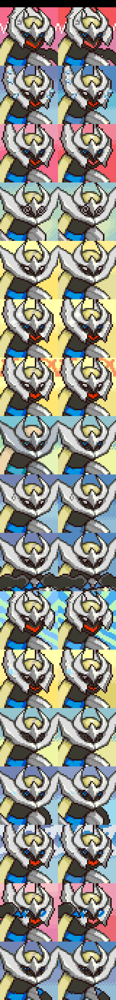
- [DonkinDo](https://twitter.com/DonkinDo) added 17 and changed the Normal portraits for Gothorita

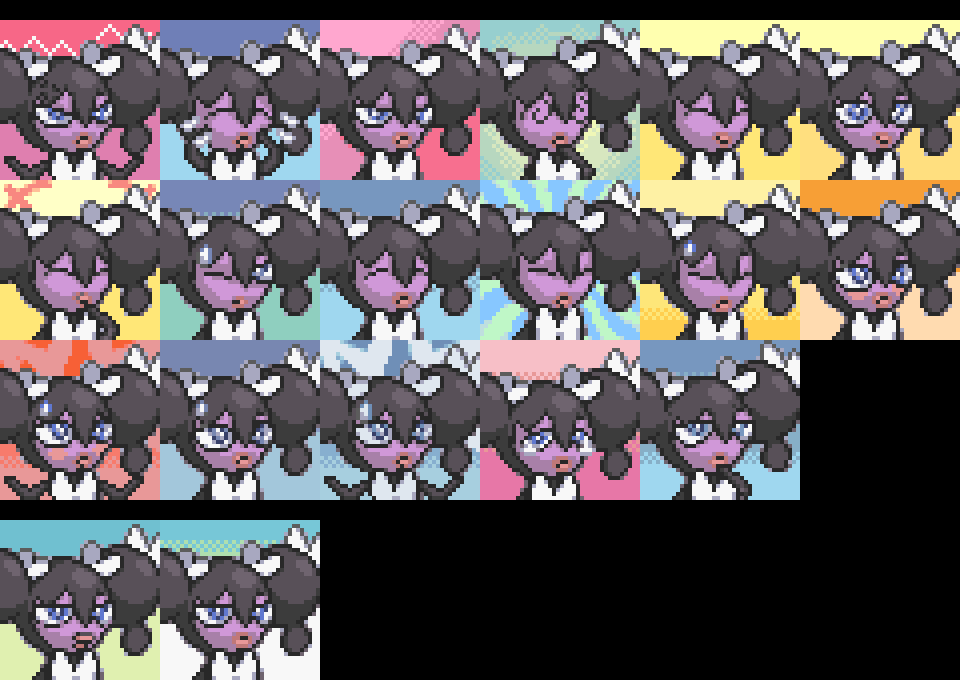
- [DonkinDo](https://twitter.com/DonkinDo) added 13 sprite kind for Axew
- [Emmuffin](https://twitter.com/Ernmuffin) changed 34 sprite kind for Skiddo
- [Emmuffin](https://twitter.com/Ernmuffin) added 34 sprite kind for Skiddo  Shiny
- [Aviivix](Aviivix#2695) added the Normal portrait for Furfrou

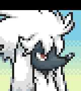
- baronessfaron added the Normal and Normal^ portrait for Swirlix

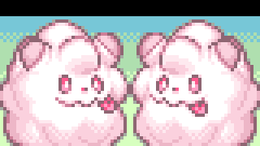
- [Emmuffin](https://twitter.com/Ernmuffin) added 16 portrait for Amaura

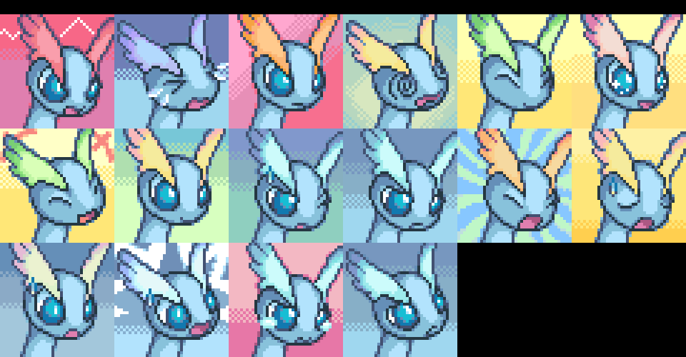
- [Emmuffin](https://twitter.com/Ernmuffin) added 16 portrait for Amaura  Shiny

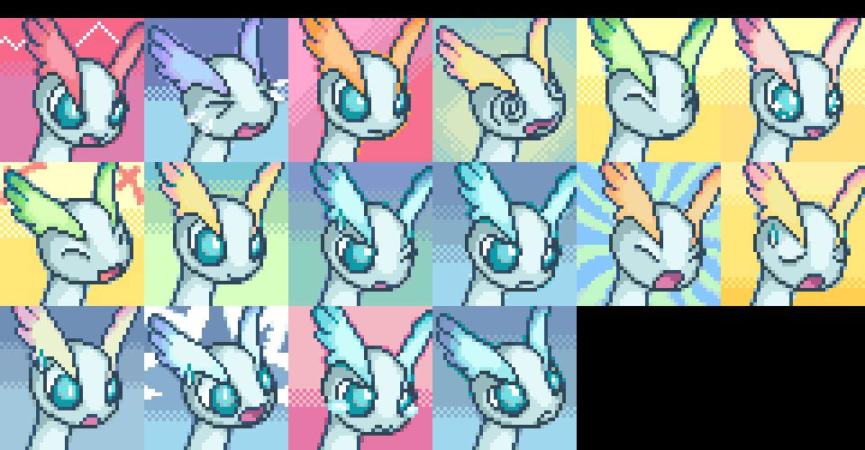
- [Emmuffin](https://twitter.com/Ernmuffin) added 16 portrait for Aurorus

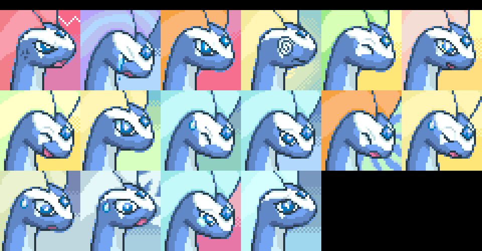
- baronessfaron added the Normal portrait for Phantump

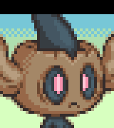
- baronessfaron added the Normal and Normal^ portrait for Pumpkaboo

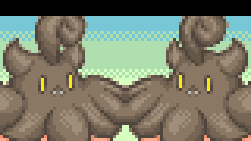
- [Aviivix](Aviivix#2695) added the Normal portrait for Toucannon

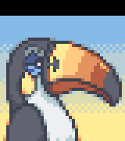
- [Aviivix](Aviivix#2695) added the Normal portrait for Mareanie

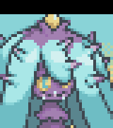
- [Emmuffin](https://twitter.com/Ernmuffin) added 34 sprite kind for Fomantis  Shiny
- [Emmuffin](https://twitter.com/Ernmuffin) added 10 sprite kind for Sandygast  Shiny
- [DonkinDo](https://twitter.com/DonkinDo) added the Normal portrait for Kartana

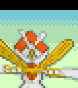
- [EzerArt](https://twitter.com/EzerArt_) added the Normal portrait for Cursola

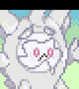
- CamusZekeSirius added 17 and changed the Normal portraits for Regieleki

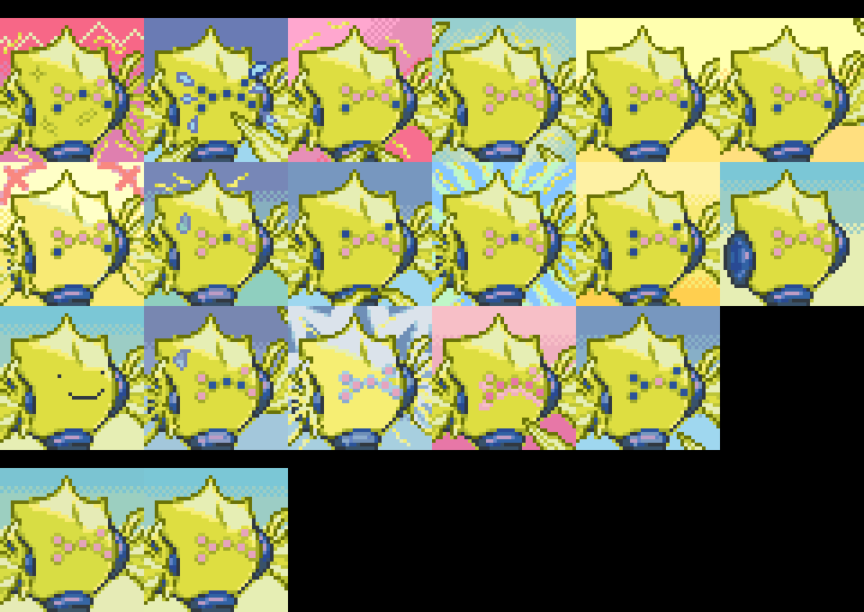
- CamusZekeSirius added 18 portrait for Regieleki  Shiny

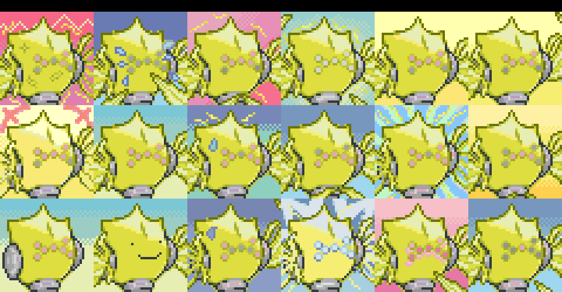
