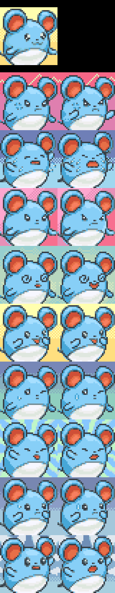

Title: News About Mystery Dungeon ROM-Hacking from 10/05/2021 to 16/05/2021
Date: 2021-05-16
Description: Exploradores dos Céus, hack jam timeline extended, many patches including "**Extend the Number of Pokémon entries**", and new sprites and portraits!

Did I miss anything? Feel free to [open a github issue](https://github.com/marius851000/pmd_hack_weekly/issues), contact me on Discord at ``marius851000#2522``, send me an email at ``mariusdavid@laposte.net``, or send me a message from an ActivityPub-compatible service (Mastodon) at ``marius851000@framapiaf.org``.

Proofread by Aviivix

# Explorers Hacking
## Hacks
### [Exploradores dos Céus - New Updates!](https://hacks.skytemple.org/h/exploradores)
> Update! It's been some months but finally something came out that we can call progress!

> Last time around most translations were messy and quite bad, revamped chapter 1 and 2, did chapter 3 and 4 (including the full feet gatekeeper minigame!). Dungeon and some extra dialogue (like saving dialogue) are still not translated, but probably will be my aim after chapter 5 is done. Inconsistencies have mostly (if not all of them) removed, and gender issues fixed. Personality test is fully translated now! (It was last time, just forgot to add it "^^). Thank you, and enjoy!

[Patch Download Link](https://cdn.discordapp.com/attachments/769498453126283274/841370051810689044/patch_05-10-2021v2.xdelta)

## SkyTemple Hack Jam - Extended Deadline
The hack jam is still ongoing!

As a reminder, the topic is "**An Unlikely Team**" with the gimmick, "**Have a Pokémon not present in the base game take an important role**."

Deadline has been extended to **May 28th 4pm UTC** (one extra week).

## SkyTemple - Tons of New Patches!
- A [patch was added by irdkwia](https://github.com/SkyTemple/skytemple-files/pull/107), allowing accuracy and power to be displayed as bars instead of stars.

- [Another patch from irdkwia](https://github.com/SkyTemple/skytemple-files/pull/104) changes how the game handles evolution internally:

  > Creates two lists for each Pokémon: one that tells what it can evolve into and what Pokémon it has for children (important for eggs). This eliminates some particular cases the game normally handles to know that.

  > Also gives the possibility to set individual stat bonuses for each Pokémon when it evolved (stats bonuses are the ones from the Pokémon you evolved into).
  
- [Yet another irdkwia patch](https://github.com/SkyTemple/skytemple-files/pull/116) is useful for interaction between binary patches and cutscene scripts:

  > Adds a patch to write custom ground engine special process code, in the same way as move and item effects.
- [Another merged change from irdkwia](https://github.com/SkyTemple/skytemple-files/pull/115) is a bugfix: 
  > ExtractDungeonData was overwriting 4 bytes of one of the hardcoded item lists.

  > With this bug, when ExtractHardcodedItemLists was applied after ExtractDungeonData lists were incorrectly extracted, which would ultimately cause a crash when accessing them.

- [Another patch by you-know-who](https://github.com/SkyTemple/skytemple-files/pull/105) was added, permitting the waza_p file to not be entirely loaded in RAM. He says that, "This patch doesn't add anything on it's own, so it's useless in the current state."

  Use filestreams to access waza_p/waza_p2 data instead of loading them entirely.

  This depends on the ActorAndLevelLoader patch, as it needs some space provided by this one.

  *I suppose this is made to reduce ram usage of the game, allowing other patches to use more memory, or make a bigger waza file.*

- [Also](https://github.com/SkyTemple/skytemple-files/pull/106), the same thing was applied to the mappa file.

>  This patch currently only helps if the mappa file is too big to fit in RAM when loading it.

### [Finally, the patch everyone was waiting for!](https://github.com/SkyTemple/skytemple-files/pull/108) (also by irdkwia): Extend the Number of Pokémon entries
> EXPERIMENTAL! Always make a backup before there is a 99.99% chance I forgot something that will break the game and changes can't be reverted
> Tests are needed for almost everything in the game
> 
> If/When this works properly, extends the number of possible Pokémon slots from 600 entries with 2 possible forms to 2048 independent entries
> Tries to maintain consistency upon applying the patch, this includes:
> 
> [ASM]:
> 
> - all the data access function for movesets, monster properties and portraits have been changed to work with the new system
> - special monster personalities have been moved after the new entries
> - special fixed floor monster IDs have been moved after the new entries IDs
> - the code that spawned 2nd forms in even floors has been removed
> - missions and Spinda bar can theoretically spawn new entries: unused flags in monster.md were turned into flags that sets mission attributes for each Pokémon
> - recruitment search menu looks for the new entries
> - the Adventure Log functions looks for the new Pokédex IDs up to 1184
> 
> [Files]:
> - waza_p.bin/waza_p2.bin movesets are extended and slots that where originally 2nd forms have a copy of the 1st form movesets
> - same for m_level.bin level curves
> - tbl_talk.tlk is also extended to contain new entries personalities
> - kaomado is extended and missing portraits for 2nd forms are filled with 1st forms when available
> - Pokémon Names and Categories have been moved to the end of the *.str files
> - the newly md_evo.bin created file from patch 104 (the patch for the evolution change) is also extended for new entries evolutions
> - special Pokémon indices (>=1155) for fixed floor properties have been moved
> - mappa_s.bin is reworked to explicitly contain female entries if they are valid on even floors, like they used to
> - obviously, monster.md is extended to contain more entries; also, the hardcoded arm9 table MonsterSpriteData that contained dungeon sprite size and sprite file size values have been moved to the unk17 unk18 properties of that file (which are unused/don't have any code to access them); property entid now contains the id of the 1st form of an entry, used for many checks in the game (was unused)

## SpriteCollab
### Sprites and Portraits
- [Miju](https://mobile.twitter.com/MijumewAndCo) added the Determined, Special0 and Surprised and changed the Angry, Happy, Normal and Pain portraits for Blastoise

- [DonkinDo](https://twitter.com/DonkinDo) added 22 and changed 11 sprites kinds for Farfetch_d Galar
- [DonkinDo](https://twitter.com/DonkinDo) added 11 sprite kind for Farfetch_d Galar
- [DonkinDo](https://twitter.com/DonkinDo) added 15 and changed the Normal portraits for Rhydon   Female

- dmDash added 22 and changed 12 sprites kinds for Jolteon
- ["motherhenna(Helen)"](<@!543717476421074945>) added 15 and changed the Normal portraits for Jolteon

- Someone with the (discord) id <@!801938240562397194> added the Special1 and changed 9 portraits for Marill

- Fearless-Quit added the Special0 and Special1 portrait for Corsola

- CamusZekeSirius changed 17 portrait for Ho_Oh  Shiny

- [0palite](https://zeropalart.tumblr.com/) added 15 and changed the Normal portraits for Sceptile

- [0palite](https://zeropalart.tumblr.com/) added the Normal portrait for Sceptile Mega

- [Murpi](https://twitter.com/murpia57?s=06) added 15 and changed the Normal portraits for Combusken   Female

- Someone with the (discord) id <@!801938240562397194> changed 13 portrait for Surskit

- [CHUNSOFT](https://www.spike-chunsoft.com/) added 14 sprite kind for Kecleon Purple
- [Deleca7755](Deleca7755#2927) changed 31 portrait for Drifloon Altcolor

- [frostibirb](https://www.reddit.com/user/WinterWyv/) changed 32 portrait for Buneary

- [DonkinDo](https://twitter.com/DonkinDo) added 14 and changed the Angry, Normal, Pain and Surprised portraits for Weavile

- [DonkinDo](https://twitter.com/DonkinDo) added 14 and changed the Angry, Normal, Pain and Surprised portraits for Weavile  Shiny

- [CHUNSOFT](https://www.spike-chunsoft.com/) added 21 sprite kind for Dialga Primal
- CamusZekeSirius changed 17 portrait for Giratina  Shiny

- CamusZekeSirius changed 17 portrait for Giratina Origin Shiny

- baronessfaron added 15 and changed the Normal portraits for Audino

- [DonkinDo](https://twitter.com/DonkinDo) added 12 sprite kind for Gothorita
- [DonkinDo](https://twitter.com/DonkinDo) added 17 and changed the Normal portraits for Gothorita

- [DonkinDo](https://twitter.com/DonkinDo) changed 22 sprite kind for Vanillite
- Someone with the (discord) id <@!340299853345325056> added the Crying, Happy, Sad, Sigh and Stunned portrait for Vanillish

- [DonkinDo](https://twitter.com/DonkinDo) added 13 sprite kind for Axew
- [powercristal](https://www.deviantart.com/powercristal) added 12 sprite kind for Mandibuzz
- [Smalusion](https://twitter.com/Smalusion) changed the Shoot sprite kind for Fennekin
- [Emmuffin](https://twitter.com/Ernmuffin) changed 16 portrait for Fennekin

- [Smalusion](https://twitter.com/Smalusion) removed the Special3 portrait for Fennekin

- [Emmuffin](https://twitter.com/Ernmuffin) added 15 sprite kind for Fennekin  Shiny
- [Emmuffin](https://twitter.com/Ernmuffin) changed 16 portrait for Fennekin  Shiny

- Meganai removed the Special3 portrait for Fennekin  Shiny

- [Smalusion](https://twitter.com/Smalusion) added 17 portrait for Fennekin Alternate

- [Emmuffin](https://twitter.com/Ernmuffin) changed 34 sprite kind for Skiddo
- [Emmuffin](https://twitter.com/Ernmuffin) added 34 sprite kind for Skiddo  Shiny
- [Aviivix](Aviivix#2695) added the Normal portrait for Furfrou

- [Emmuffin](https://twitter.com/Ernmuffin) added 16 portrait for Amaura

- [Emmuffin](https://twitter.com/Ernmuffin) added 16 portrait for Amaura  Shiny

- [Emmuffin](https://twitter.com/Ernmuffin) added 16 portrait for Aurorus

- [Emmuffin](https://twitter.com/Ernmuffin) added 16 portrait for Aurorus  Shiny

- baronessfaron added the Normal portrait for Phantump

- baronessfaron added the Normal and Normal^ portrait for Pumpkaboo

- [Aviivix](Aviivix#2695) added the Normal portrait for Toucannon

- baronessfaron added the Normal portrait for Ribombee

- [Aviivix](Aviivix#2695) added the Normal portrait for Mareanie

- [Emmuffin](https://twitter.com/Ernmuffin) added 34 sprite kind for Fomantis  Shiny
- [DonkinDo](https://twitter.com/DonkinDo) added 11 sprite kind for Steenee
- [Emmuffin](https://twitter.com/Ernmuffin) added 10 sprite kind for Sandygast  Shiny
- [DonkinDo](https://twitter.com/DonkinDo) added the Normal portrait for Kartana

- baronessfaron added the Normal and Normal^ portrait for Hatterene

- [EzerArt](https://twitter.com/EzerArt_) added the Normal portrait for Cursola

- CamusZekeSirius added 17 and changed the Normal portraits for Regieleki

- CamusZekeSirius added 18 portrait for Regieleki  Shiny

