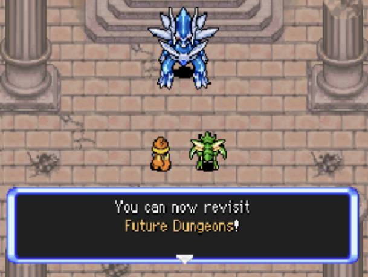
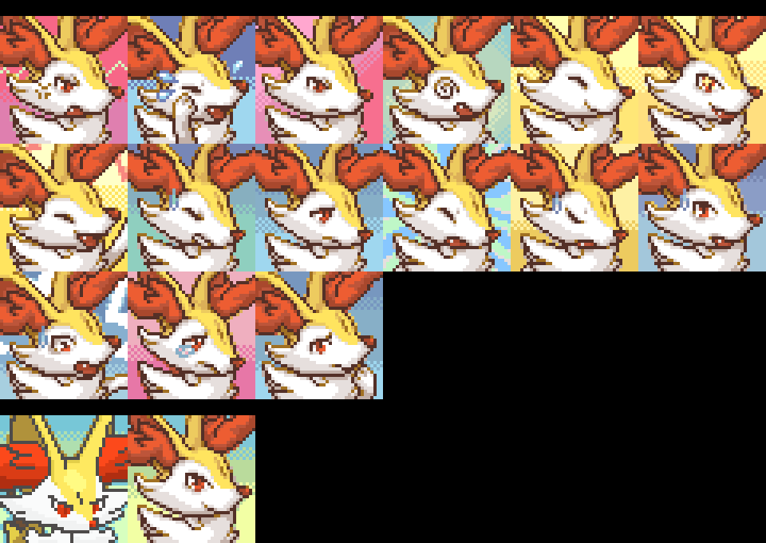

Title: news about mystery dungeon rom-hacking from 17/05/2021 to 23/05/2021
Date: 2021-05-23
Description: New Explorers of Skies release, progress on Explorers of Hell, bugfix skytemple release, new sprites and portraits

Did I miss anything? Feel free to [open a github issue](https://github.com/marius851000/pmd_hack_weekly/issues), contact me on Discord at ``marius851000#2522``, send me an email at ``mariusdavid@laposte.net``, or send me a message from an ActivityPub-compatible service (Mastodon) at ``marius851000@framapiaf.org``.

# Explorers Hacking
## Explorers of Hell - Progress update
> Hello everyone ! Here is some news about Pokemon Mystery Dungeon: Explorers of Hell. 
>
> - After recruiting Dialga and Palkia, you will be able to revisit the Future Dungeons and The Nightmare (Azurill's Brain in PMD: Hell) 
> - Arceus will be recruitable in the Destiny Tower (Tower of God in PMD: Hell)
> - New items will appear in the Kecleon store
> - The text speed has been multiplied by 4.
> - In the basic game, pokemons appear every 36 turns. Here, they will appear every 12 turns, so expect to face 3x more enemies in dungeons.
> - All moves have received some changes. Most have received a PP buff, and some have received nerfs. Here are some changes: 
> 
> ---
> - Air Slash hits the whole room 
> - Bullet Seed and Pin Missile no longer hit from a distance 
> - Thunder hits around the user like Thunderbolt 
> - Protect 10 PP -> 7 PP
> - Light Screen and Reflect have effect on all allies in the room 
> - Agility 22 PP -> 8 PP
> ---
> - A new dungeon : Shiny Resort, allowing you to see all news shinys without being able to recruit them 
> 
> And many other things! To be aware of new information or simply ask questions and interact, you can join the server : https://discord.com/invite/6QbPHYZDtg

## [Explorer of Skies](https://hacks.skytemple.org/h/skies) - new release
> This is by far Skies biggest update yet! It's hard to include everything with just a short hook, so make sure you read the changelogs this time!
> 
> New features:
> - Two new postpost game events
>   - Recruiting Dialga will allow you to revisit the Future -- Where you can find a Shiny Celebi!
>   - Recruiting Palkia will allow you to visit the "Far Away" dungeons
> - 7 New dungeons -- Enchanted Meadows, Nightfall Lake, Infested Forest, Prehistoric Preserve, Echo Park, Sunny Beach and Basalt Karst 
>   * All with unique themes with the intention of being a series of post-Dark Crater challenge dungeons that DON'T have special restrictions.
> - 5 new Pokemon (Technically 6):
>   * Victini
>   * Galarian Corsola
>   * Cursola
>   * Espurr
>   * Meowstic (Male and Female)
> - A new partner Pokemon -- Espurr -- Female Espurr replaces partner Skitty and Male Espurr replaces Meowth
> - A completely reworked Marowak Dojo system, should be balanced for all stages of the game.
> - Added a one-way quick tunnel from Sharpedo Bluff to Crossroads (Like in RTDX!)
> - Kangaskhan Rocks added into the Dojo Hub and Spinda Cafe
> - Graduating now unlocks all optional dungeons
> - Beating Dark Crater now unlocks all Seven Treasure dungeons
> - Increased text speed (By 4x!)
> - Purple Kecleon 
> - Updated move animations for brand new moves
> - Added weather abilities to Pokemon like Pelipper and Ninetales
> - Nerfed those pesky Perish Songs -- Only room wide instead of floor wide now!
> - Better Rescue Jobs in optional dungeons
> - Sped up Xatu's unboxing
> - Added helpful controls on the top screen for new players learning how to use Move Shortcuts and Complete Team Control
> - White frames!
> - A better looking changelog
> - LOTS of bug fixes
> 
> https://discord.gg/uTJPcg9sdZ

Here is the [link to the patch](https://projectpokemon.org/home/applications/core/interface/file/attachment.php?id=49036) and the [link to the changelog](https://projectpokemon.org/home/applications/core/interface/file/attachment.php?id=49035) (as long as usual).

The 3 first line of the changelog state :
> FYI: This is by far the biggest update yet. I would recommend restarting with a new save, however this isn't mandatory or won't cause major issues (Just delete the now blank Moonblast move from any Pokemon you've recruited that may have it)
> 
> Seriously, this is a BIG update. I really recommend reading the "New This Update" and "Bug Fixes" section. (Besides, I work hard on this thing)
> 
> Additionally, the reason this update took so long to get out is because I released the first half of it as a beta-test for my Discord members, thank you to everyone who beta tested and helped me fix important bugs before releasing such a massive update.

## SkyTemple Hack Jam - Still ongoing
The hack jam is still ongoing!

As a reminder, the topic is "**An Unlikely Team**" with the gimmick, "**Have a Pokémon not present in the base game take an important role**."

The last week, deadline were extended to **May 28th 4pm UTC** (one extra week).

## SkyTemple - Bugfixes and planning
> **SkyTemple 1.2.3**
> Download: https://projectpokemon.org/home/files/file/4193-skytemple-pmd2-rom-edtior/
> 
> Bugfixes:
> - Fixed a corruption bug when applying the patch ExtractHardcodedItemLists after ExtractDungeonData (thanks to Irdkwia)

Parakoopa also made an announcement targeting beta testers and skytemple contributors.
> Hey! I'm currently planning SkyTemple 2.2. I want to make it all about editing minor things you currently need a hex editor for + editing the level list.
>
> I made a project on Github:
> 
> [https://github.com/orgs/SkyTemple/projects/4](https://github.com/orgs/SkyTemple/projects/4)
> 
> Are there more things that I might have missed? Tell me here and I'll add them or create an issue on Github directly.

## SpriteCollab
### new sprites and portrait
- [Murpi](https://twitter.com/murpia57?s=06) added 15 and changed the Normal portraits for Rattata   Female

- ["motherhenna(Helen)"](<@!543717476421074945>) changed 7 portrait for Jolteon

- [Murpi](https://twitter.com/murpia57?s=06) added 15 and changed the Normal portraits for Ledyba   Female

- [Murpi](https://twitter.com/murpia57?s=06) added 15 and changed the Normal portraits for Ledyba  Shiny

- [Murpi](https://twitter.com/murpia57?s=06) added 15 portrait for Ledyba  Shiny Female

- [Murpi](https://twitter.com/murpia57?s=06) changed the Sigh portrait for Ledian   Female

- [Murpi](https://twitter.com/murpia57?s=06) added 15 and changed the Normal portraits for Ledian   Female

- [Murpi](https://twitter.com/murpia57?s=06) added 15 portrait for Ledian  Shiny Female

- [Murpi](https://twitter.com/murpia57?s=06) added 15 and changed the Normal portraits for Aipom   Female

- [Murpi](https://twitter.com/murpia57?s=06) added 16 and changed the Normal portraits for Wooper   Female

- [Murpi](https://twitter.com/murpia57?s=06) added 15 and changed the Normal portraits for Murkrow   Female

- [Nooga](https://www.deviantart.com/ubernooga) changed the Normal portrait for Blaziken  Shiny

- [Nooga](https://www.deviantart.com/ubernooga) changed the Normal portrait for Blaziken  Shiny Female

- [Palika](https://twitter.com/_Palika_) changed the Happy, Joyous, Shouting and Sigh portrait for Tropius

- [DonkinDo](https://twitter.com/DonkinDo) added 15 and changed the Normal portraits for Tropius

- [Emmuffin](https://twitter.com/Ernmuffin) added 15 and changed the Normal portraits for Krokorok

- [Emmuffin](https://twitter.com/Ernmuffin) added 16 portrait for Krokorok  Shiny

- [DonkinDo](https://twitter.com/DonkinDo) added 33 sprite kind for Vanillite  Shiny
- [Emmuffin](https://twitter.com/Ernmuffin) changed the Pain sprite kind for Fennekin
- [Emmuffin](https://twitter.com/Ernmuffin) added 18 and changed 15 sprites kinds for Fennekin
- [Emmuffin](https://twitter.com/Ernmuffin) added 15 and changed the Normal portraits for Braixen

- [Emmuffin](https://twitter.com/Ernmuffin) added 15 and changed the Normal portraits for Braixen  Shiny

- [DonkinDo](https://twitter.com/DonkinDo) added 11 sprite kind for Honedge
- [DonkinDo](https://twitter.com/DonkinDo) added the Normal portrait for Honedge Alternate

- [Noivern](https://twitter.com/notarealnoivern) added the Normal portrait for Bergmite

- [Emmuffin](https://twitter.com/Ernmuffin) added 15 and changed the Normal portraits for Lycanroc

- [Emmuffin](https://twitter.com/Ernmuffin) added 15 and changed the Normal portraits for Lycanroc  Shiny

- [DonkinDo](https://twitter.com/DonkinDo) added 11 sprite kind for Salazzle
- [Emmuffin](https://twitter.com/Ernmuffin) added 16 and changed the Normal portraits for Raboot

- [Emmuffin](https://twitter.com/Ernmuffin) added 16 and changed the Normal portraits for Raboot  Shiny

