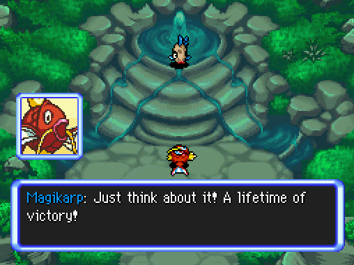

Title: News About Mystery Dungeon ROM-Hacking from dd/mm/yyyy to dd/mm/yyyy
Date: yyyy-mm-dd
Description: ...

Did I miss anything? Feel free to [open a github issue](https://github.com/marius851000/pmd_hack_weekly/issues), contact me on Discord at ``marius851000#2522``, send me an email at ``mariusdavid@laposte.net``, or send me a message from an ActivityPub-compatible service (Mastodon) at ``marius851000@framapiaf.org``.

# Explorers Hacking
## PMD: Crashing Dimension
*by PikaNeko*
>Howdy, do you remember a stupid idiot said that they would make a fan game called Crashing Dimension. It has been for a long! It is absolutely not because that person is lazy. They finally start working on the project. . _ .
>
>Website: https://sites.google.com/view/pmdcd/
>
>Discord: https://discord.gg/6mKWG3xcQh
>
> (Note: PMD Crashing Dimension will have game and novel at the same time)
*on a separate announcement*
> Here is the first update of PMD: Crashing Dimensions!
>
> https://docs.google.com/document/d/10jPa8DAilbVbFCj35ingDK1ASxhjCNjEdT_DZ4g6xy4/edit?usp=sharing
>
>Enjoy!
>
>Pika the Guildmaster of Team Pika

## SkyTemple Game Jam Submissions Closed!
The SkyTemple Game Jam's submission period is over !
Here are all the 12 submitted game.
### John Cena and the Quest for the Undertale Orgy
> John Cena and the Quest for the Undertale Orgy
> 
> Follow John Cena, Copypasta Vaporeon, and Bidoof from Grass Continent as they embark on the adventure of a lifetime. Filled with dead memes and sexual innuendo, this hack is for mature audiences only.
> 
> About 15-20 minutes long. Created by Ass Cucumber. Patch is for the US version.
> 
> https://cdn.discordapp.com/attachments/840183736354996224/846776452992466994/JCATQFTUO.zip

*you should read the ``READ THIS FIRST.txt`` file. In particular, it is written that this rom is disturbing.*

### Pokémon Mystery Dungeon: Stardom Treasure Prologue
>It's a big day! Agan the Gible has been called to Guildmaster Charizard's chamber, what could it be? Find out by yourself!
>
>This hack was made by SuperFabbioGuy, due to some problems, only the intro cutscene could be made, should take at least 3 minutes to complete :P
>
>(There is a video of the short cutscene + the patch for the USA region, enjoy it!)
>
> +This is fixing a big mistake I made with the previous submission, which is... uploading the wrong xDelta patch :P What did we learn today? Test your xDelta patches before anything else! Hopefully everything goes well this time
>
> +Reuploading once again due to a few issues, HOPEFULLY this time everything is right :P
> 
> https://cdn.discordapp.com/attachments/840183736354996224/847947503910387782/PMD_Stardom_Treasure.rar

### Pokémon Mystery Dungeon: Corrupted Core - The Prologue!
> Introducing Pokémon Mystery Dungeon: Corrupted Core - The Prologue!
> 
> This one-shot story from Team Fire Spark , creator of PMD Retold, sees Team Fire Spark continue their adventures with their new recruit Manaphy. But what seems like a routine mission quickly turns into the beginning of a mystery as they find four Pokémon who never should have existed. 
> 
> Contains one dungeon with 15 floors and runs for roughly 25-40 minutes. 
> 
> (Screenshots and patch are in the .zip file. Patch is for the US version.)
> 
> https://cdn.discordapp.com/attachments/840183736354996224/847017947590950912/PMD_CorruptedCore_Prologue.zip

### Pokémon Mystery Dungeon: Distant Connection
> Pokémon Mystery Dungeon: Distant Connection by runway55 
> 
> A story that has a small possibility of being expanded on, I present to you my first ever hack. This is a story of a human turned Pokemon found on the beach by a team. While that team is out of town helping him get back to his world, the human stays back in town and another Pokemon begins to see the human as someone they can bond with.
> 
> This hack has no dungeons and is roughly 13-18 minutes, varies based on how fast of a reader you are.
> 
> Screenshots and patch are in the .zip file, and the patch is for the US version.
> 
> https://cdn.discordapp.com/attachments/840183736354996224/847304633173147708/PMD_Distant_Connection.zip

### Pokémon Mystery Dungeon: Algernon XS.
> Team Sandwich presents...Pokémon Mystery Dungeon: Algernon XS.
> 
> Despite constraints within our team, I was able to cobble together something from our planning, thus we present this brief little story sequence with a 9-floor dungeon. This is the opening to a tale of a group of dungeoneers, heading on their way for a visit to the doctor for Alger, the player character.
>
> Three native-res screenshots included in the zip, as well as an xdelta for the US version of the game. Playtime around 5-10 minutes.
> 
> Team Sandwich is: Glasses Freek Jr., Gelius, emmuffin, kkzero, and ThunderAxe31.
> 
> https://cdn.discordapp.com/attachments/840183736354996224/847703959736549386/PMD_Algernon_XS.zip

### Pokemon Mystery Dungeon: Explorers of the Unknown!
> Hello, everyone! Here is my submission: Pokemon Mystery Dungeon: Explorers of the Unknown!
> 
> This hack is made soley by Espik . 
> 
> The patch is for the US version. Estimated playtime: 40-60 minutes. Screenshots are in the ZIP file.
> 
> One day, a human wakes up in the middle of nowhere, having turned into a Pokémon.
>
> Not too long after, they stumble upon Team Basil, a friendly exploration team.
>
> What marvelous adventures await our recruited hero?
>
> Find out in Pokémon Mystery Dungeon: Explorers of the Unknown!
>
> https://cdn.discordapp.com/attachments/840183736354996224/847850270012735508/PMD_ExplorersOfTheUnknown.zip

### Pokémon Mystery Dungeon: Fount of Victory
> Tired after being everyone's punching bags for so long, Magikarp and Feebas have had enough and attempt to scale Mt. Victory, which brings promises of unlimited victory for those who reach its depths!
> 
> Contains one dungeon with 16 floors.
> 
> Created by Kilogram Meter Per Square Second.
>
> (Screenshots and the patch are in the .zip file. The patch is for the EU version of Explorers of Sky. Make sure to read the readme before playing.)
>
> https://cdn.discordapp.com/attachments/840183736354996224/847866306401009714/Fount_of_Victory.zip

*The images in the folder doesn't seem to have an extension. If you are using windows or macos, you may need to add a ``.png`` at th end of the file name to be able to read it*

### Amaura on the High Seas
> Broke and stuck without a job, Amaura's life has hit a new low. So she does what any logical Pokemon would do: become a pirate, of course!
> 
> Created by Slumbreon 
> 
> Contains 5 dungeons of increasing length because I am insane.
> 
> (Screenshots and patch in the zip folder, made for the US version of the rom)
>
> https://cdn.discordapp.com/attachments/840183736354996224/847735054544666634/AotHS.zip

### PMD Chip 2: Apple Alliance
> What do an Apple-loving Bulbasaur and an Apple-stealing Staryu have in common? An Apple they BOTH want to get back, apparently! 
> 
> Follow Emmy in **PMD Chip 2: Apple Alliance**, the highly(?) requested sequel to her adventure!
> 
> This hack was created by Team Portal, a team composed of:
> - Miju (20)
> - Filthy
> - PazK | Keisuke & Arata
>
>It features four short dungeons for a total of ~35 minutes of gameplay. The zip file contains the screenshots and a patch for the US version.
> 
> https://cdn.discordapp.com/attachments/840183736354996224/847773963585323018/chip2.zip

### Pokémon Mystery Dungeon: Blizzard Island Guide
> Pokémon Mystery Dungeon: Blizzard Island Guide by Adex 
> 
> Vanillite is an aspiring mountain guide who hopes to help Pokémon climb to the top of Vast Ice Mountain! Although business isn’t doing so hot, that might change when an unexpected traveler arrives!
> 
> Contains three dungeons and lasts about 30-40 minutes. This patch is for the US version.
>
> https://cdn.discordapp.com/attachments/840183736354996224/847813598176084008/PMD_BlizzardIslandGuide.zip

### PMD: Fragments
> PMD: Fragments (PMD Frag), or a simple, basic one-shot story with a team that no one expected (and also no one wanted to play with), (probably) a lot of syntax/grammar/spelling mistakes and hard(?) dungeons (but I think it depends on your experience with MD). 
> 
> Total length of the hack: ~1h45 (maybe less if you are fast)
> Note: this hack is a bit more serious than its description
>
> Screenshots and xdelta patch in the zip file
> 
> Created by Irdkwia
>
> https://cdn.discordapp.com/attachments/840183736354996224/847838156002951208/pmd_frag.zip

### Pokémon Mystery Dungeon: Victorious
> Pokémon Mystery Dungeon: Victorious (fixed)
>
> What happens when the symbol of defeat makes a team with a wimpy snow-type and a grumpy fighter? Perhaps not even the future may tell!
> 
> Made by aero marius851000 Precascer 
>
> Contains 3 dungeons and 2 boss fights.
>
> Screenshots and ROM are in the .zip file. Made for the US version
> 
> https://cdn.discordapp.com/attachments/840183736354996224/847926654773100594/teamv.zip

### 
## New Commission Sheet for DonkinDo
*Editor's Note: I really need to make a master list of artists' commission sheets.*

- [Reddit link](https://www.reddit.com/user/DonkinDo)
- [Twitter link](https://twitter.com/DonkinDo)

## SkyTemple
- [A patch was made to fix the stats display patch](https://github.com/SkyTemple/skytemple-files/pull/118).
### Dedicated Subforum on Project Pokémon!
*From Parakoopa*
>Hey everyone!
>
>In partnership with Project Pokémon, there is now a dedicated subforum there for questions about EoS ROM Hacking. So if you have any questions hat might have gotten buried here, or that may be too complicate to be solved here, try asking there instead:
>
> https://projectpokemon.org/home/forums/forum/234-rom-explorers-of-sky-rom-hacking-support.html
>
>And if you already have some experience in EoS ROM Hacking, please check the forums there for some new questions :slight_smile: - We'll also check if we can auto-post new threads here.

## SpriteCollab
### general
### Sprites and Portraits

# Some particularly interesing art ...
*Oh... a short animation by TeeterGlance...*

[YouTube link](https://www.youtube.com/watch?v=Ro09nYiFk3A)

