Title: News About Mystery Dungeon ROM-Hacking from 31/05/2021 to 06/06/2021
Date: 2021-06-06
Description: IA of Rescue Team, Skies release, Red Rescue Team decompilation, online patcher, edition of NDS ROM metadata in SkyTemple, SkyTemple merch, new tilesets, sprites and portraits, as well as many other things (and changes for the newsletter itself)!

Did I miss anything? Feel free to [open a github issue](https://github.com/marius851000/pmd_hack_weekly/issues), contact me on Discord at ``marius851000#2522``, send me an email at ``mariusdavid@laposte.net``, or send me a message from an ActivityPub-compatible service (Mastodon) at ``marius851000@framapiaf.org``.

Proofread by Aviivix

I also made some changes to the site. Right now, I host this website using the free Azure credit offered by my school. I plan on getting my hands on a custom domain name (either paid or via eu.org), as well as possibly self hosting it via my Rasberry Pi for educational purposes.

# Rescue Team Hacking
## Video explaining the IA of RRT
AnonymousRandPerson published a video on Reddit explaining how the IA in Rescue Team works.

[Reddit post](https://www.reddit.com/r/MysteryDungeon/comments/nox2gt/how_ai_works_in_pok%C3%A9mon_mystery_dungeon_redblue/)

[Youtube video link](https://youtu.be/plke4eU_PU8)

In addition, here are his notes: [https://gist.github.com/AnonymousRandomPerson/a2656f25ab0e0d06268e64f215be5187](https://gist.github.com/AnonymousRandomPerson/a2656f25ab0e0d06268e64f215be5187)

## Progress on PMD Red Rescue Team Decompilation
While I haven't made a list of exact changes yet, there seems to be a lot of progress in the PMD Red Rescue Team decompilation effort. [Take a look if you're interested](https://github.com/pret/pmd-red)! For those unfamiliar with the concept, decompilation is the process of recreating the code of a game or other program based on released, 'compiled' data.

# Explorers Hacking
## Pokémon Mystery Dungeon 99 - Team Change
Alekemon first announced that Pokémon Mystery Dungeon 99 was cancelled, and then said it would be continued by Team Pika. Alekemon says he will be making PMD Hidden Explorers instead.

*Alekemon, 4 months ago, about PMD 99:*
> Explorers of Sky... but different!
> 
> - Every dungeon has 99 floors
>
> - Your Pokémon has to be Lvl 1 to enter
>
> - Sylveon added with moveset and stats but Normal-type (Credits: Fable: [https://twitter.com/fabledpainter](https://twitter.com/fabledpainter))

## Explorers of Hell Progress Update
> Hi everyone! Pokemon Mystery Dungeon: Explorers of Hell is more than halfway through development! The game is still scheduled for September. Here are some news about the progress, V0.3 will be released next week for beta-testers, and very few news will be communicated from July.
> 
> - New title screen.
>
> - All pokemon have now 2 abilities, even the legendary ones. It is either their secret ability or a new one. The goal is to have the best balance possible, so Blaziken will not have Speed Boost for example. In addition, each final form of Pokemon will learn several of its eggmoves by leveling up.
> 
> - New special Pokemon will be recruitable thanks to the mystery part/secret slab, like Primal Dialga or Shiny Celebi.
> 
> - A new special dungeon accessible after graduation, this one will allow you to meet and recruit pokemon gen 5 and more.
> 
> - A Kangaskhan Rock in the Marowak Dojo with several options.
> 
> - With the absence of special episodes in this game, Star Cave will be accessible after graduation.
> 
> There are still a lot of other features, don't hesitate to keep up to date with the latest news on the [Babou's Guild server!](https://discord.gg/6QbPHYZDtg) :SpindaShake:

## Explorers of Skies New Release
*By staro*

> Yo! New Skies update -- it's 1.15!
> 
> New features:
> 
> - A postpost game dungeon that unlocks after defeating Darkrai -- The Magnagate! The Magnagate drastically changes every visit, no two runs will be the same! (Documented more in the Changelog)
> - A new TM + Move: Infestation
> - New Graphics:
>   * A new title screen
>   * A new Skies logo
>   * A new Skies banner for real hardware players
>   * New main menu background art by @/fledermaus
>   * A new top screen stats background voted for by the Discord community
>   * New background for other top screens
> - Custom Tilesets made by me for new dungeons:
>   * Infested Forest
>   * Nightfall Lake
>   * Sunny Beach
>   * Magnagate
> - Forced ally buffs:
>   * Buffed both Future Grovyle and Hidden Land Grovyle
>   * Massively reworked Cresselia to no longer be useless, given buffs and a new moveset: Moonblast, Psychic, Psycho Cut and Energy Ball
>  - Streamlined Aegis Cave even more (See changelog)
>  - You can now recruit Pokemon in Beach Cave, Oblivion Forest, Treacherous Waters, Southeasten Islands and Inferno Cave.
>  - Readded Partner Skitty, rereplacing Female Espurr
>  - New move stat displays -- created by Irdkwia
> - Important bug fixes (See changelog)
>
> Some other things to note: 
> The Discord has grown so much the past few weeks that I've been able to apply it for Discord Partnership! I've also added some channels for the community for speedrunning, pet channels and more! Thanks for the support and interest in the project.

[Discord server](https://discord.gg/uTJPcg9sdZ)

[Download patch](https://cdn.discordapp.com/attachments/798551098720780311/850832220536700928/Explorers_of_Skies_Patch_V1.15.xdelta)

*post publication update: he later published a new version fixing some issue with this release: [v1.15.1](https://cdn.discordapp.com/attachments/798551098720780311/851254989439238184/Explorers_of_Skies_Patch_V1.15.1.xdelta)*

[Changelog](https://cdn.discordapp.com/attachments/798551098720780311/850832209200152586/ChangelogV1.15.txt)

## PMD: Distant Connection in Development
*By runway55*
> From a small Hack Jam project, PMD: Distant Connection is now officially in development along with a Discord server and a teaser trailer for what's to come from it! This hack will expand on the characters and the world that was featured in the Hack Jam, as well as actually having dungeons to go with it. This will be a long project and I look forward to the end result of what I create.
> 
> Teaser Trailer: [https://youtu.be/Ix0nysqUh3w](https://youtu.be/Ix0nysqUh3w)
>
> Discord Server: [https://discord.gg/g3zeEJn27j](https://discord.gg/g3zeEJn27j)

## Ass Cucumber's ROM Hack Disqualified Due to its Content
*From the SkyTemple server*
> Hi! We as mod team have decided to disqualify John Cena and the Quest for the Undertale Orgy from the SkyTemple Hack Jam for breaking rule 6. We are sorry we have acted so slow on this and that this is happening after the jam is already over for one week. We will make sure to be more clear about rules in the future and to have a screening in place to prevent this from happening again.
> 
> We still appreciate the work Ass Cucumber put into this a lot! The hack will also remain in the submissions channel until after the jam. You can of course also still talk about it, as long as it doesn't break rule 6.

## Aero's New Hack
> Hi, this is Aero, i'd like to announce that i am starting on a new rom hack, it isnt difficulty this time.
> 
> Go through the hilarious journey and immerse yourself into things that are literally just memes.
>
> (its still gonna be hard as fuck tho)

## DonkinDo's New Discord Server
> Since i have projects i like to have a place to update it, outside twitter. And also a place to talk with other developers, artists, musicians, etc. This place will feature stuff from Bug Fables Demake and PMD: Explorers of Sunlight. 

[Discord server](https://discord.gg/tuupGEx7Tk)

## Tempory New Icon for the SkyTemple Server
To celebrate [LGBT Pride Month](https://en.wikipedia.org/wiki/Gay_pride#LGBT_Pride_Month), Parakoopa temporarily changed the SkyTemple server's icon. The new icon was made by NeroIntruder based on the original SkyTemple server icon.

## Online Patcher for Sky ROMs
tech-ticks made an [online patcher](https://github.com/SkyTemple/patcher) for ROM hacks. It is targeted at hack-developers who want to use an online interface for users to patch their ROM files.

## SkyTemple
- [Fixed by Parakoopa](https://github.com/SkyTemple/skytemple-dtef/commit/643641562f911128c3135da7e970f0fac20d2a79): Fixes importing with animations.
- [Added by Parakoopa and tech-ticks](https://github.com/SkyTemple/skytemple/pull/279): Allows users to edit the internal ROM name, ID, and localized titles, and to import and export the game icon.
- [Added by Parakoopa](https://github.com/SkyTemple/skytemple/commit/a75a5edebae446e74323f833c61e1285aefd5777): Allows users to add new levels.
- [Updated by Parakoopa](https://github.com/SkyTemple/skytemple/commit/1e80f897454b4118f21ca57ba7966cb4f0650de8): Lists empty scenes in the UI.
- [Added by Parakoopa](https://github.com/SkyTemple/skytemple/commit/f2426f0c94caa5bd75d437eca368f97d4736ec3a): Allows users to add new map backgrounds.
- [Added by Parakoopa](https://github.com/SkyTemple/skytemple/commit/502fc1f9747b24ae038ea5679600d145baee2c3a): Allows users to edit the level list.
- [Added by Parakoopa](https://github.com/SkyTemple/skytemple/commit/8c60c49701bcc6b9353d9eb907b645d38acce895): Allows users to map dungeon tilesets to overworld floors.

## SkyTemple Merch
*From Parakoopa*
> Alright, so just for fun we have a little merch shop open for a few days haha - currently only the Duskako design is available, the SkyTemple logo is still being approved. Have any other ideas for it? Let me know!
> 
> [https://shop.spreadshirt.com/skytemple-merch/](https://shop.spreadshirt.com/skytemple-merch/)

## New Commission Listing Page
I finally added a page to the site listing available commissions. You can access it [here]({filename}/pages/commission_list.md). It also features an updated commission sheet for Emuffin.

## Tilesets
*TilesetCollab when?*

Staro shared two new tilesets in the [#custom-resources channel of their Discord server](https://discord.gg/uTJPcg9sdZ) that can be imported with SkyTemple. There are other tilesets featured in that channel too!

Staro requires credit if you use these tilesets, or any of their resources.

I also made [a page]({filename}/pages/tilesets.md) listing tilesets I've found with permission (although currently all tilesets listed there are by Staro).

**Nightfall Lake**

[Download](../tileset/Nightfall_Lake.zip)

**Sunny Beach**

[Download](../tileset/Sunny_Beach.zip)

## Sprites and Portraits
*Editor's Note: I've finally added support for animated sprites. (It was easier than expected!) Enjoy, though hopefully it doesn't make this newsletter too long.*

*Sprites are animated PNG files. If sprites don't appear animated to you, check to make sure your browser supports animated PNG. (Though most modern browsers should.)*

*This first image is not part of SpriteCollab, but I wanted to feature it anyway since the art is just stellar!*

**Remukko portraits by Remukko**

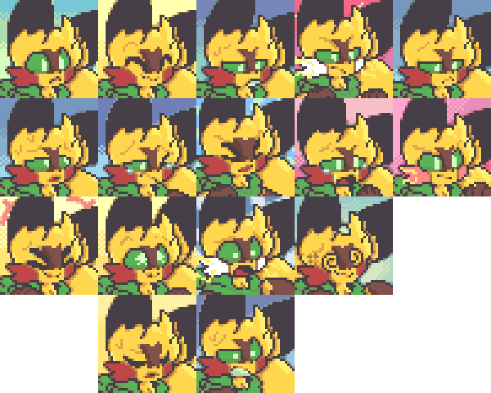

[Give them some love over on their Twitter post!](https://twitter.com/Remcowo521/status/1399319510683983873)

- Phillips196 added 13 and changed 6 portraits for Haunter

  - **added**

  - 

  - **old -> new**

  - 

- Phillips196 added 13 and changed 6 portraits for Haunter  Shiny

  - **added**

  - 

  - **old -> new**

  - 

- Phillips196 added 13 and changed 7 portraits for Gengar

  - **added**

  - 

  - **old -> new**

  - 

- Phillips196 added 13 and changed 7 portraits for Gengar  Shiny

  - **added**

  - 

  - **old -> new**

  - 

- ["motherhenna(Helen)"](<@!543717476421074945>) added 15 and changed the Normal portraits for Dragonite

  - **added**

  - 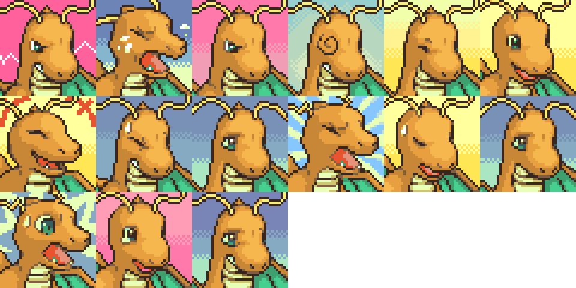

  - **old -> new**

  - 

- Someone with the (discord) id <@!182636701460594688> added 14 and changed the Happy and Normal portraits for Ampharos

  - **added**

  - 

  - **old -> new**

  - 

- [Murpi](https://twitter.com/murpia57?s=06) added 15 portrait for Kricketune  Shiny

  - **added**

  - 

- [DonkinDo](https://twitter.com/DonkinDo) added the Special2 and changed the Happy, Inspired, Normal and Special1 portraits for Vespiquen

  - **added**

  - 

  - **old -> new**

  - 

- baronessfaron added 16 and changed the Normal portraits for Cresselia

  - **added**

  - 

  - **old -> new**

  - 

- baronessfaron changed 17 portrait for Cresselia  Shiny

  - **old -> new**

  - 

- baronessfaron added 16 portrait for Cresselia  Shiny

  - **added**

  - 

- [Emmuffin](https://twitter.com/Ernmuffin) added 22 and changed 12 sprites kinds for Phione

  - **new Cringe animation**

  - 

  - **new DeepBreath animation**

  - 

  - **new Eat animation**

  - 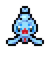

  - **new EventSleep animation**

  - 

  - **new Faint animation**

  - 

  - **new Float animation**

  - 

  - **new Head animation**

  - 

  - **new HitGround animation**

  - 

  - **new Laying animation**

  - 

  - **new LeapForth animation**

  - 

  - **new LookUp animation**

  - 

  - **new LostBalance animation**

  - 

  - **new Nod animation**

  - 

  - **new Pain animation**

  - 

  - **new Pose animation**

  - 

  - **new Pull animation**

  - 

  - **new Sink animation**

  - 

  - **new Sit animation**

  - 

  - **new Trip animation**

  - 

  - **new Tumble animation**

  - 

  - **new TumbleBack animation**

  - 

  - **new Wake animation**

  - 

  - **changed Attack animation (old -> new)**

  - 

  - **changed Charge animation (old -> new)**

  - 

  - **changed Double animation (old -> new)**

  - 

  - **changed Hop animation (old -> new)**

  - 

  - **changed Hurt animation (old -> new)**

  - 

  - **changed Idle animation (old -> new)**

  - 

  - **changed Rotate animation (old -> new)**

  - 

  - **changed Shoot animation (old -> new)**

  - 

  - **changed Sleep animation (old -> new)**

  - 

  - **changed Swing animation (old -> new)**

  - 

  - **changed Twirl animation (old -> new)**

  - 

  - **changed Walk animation (old -> new)**

  - 

- [Emmuffin](https://twitter.com/Ernmuffin) added 22 and changed 12 sprites kinds for Phione  Shiny

  - **new Cringe animation**

  - 

  - **new DeepBreath animation**

  - 

  - **new Eat animation**

  - 

  - **new EventSleep animation**

  - 

  - **new Faint animation**

  - 

  - **new Float animation**

  - 

  - **new Head animation**

  - 

  - **new HitGround animation**

  - 

  - **new Laying animation**

  - 

  - **new LeapForth animation**

  - 

  - **new LookUp animation**

  - 

  - **new LostBalance animation**

  - 

  - **new Nod animation**

  - 

  - **new Pain animation**

  - 

  - **new Pose animation**

  - 

  - **new Pull animation**

  - 

  - **new Sink animation**

  - 

  - **new Sit animation**

  - 

  - **new Trip animation**

  - 

  - **new Tumble animation**

  - 

  - **new TumbleBack animation**

  - 

  - **new Wake animation**

  - 

  - **changed Attack animation (old -> new)**

  - 

  - **changed Charge animation (old -> new)**

  - 

  - **changed Double animation (old -> new)**

  - 

  - **changed Hop animation (old -> new)**

  - 

  - **changed Hurt animation (old -> new)**

  - 

  - **changed Idle animation (old -> new)**

  - 

  - **changed Rotate animation (old -> new)**

  - 

  - **changed Shoot animation (old -> new)**

  - 

  - **changed Sleep animation (old -> new)**

  - 

  - **changed Swing animation (old -> new)**

  - 

  - **changed Twirl animation (old -> new)**

  - 

  - **changed Walk animation (old -> new)**

  - 

- [Emmuffin](https://twitter.com/Ernmuffin) added 16 portrait for Tepig  Shiny

  - **added**

  - 

- [Emmuffin](https://twitter.com/Ernmuffin) added 33 sprite kind for Oshawott  Shiny

  - **new Attack animation**

  - 

  - **new Charge animation**

  - 

  - **new Cringe animation**

  - 

  - **new DeepBreath animation**

  - 

  - **new Double animation**

  - 

  - **new Eat animation**

  - 

  - **new EventSleep animation**

  - 

  - **new Faint animation**

  - 

  - **new Float animation**

  - 

  - **new Head animation**

  - 

  - **new HitGround animation**

  - 

  - **new Hop animation**

  - 

  - **new Hurt animation**

  - 

  - **new Idle animation**

  - 

  - **new Laying animation**

  - 

  - **new LeapForth animation**

  - 

  - **new LookUp animation**

  - 

  - **new LostBalance animation**

  - 

  - **new Nod animation**

  - 

  - **new Pain animation**

  - 

  - **new Pose animation**

  - 

  - **new Pull animation**

  - 

  - **new Rotate animation**

  - 

  - **new Shoot animation**

  - 

  - **new Sink animation**

  - 

  - **new Sit animation**

  - 

  - **new Sleep animation**

  - 

  - **new Swing animation**

  - 

  - **new Trip animation**

  - 

  - **new Tumble animation**

  - 

  - **new TumbleBack animation**

  - 

  - **new Wake animation**

  - 

  - **new Walk animation**

  - 

- [Emmuffin](https://twitter.com/Ernmuffin) added 16 portrait for Oshawott  Shiny

  - **added**

  - 

- LegendaryPhoenix added the Normal portrait for Dewott  Shiny

  - **added**

  - 

- [powercristal](https://www.deviantart.com/powercristal) added 11 sprite kind for Trubbish

  - **new Attack animation**

  - 

  - **new Charge animation**

  - 

  - **new Double animation**

  - 

  - **new Hop animation**

  - 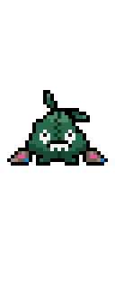

  - **new Hurt animation**

  - 

  - **new Idle animation**

  - 

  - **new Rotate animation**

  - 

  - **new Sleep animation**

  - 

  - **new Swing animation**

  - 

  - **new Walk animation**

  - 

  - **new Withdraw animation**

  - 

- baronessfaron added 12 sprite kind for Deerling

  - **new Attack animation**

  - 

  - **new Charge animation**

  - 

  - **new Double animation**

  - 

  - **new Hop animation**

  - 

  - **new Hurt animation**

  - 

  - **new Idle animation**

  - 

  - **new RearUp animation**

  - 

  - **new Rotate animation**

  - 

  - **new Shoot animation**

  - 

  - **new Sleep animation**

  - 

  - **new Swing animation**

  - 

  - **new Walk animation**

  - 

- baronessfaron added 15 and changed the Normal portraits for Deerling

  - **added**

  - 

  - **old -> new**

  - 

- Murpi changed the Normal portrait for Meloetta

  - **old -> new**

  - 

- Murpi changed the Normal portrait for Meloetta Pirouette

  - **old -> new**

  - 

- [Murpi](https://twitter.com/murpia57?s=06) added the Normal portrait for Meloetta Pirouette

  - **added**

  - 

- [Emmuffin](https://twitter.com/Ernmuffin) added 33 sprite kind for Chespin  Shiny

  - **new Attack animation**

  - 

  - **new Charge animation**

  - 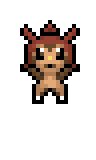

  - **new Cringe animation**

  - 

  - **new DeepBreath animation**

  - 

  - **new Double animation**

  - 

  - **new Eat animation**

  - 

  - **new EventSleep animation**

  - 

  - **new Faint animation**

  - 

  - **new Float animation**

  - 

  - **new Head animation**

  - 

  - **new HitGround animation**

  - 

  - **new Hop animation**

  - 

  - **new Hurt animation**

  - 

  - **new Idle animation**

  - 

  - **new Laying animation**

  - 

  - **new LeapForth animation**

  - 

  - **new LookUp animation**

  - 

  - **new LostBalance animation**

  - 

  - **new Nod animation**

  - 

  - **new Pain animation**

  - 

  - **new Pose animation**

  - 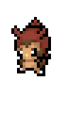

  - **new Pull animation**

  - 

  - **new Rotate animation**

  - 

  - **new Shoot animation**

  - 

  - **new Sink animation**

  - 

  - **new Sit animation**

  - 

  - **new Sleep animation**

  - 

  - **new Swing animation**

  - 

  - **new Trip animation**

  - 

  - **new Tumble animation**

  - 

  - **new TumbleBack animation**

  - 

  - **new Wake animation**

  - 

  - **new Walk animation**

  - 

- [Emmuffin](https://twitter.com/Ernmuffin) added 15 and changed the Normal portraits for Chespin  Shiny

  - **added**

  - 

  - **old -> new**

  - 

- [Emmuffin](https://twitter.com/Ernmuffin) added 11 sprite kind for Braixen

  - **new Appeal animation**

  - 

  - **new Attack animation**

  - 

  - **new Charge animation**

  - 

  - **new Double animation**

  - 

  - **new Hop animation**

  - 

  - **new Hurt animation**

  - 

  - **new Idle animation**

  - 

  - **new Rotate animation**

  - 

  - **new Sleep animation**

  - 

  - **new Swing animation**

  - 

  - **new Walk animation**

  - 

- [Emmuffin](https://twitter.com/Ernmuffin) added 15 and changed the Normal portraits for Froakie  Shiny

  - **added**

  - 

  - **old -> new**

  - 

- [DonkinDo](https://twitter.com/DonkinDo) added 22 sprite kind for Honedge

  - **new Cringe animation**

  - 

  - **new DeepBreath animation**

  - 

  - **new Eat animation**

  - 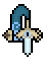

  - **new EventSleep animation**

  - 

  - **new Faint animation**

  - 

  - **new Float animation**

  - 

  - **new Head animation**

  - 

  - **new HitGround animation**

  - 

  - **new Laying animation**

  - 

  - **new LeapForth animation**

  - 

  - **new LookUp animation**

  - 

  - **new LostBalance animation**

  - 

  - **new Nod animation**

  - 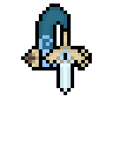

  - **new Pain animation**

  - 

  - **new Pose animation**

  - 

  - **new Pull animation**

  - 

  - **new Sink animation**

  - 

  - **new Sit animation**

  - 

  - **new Trip animation**

  - 

  - **new Tumble animation**

  - 

  - **new TumbleBack animation**

  - 

  - **new Wake animation**

  - 

- [Emmuffin](https://twitter.com/Ernmuffin) added 33 sprite kind for Amaura

  - **new Attack animation**

  - 

  - **new Charge animation**

  - 

  - **new Cringe animation**

  - 

  - **new DeepBreath animation**

  - 

  - **new Double animation**

  - 

  - **new Eat animation**

  - 

  - **new EventSleep animation**

  - 

  - **new Faint animation**

  - 

  - **new Float animation**

  - 

  - **new Head animation**

  - 

  - **new HitGround animation**

  - 

  - **new Hop animation**

  - 

  - **new Hurt animation**

  - 

  - **new Idle animation**

  - 

  - **new Laying animation**

  - 

  - **new LeapForth animation**

  - 

  - **new LookUp animation**

  - 

  - **new LostBalance animation**

  - 

  - **new Nod animation**

  - 

  - **new Pain animation**

  - 

  - **new Pose animation**

  - 

  - **new Pull animation**

  - 

  - **new Rotate animation**

  - 

  - **new Shoot animation**

  - 

  - **new Sink animation**

  - 

  - **new Sit animation**

  - 

  - **new Sleep animation**

  - 

  - **new Swing animation**

  - 

  - **new Trip animation**

  - 

  - **new Tumble animation**

  - 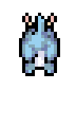

  - **new TumbleBack animation**

  - 

  - **new Wake animation**

  - 

  - **new Walk animation**

  - 

- [Emmuffin](https://twitter.com/Ernmuffin) added 12 sprite kind for Aurorus

  - **new Attack animation**

  - 

  - **new Charge animation**

  - 

  - **new Double animation**

  - 

  - **new Hop animation**

  - 

  - **new Hurt animation**

  - 

  - **new Idle animation**

  - 

  - **new RearUp animation**

  - 

  - **new Rotate animation**

  - 

  - **new Shoot animation**

  - 

  - **new Sleep animation**

  - 

  - **new Swing animation**

  - 

  - **new Walk animation**

  - 

- baronessfaron added the Normal portrait for Sliggoo

  - **added**

  - 

- [DonkinDo](https://twitter.com/DonkinDo) added 35 sprite kind for Noibat

  - **new Attack animation**

  - 

  - **new Charge animation**

  - 

  - **new Cringe animation**

  - 

  - **new DeepBreath animation**

  - 

  - **new Double animation**

  - 

  - **new Eat animation**

  - 

  - **new EventSleep animation**

  - 

  - **new Faint animation**

  - 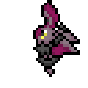

  - **new Fainted animation**

  - 

  - **new Float animation**

  - 

  - **new Head animation**

  - 

  - **new HitGround animation**

  - 

  - **new Hop animation**

  - 

  - **new Hover animation**

  - 

  - **new Hurt animation**

  - 

  - **new Idle animation**

  - 

  - **new Laying animation**

  - 

  - **new LeapForth animation**

  - 

  - **new LookUp animation**

  - 

  - **new LostBalance animation**

  - 

  - **new Nod animation**

  - 

  - **new Pain animation**

  - 

  - **new Pose animation**

  - 

  - **new Pull animation**

  - 

  - **new Rotate animation**

  - 

  - **new Shoot animation**

  - 

  - **new Sink animation**

  - 

  - **new Sit animation**

  - 

  - **new Sleep animation**

  - 

  - **new Swing animation**

  - 

  - **new Trip animation**

  - 

  - **new Tumble animation**

  - 

  - **new TumbleBack animation**

  - 

  - **new Wake animation**

  - 

  - **new Walk animation**

  - 

- Murpi added the Normal portrait for Hoopa

  - **added**

  - 

- [CryptoIllogical](ranunculusxing@gmail.com) added the Normal portrait for Xurkitree

  - **added**

  - 

- [CryptoIllogical](ranunculusxing@gmail.com) added 34 sprite kind for Yamper

  - **new Attack animation**

  - 

  - **new Charge animation**

  - 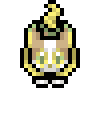

  - **new Cringe animation**

  - 

  - **new DeepBreath animation**

  - 

  - **new Double animation**

  - 

  - **new Eat animation**

  - 

  - **new EventSleep animation**

  - 

  - **new Faint animation**

  - 

  - **new Float animation**

  - 

  - **new Head animation**

  - 

  - **new HitGround animation**

  - 

  - **new Hop animation**

  - 

  - **new Hurt animation**

  - 

  - **new Idle animation**

  - 

  - **new Laying animation**

  - 

  - **new LeapForth animation**

  - 

  - **new LookUp animation**

  - 

  - **new LostBalance animation**

  - 

  - **new Nod animation**

  - 

  - **new Pain animation**

  - 

  - **new Pose animation**

  - 

  - **new Pull animation**

  - 

  - **new Rotate animation**

  - 

  - **new Shock animation**

  - 

  - **new Shoot animation**

  - 

  - **new Sink animation**

  - 

  - **new Sit animation**

  - 

  - **new Sleep animation**

  - 

  - **new Swing animation**

  - 

  - **new Trip animation**

  - 

  - **new Tumble animation**

  - 

  - **new TumbleBack animation**

  - 

  - **new Wake animation**

  - 

  - **new Walk animation**

  - 

- [CryptoIllogical](ranunculusxing@gmail.com) added 34 sprite kind for Yamper  Shiny

  - **new Attack animation**

  - 

  - **new Charge animation**

  - 

  - **new Cringe animation**

  - 

  - **new DeepBreath animation**

  - 

  - **new Double animation**

  - 

  - **new Eat animation**

  - 

  - **new EventSleep animation**

  - 

  - **new Faint animation**

  - 

  - **new Float animation**

  - 

  - **new Head animation**

  - 

  - **new HitGround animation**

  - 

  - **new Hop animation**

  - 

  - **new Hurt animation**

  - 

  - **new Idle animation**

  - 

  - **new Laying animation**

  - 

  - **new LeapForth animation**

  - 

  - **new LookUp animation**

  - 

  - **new LostBalance animation**

  - 

  - **new Nod animation**

  - 

  - **new Pain animation**

  - 

  - **new Pose animation**

  - 

  - **new Pull animation**

  - 

  - **new Rotate animation**

  - 

  - **new Shock animation**

  - 

  - **new Shoot animation**

  - 

  - **new Sink animation**

  - 

  - **new Sit animation**

  - 

  - **new Sleep animation**

  - 

  - **new Swing animation**

  - 

  - **new Trip animation**

  - 

  - **new Tumble animation**

  - 

  - **new TumbleBack animation**

  - 

  - **new Wake animation**

  - 

  - **new Walk animation**

  - 

