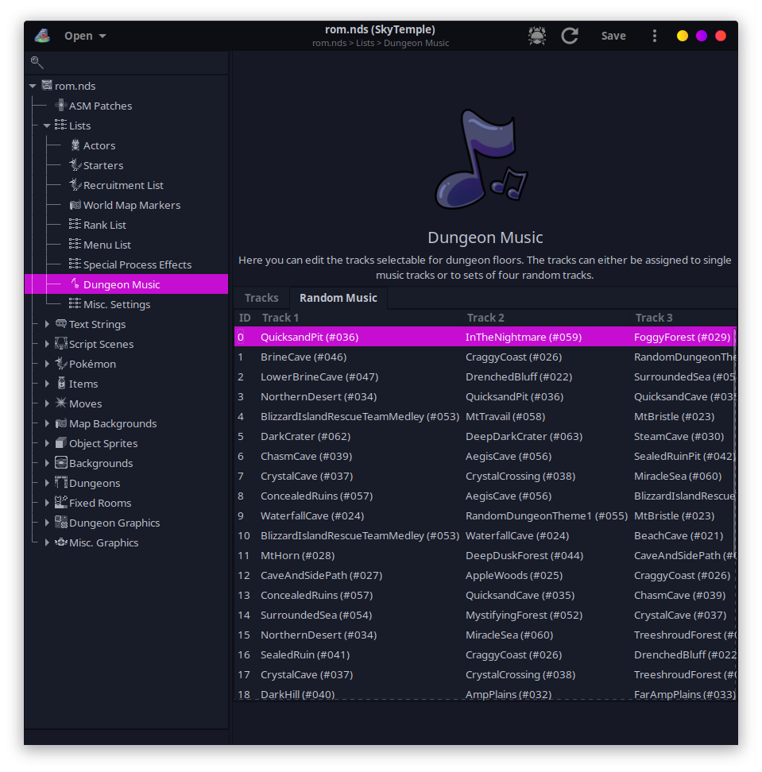
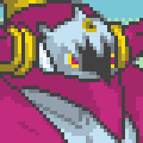

Title: News About Mystery Dungeon ROM-Hacking from 07/06/2021 to 13/06/2021
Date: 2021-06-13
Description: PMD Retold episode 12, Explorer of Skies patch, editing of many small content who are hardcoded in SkyTemple and new sprites and portraits.

Did I miss anything? Feel free to [open a github issue](https://github.com/marius851000/pmd_hack_weekly/issues), contact me on Discord at ``marius851000#2522``, send me an email at ``mariusdavid@laposte.net``, or send me a message from an ActivityPub-compatible service (Mastodon) at ``marius851000@framapiaf.org``.

# Explorers Hacking
## Explorers of Skies patch release
*By staro*

> So it seem's yesterday I boofed up and pushed out a release thinking an experimental new feature was going to work perfectly and it didn't. This led to crashes and frame drops for both emulator players and real hardware players. I apologize for any inconvenience, I should have done a third beta test before releasing. This new update remedies that and includes a few new bug fixes. Saves **Should** be alright to transfer over. You should update to this ASAP.
> 
> 1.15.1:
>
> - Removed the ExpandPokeList and ChangeEvoSystem patches.
> 
> - Added Play Rough to Espurr and both Meowstics
>
> - Fixed an issue with a Magmortor becoming the Aggron boss in Special Episode 4 
>
> - Fixed Move Stat Displays not working with two-turn moves.
> 
> [Explorers_of_Skies_Patch_V1.15.1.xdelta](https://cdn.discordapp.com/attachments/798551098720780311/851254989439238184/Explorers_of_Skies_Patch_V1.15.1.xdelta)

*staro also released an updated changelog, that also include change to version 1.15: [changelog](https://cdn.discordapp.com/attachments/798551098720780311/851254987384422430/ChangelogV1.15.1.txt)*

*21 hour later by staro*

> In case you play on real hardware and experience issues with Drenched Bluff, use this patch. (Emulator players don't need this, there are no new features except a bug fix)
> 
> [Explorers_of_Skies_Patch_V1.15.1HARDWAREFIX.xdelta](https://cdn.discordapp.com/attachments/798551098720780311/851570664149876778/Explorers_of_Skies_Patch_V1.15.1HARDWAREFIX.xdelta)

## PMD Retold episode 12
The episode 12 [were released on youtube](https://youtu.be/R48Ksq-L1Wg).

## SkyTemple
TODO: the nix package
Parakoopa released a video demonstrating some capability of the future SkyTemple 1.3 : [youtube link](https://youtu.be/oFceF-dvA9A)

- Skytemple [has been packaged](https://github.com/NixOS/nixpkgs/pull/124977) in [Nixpkgs unstable](https://nixos.org/) by Xfix. The package is named ``skytemple`` (fix pending for graph display and patching).
- Parakoopa [made another fix](https://github.com/SkyTemple/skytemple-dtef/commit/064930191e674288d684792095dc3567846ec0c1) for importing animation, and released version 1.1.4 of ``skytemple-dtef``.
- The debug assistant window (displaying when starting the debugger for the first time) [were removed](https://github.com/SkyTemple/skytemple-ssb-debugger/commit/5f36b3701610f0e42609dda37055d29e667b04ba) by Parakoopa.
- Parakoopa also [made](https://github.com/SkyTemple/skytemple-ssb-debugger/commit/1bfe8c6df015faab65e46819dc8f8fa57586217d) some enhancement for "script add event handler".
- Parakoopa [added](https://github.com/SkyTemple/skytemple/commit/39673f3daa145cde987fc3624fb63af0ef409c2a) the possibility to add new scenes.
- Parakoopa [also made](https://github.com/SkyTemple/skytemple/commit/9f5099d0b9f54283a700557d42bb505ba4b0b3bb) rest room render correctly in the editor.
- He [also added](https://github.com/SkyTemple/skytemple/commit/74c2b1cc1720208d26b7914e778e830b8e56e757) the ability to import and export traps and items images.

- Parakoopa [added the ability](https://github.com/SkyTemple/skytemple/commit/edb8fae2c9357bf70590d959b17010683ea1e50e) to edit various hardcoded data:
  - The dungeon spawn rate
  - The main menu music
  - the text speed
  - Min IQ required by enemies to learn Exclusive Move-User.
  - Min IQ required by enemies to learn Item Master.
  - Belly points lost when walking through walls.
  - 1/1000 belly points lost when walking through walls.
  - Intimidator activation chance.
  - Burn damage delay.
  - Poison damage delay.
  - Bad poison damage delay.
  - Chance of Ginseng increasing a move's power by 3.
  - ([later](https://github.com/SkyTemple/skytemple/commit/4090868f312b467ac06e1ba1b78552cc24a29894)) belly lost by turn

- Parakkopa [added](https://github.com/SkyTemple/skytemple/issues/145) the ability to edit music dungeon music (don't permit to edit music itself yet -- Parakoopa said it was pretty hard to do). Also use label for music list, rather than display their number.

*The GTK theme used in these screenshots is "[Sweet-Dark](https://github.com/EliverLara/Sweet)"*

## Sprites and Portraits
*Sprites are animated using APNG. If sprites aren't animated, check that your browser support it. Only old browser shouldn't support it.*

- [Emmuffin](https://twitter.com/Ernmuffin) changed 16 portrait for Ivysaur

  - **old -> new**

  - 

- [Emmuffin](https://twitter.com/Ernmuffin) added 15 and changed the Normal portraits for Ivysaur  Shiny

  - **added**

  - 

  - **old -> new**

  - 

- Fearless-Quit added 13 and changed the Normal, Pain and Teary-Eyed portraits for Diglett

  - **added**

  - 

  - **old -> new**

  - 

- Fearless-Quit added 16 portrait for Diglett Alternate

  - **added**

  - 

- Someone with the (discord) id <@!555360707617488904> added 15 and changed the Normal portraits for Ponyta

  - **added**

  - 

  - **old -> new**

  - 

- Phillips196 added 18 and changed the Normal portraits for Electrode

  - **added**

  - 

  - **old -> new**

  - 

- Phillips196 added 18 portrait for Electrode  Shiny

  - **added**

  - 

- [DonkinDo](https://twitter.com/DonkinDo) added the Special0 and Special0^ and changed 24 portraits for Igglybuff

  - **added**

  - 

  - **old -> new**

  - 

- [DonkinDo](https://twitter.com/DonkinDo) removed the Special1 and Special1^ portrait for Igglybuff

  - **deleted**

  - 

- [Pokenoice](Pokenoice#8353) added the Special0 portrait for Sunflora

  - **added**

  - 

- [Pokenoice](Pokenoice#8353) added the Crying, Dizzy, Inspired, Sad and Shouting and changed 11 portraits for Sunflora

  - **added**

  - 

  - **old -> new**

  - 

- [DonkinDo](https://twitter.com/DonkinDo) added 12 sprite kind for Roselia Alternate

  - **new Attack animation**

  - 

  - **new Charge animation**

  - 

  - **new Double animation**

  - 

  - **new Hop animation**

  - 

  - **new Hurt animation**

  - 

  - **new Idle animation**

  - 

  - **new Rotate animation**

  - 

  - **new Shoot animation**

  - 

  - **new Sleep animation**

  - 

  - **new Swing animation**

  - 

  - **new Twirl animation**

  - 

  - **new Walk animation**

  - 

- [DonkinDo](https://twitter.com/DonkinDo) added 34 portrait for Roselia Alternate

  - **added**

  - 

- CamusZekeSirius added 16 and changed the Normal portraits for Regice

  - **added**

  - 

  - **old -> new**

  - 

- CamusZekeSirius added 16 and changed the Normal portraits for Regice  Shiny

  - **added**

  - 

  - **old -> new**

  - 

- [Deleca7755](Deleca7755#2927) changed the Normal and Normal^ portrait for Meloetta

  - **old -> new**

  - 

- Murpi added the Normal^ and changed the Normal portraits for Meloetta

  - **added**

  - 

  - **old -> new**

  - 

- [Deleca7755](Deleca7755#2927) added the Normal and Normal^ portrait for Meloetta  Shiny

  - **added**

  - 

- Murpi added the Normal^ and changed the Normal portraits for Meloetta Pirouette

  - **added**

  - 

  - **old -> new**

  - 

- baronessfaron added the Normal portrait for Goodra

  - **added**

  - 

- Murpi added the Normal portrait for Hoopa Unbound

  - **added**

  - 

- baronessfaron added the Joyous and Normal portrait for Brionne

  - **added**

  - 

- baronessfaron added the Normal portrait for Cutiefly

  - **added**

  - 

- baronessfaron added the Normal portrait for Lurantis

  - **added**

  - 

- baronessfaron added the Normal portrait for Drampa

  - **added**

  - 

- [DonkinDo](https://twitter.com/DonkinDo) added 17 portrait for Hatterene

  - **added**

  - 

- CamusZekeSirius added the Normal^ and changed the Normal portraits for Regidrago

  - **added**

  - 

  - **old -> new**

  - 

