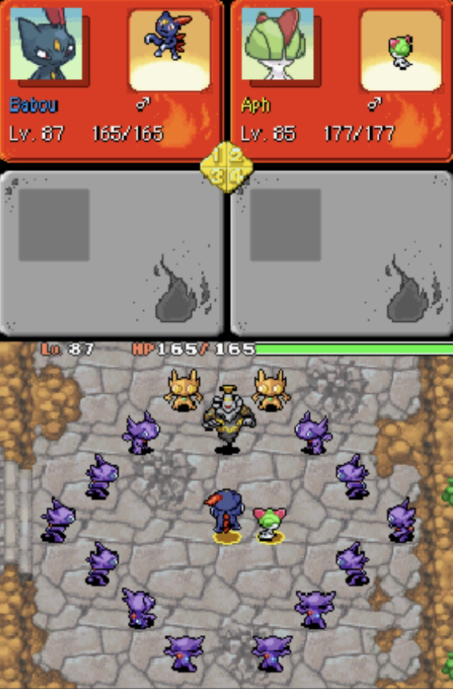

Title: PMD ROM Hacking Weekly - June 27th, 2021
Date: 2021-06-27
Description: TODO: description

<h2 id="ToC">Table of Contents</h2>

TODO: content of the TOC

<h1 id="HackNews"><a href="#ToC">⮝</a>  Explorers ROM Hacking News</h1>

::: title 2 HackNews-EOH "Explorers of Hell news"

*From [Babou's Discord server](https://discord.gg/6QbPHYZDtg)*

> Hello @everyone! Here is some news about Pokemon Mystery Dungeon: Explorers of Hell. Expect little or no news until the game is released.
> 
> - Some bosses will be replayable in "Hell" mode. Here is an example with the replay against Dusknoir
> - You will get an HM by going up in exploration rank
> - The guild's Q&A table now answers more useful questions
> - All Legendary Pokemon will be recruitable in Shiny. You will need Mystery Part/Secret Slab, and they will appear in a dungeon floor with a very low percentage
> - A new dungeon: Victory Road, which can be unlocked after graduation, and will allow you to recruit Victini 
> 
> Thanks again to all those who follow the progress of the game, a release date will be communicated in August, I hope you will like the game! :totolaugh:
> 
> Tweet Link : [https://twitter.com/babouzzz/status/1408862088647385092?s=21](https://twitter.com/babouzzz/status/1408862088647385092?s=21)

::: title 2 HackNews-EOD "Explorers of Death news"

FireFox6 shared a video with the two first cutscenes of Explorers of Death

> I've come a long way in both romhacking and video editing skills since the last time Youtube saw my hack (The Skytemple hack showcase video). The hack is still in development, there's alot more done than what you see here.
> Keep in mind that what is shown here may be changed later
> 
> If you wish to see updates about the romhack, join the Explorers of Death Discord Server! DM my Discord Account, FireFox6#/3633 (ignore the slash) for a link. (Be sure to specifically ask for a link, if you just say "hello" or something similar, I may ignore you).

::: youtube https://www.youtube.com/watch?v=4SvShOFe41E

*Additionally, Spark announced update on the ask blog*

> [https://explorersofdeath.tumblr.com/](https://explorersofdeath.tumblr.com/)
>
> The official EOD Tumblr has updated! 
>
> Send the EOD trio questions by going to the ask page. 
>
> Questions can be sent to past or future versions of the characters when specified.
> 
> The past takes place during the events of the story, and the future takes place after the ending of the story.
> 
> Please only read the blog if you've read the creepypasta!

::: title 2 HackNews-Pika "PMD: 99 Discord server moved to Team Pika, demo soon"

*While I can't find the original announcement, the server PMD: 99 has been closed, but the project is still ongoing. It is now hosted on the Team Pika Integrated Based Discord Server*

*announcment by Niko in the SkyTemple Discord Server*

> Update
> 
> While PMD: Crashing Dimension is being worked by the team and me, PMD 99 will have a new demo very soon. Thank for the help of the team members. :pikachu: 
> 
> I will make a small mod for Explorers of Sky which turns all the stuff into 8 bits style in the future I guess.

::: title 2 HackNews-History "news hacks: PMD: History Museum"

*Announcement made by Niko in the SkyTemple discord server*

> Short PMD Fan Games
> 
> **PMD: History Museum**
>
> *Purpose of the fan games*
>
> To make the unused sprites / dungeons and demo dungeons be known by public.
> 
> *Feature*
> 
> - New dungeons (EoS demos dungeon and Rescue Team unused dungeon remade)
> - Reuse the unused sprite of PMD games
> 
> Discord server: [https://discord.gg/ymq3FjA3Af](https://discord.gg/ymq3FjA3Af)
> 
> (Release date: before the end of August)
> 
> **PMD: Explorers of Pixel**
> 
> *Feature*
> 
> Just make the whole games into Game Boy style, yeah...
> 
> (Release date: soon)

<h1 id="NewAssets"><a href="#ToC">⮝</a>  New Community Assets</h1>

Animated sprites in this section are animated PNG files. If animated sprites appear to be static images, make sure that your browser supports PNG animation. (Most modern browsers should display them just fine, though.)

<h2 id="NewAssets-Pokemon"><a href="#ToC">⮝</a>  Pokemon</h2>

<h2 id="NewAssets-Graphics"><a href="#ToC">⮝</a>  Other Graphics</h2>

<h1 id="SkyTemple"><a href="#ToC">⮝</a>  SkyTemple Changes</h1>

<h3 id="SkyTemple-NewFeatures"><a href="#ToC">⮝</a>  New Features</h3>

- [Committed by TODO](...): description

<h3 id="SkyTemple-Fixes"><a href="#ToC">⮝</a>  Fixes</h3>

<h3 id="SkyTemple-Changes"><a href="#ToC">⮝</a>  Changes</h3>

<h3 id="SkyTemple-Screenshots"><a href="#ToC">⮝</a>  Screenshots</h3>

<h2 id="EditorNotes"><a href="#ToC">⮝</a>  Editor's Notes</h2>

TODO: editor note if appropriate

Did I miss anything? Feel free to [open a github issue](https://github.com/marius851000/pmd_hack_weekly/issues), contact me on Discord at ``marius851000#2522``, send me an email at ``mariusdavid@laposte.net``, or send me a message from an ActivityPub-compatible service (Mastodon) at ``marius851000@framapiaf.org``.

**Newsletter Credits**

Written and initially formatted by ``marius851000#2522``.

TODO: remember to remove if can't proofread
Proofread and edited by ``Aviivix#2695``.

---