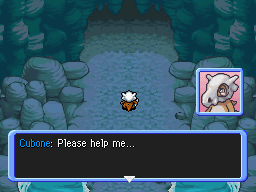

Title: PMD ROM Hacking Weekly - July 25th, 2021
Date: 2021-07-25
Description: PMD Retold chapter 14, Cubone's Desire announcement, Explorer's of Hell trailer, Explorers of Spirit looking for tester, new commission sheet for DunkinDo, community assets, new portraits and sprites, dungeon preview, guest pokemon edition, patch for dungeon interruption

<h2 id="ToC">Table of Contents</h2>

TODO: content of the TOC

::: title 1 HackNews "Explorers ROM Hacking News"

::: title 2 HackNews-Retold "PMD Explorers Retold : Chapter 14 published !"

*From the video description*

> Mitchell and Sparky are trapped in the future! And now they find themselves on the run with no one to trust, except for the one Pokémon they consider as their enemy... Join me for a 35 minute premiere as the future arc begins!

::: youtube https://www.youtube.com/watch?v=D5MQDi-xCrg

::: title 2 HackNews-Cubone "Cubone's Desire announced !"

*From the projectpokemon forum post*

> Follow the journey of a Cubone who wakes up from a terrible nightmare, only to find his loved one disappearing. Join Cubone and meet friends and enemies alike on his way to find what he cherishes the most.

[The forum post containing more information](https://projectpokemon.org/home/forums/topic/59180-pok%C3%A9mon-mystery-dungeon-cubones-desire/)

[Direct patch link](https://projectpokemon.org/home/applications/core/interface/file/attachment.php?id=49805&key=4a12118ad6daa24f3f2e36754ae89ff8)

[Discord server](https://discord.com/invite/8zbcEDzmAD)

::: title 2 HackNews-Pika "Crashing Dimension and 99 updates !"

*By PikaNiko in the SkyTemple Discord server*

> <u>Pika news #1</u>
> 
> **PMD: Crashing Dimension**
> 
> As now PMD: Crashing Dimension covers several Pokémon games in plot. I have done a lot of researching about this and have brainstormed a lot of ideas.
> 
> So while there will be a written story of PMD: Crashing Dimension, I decide to use animation (just like PMD Retold) and some of the boss battle and important dungeon of PMD: Crashing Dimension will be in game form. :sneaseldizzy: 
> 
> **PMD: 99**
> 
> Next version of PMD: 99 will finish the modifying of all dungeons and finish the rebalance of the game. (and of course the problem that the patch cannot be used) :vulpix:

::: title 2 HackNews-Hell "Explorers of Hell trailer and r-word removal"

*All by Babou*

> Hello everyone ! :Wave: 
>
> Here is the trailer for Pokemon Mystery Dungeon: Explorers of Hell! The release date is **August 2, 2021**. I hope you will like the game!
>
> Trailer : [https://twitter.com/babouzzz/status/1418644991514185732?s=2](https://twitter.com/babouzzz/status/1418644991514185732?s=2)
>
> My discord : [https://discord.gg/6QbPHYZDtg](https://discord.gg/6QbPHYZDtg)

*later...*

> Hi everyone! Here is the trailer on YouTube, I invite you to see it, it has a few more videos and shows a new feature that is not on the twitter trailer! Enjoy! :sparkles:

::: youtube https://www.youtube.com/watch?v=JNdX1ZbNSPM

*also*

> Hi everyone, I removed the r-word from the scripts to avoid offending some people. The game will still have an open humor, because that's the whole point of the game. It's possible that I forgot to remove 1 or 2 r-words, if you come across them when you play the game, please let me know and the correction will be made! 
> 
> Thanks again for all your positive messages, they make me very happy, I really hope you will enjoy the game and have a good time on it! :pokepika: 
> 
> Corrected scene: [https://twitter.com/babouzzz/status/1418852104895086593?s=21](https://twitter.com/babouzzz/status/1418852104895086593?s=21)

::: twitter_vid https://twitter.com/babouzzz/status/1418852104895086593

::: title 2 HackNews-Distant "Distant Connection news !"

*Both by runway55 on the distant connection Discord*

> Distant Connection will now be an episodic release, with a few chapters for each release. With this, the new planned release for the first episode of Distant Connection will now be Fall 2021.

> Been a while since I've gave an update on the status of DC's development, but I got something. The script is roughly 25-35%, which means the first episode's script is complete, so I'll start working on that in SkyTemple either when the script is 100% complete or when SkyTemple 1.3 is released, whichever comes first. Development has been slow so I'm going to work on focusing on it more and will work to have the script done by the end of the month.

*followed by a seemingly unrelated joke*

::: title 2 HackNews-Spirit "Explorers of the Spirit looking for testers"
*By MaxSchersey*

> With the release of Act 3 of Explorers of the Spirit quickly approaching, Team EotS is looking for more prerelease testers to help identify any missed bugs and provide feedback! Just fill out this form and more info will be provided in the coming days.
>
> [https://docs.google.com/forms/d/e/1FAIpQLSe0IGKh_RPJ49IGv9HH46MkUV8t_Cg1LH5FqwuoXIhAfd1Gdw/viewform?usp=sf_link](https://docs.google.com/forms/d/e/1FAIpQLSe0IGKh_RPJ49IGv9HH46MkUV8t_Cg1LH5FqwuoXIhAfd1Gdw/viewform?usp=sf_link)
>
> We are also open to anyone with SkyTemple script engine experience that is interested in joining the Creative Team for Act 4! We're going to be crafting the wildest segment of EotS, and having another creative brain in the room that knows how to manipulate EoS can never hurt! DM me if you're interested!

::: title 2 CommissionSheet-DonkinDo "New commission sheet for DonkinDo"

*from [https://twitter.com/DonkinDo/status/1415560034147241986](https://twitter.com/DonkinDo/status/1415560034147241986)*

> ixelart commission! Game insertion focusing, good at reproducing styles, those are my more experienced ones, still able of other things. If you have money to spend on this, of course. #Pokemon #pixelart #commissionsopen #FireEmblem #pokemonmysterydungeon

<video autoplay loop>
    <source src="../../images/donkin-commission.mp4" type="video/mp4">
    Your browser does not support the video tag.
</video>

::: title 2 NewAssets "New Community Assets"

Animated sprites in this section are animated PNG files. If animated sprites appear to be static images, make sure that your browser supports PNG animation. (Most modern browsers should display them just fine, though.)

::: title 3 NewAssets-Pokemon Pokemon

*shared by Emboarger in the ``sprite-ressources`` channel of the SkyTemple Discord server*

> Bit random but working on egg portraits for my rom hack and thought I'd put the normal one here in case anyone wanted to use it
>
> 

::: title 3 NewAssets-Graphics "Other Graphics"

*These were shared in the SkyTemple Discord for about 6 weeks, but I kept forgetting writing about them*

::: title 4 NewAssets-PortraitBG "Portrait Backgrounds"
*by DonkinDo*

> Cutely Evil Portrait BG, if anyone interested
> 
> 

*by Fearless-Quit*

> Here is the bragging-monologuing background that was used in PMD Red/Blue Rescue Team for Medicham and Ekans!
> 
> 

::: title 4 NewAssets-Tents "Tents"

*by DunkinDo*

> free 2 use, custom tents
>
> 

::: title 4 NewAssets-Apples "Apples"

*by fledermaus*

> free apples :)
> 
> 
>
> 
>
> 
>
> 
>
> 
>
> 
>
> 
>
> 
>
> 
>
> natural apple colours, + golden, black, and white
>
> oop i forgot to make them transparent but that's easy enough to do with any program :EspurrGladByNeroIntruder:

::: title 4 NewAssets-GraphicsOther "Other"

*by DunkinDo*

> free 2 use, credit if used pls :Gardesmug:
>
> 

::: title 2 SkyTemple "SkyTemple Changes"

*From the SkyTemple Twitter account*
> The next SkyTemple version will have a new dungeon editor with a preview function 👀:

::: youtube https://www.youtube.com/watch?v=HPwYWqL3fs4

::: title 3 SkyTemple-NewFeatures "New Features"
- [Commited by End45](https://github.com/SkyTemple/skytemple-files/pull/142): Add EditExtraPokemon patch (more information are avalaible in the merge request)
  > Adds a patch that un-hardcodes the way the game adds additional pokémon to the team when entering uncleared dungeons. This data will now be part of a table inside arm9.bin, making it possible to edit it with a hex editor.
    - Commited by End45 ([backend](https://github.com/SkyTemple/skytemple-files/pull/145), [frontend](https://github.com/SkyTemple/skytemple/pull/310)): Ability to edit guest pokémon data (requires the EditExtraPokemon patch to be applied).
      > Adds a new screen under "Lists" that can be used to change which dungeons add guest pokémon to your team when they are uncleared and what pokémon they add. The new screen also allows changing some dungeon data that was previously hardcoded by ID, such as which dungeons have Hidden Land-like restrictions active.

A potential improvement to the screen would be changing the guest columns to use a dropdown listing all the guest data entries instead of an integer.

- Commited by Parakoopa ([backend](https://github.com/SkyTemple/skytemple-files/commit/650028e168e80cef3686eefd48f3584e2d63259a), [interface](https://github.com/SkyTemple/skytemple/commit/416d581193071c3a88f69fc1f2586fe4c055e0bf)): Ability to edit 
"Life Seed, Oran Berry, Sitrus Berry" HP gain has been added. The setting can be found in ``Lists->Misc. Settings->Items``.

- [Commited by irdkwia](https://github.com/SkyTemple/skytemple-files/pull/143): "Fix BGP model: tile 0 must be blank"
  > The game uses tile 0 to clear backgrounds.
  >
  > Caused that background glitch in EoD.

- Commited by Parakoopa ([backend](https://github.com/SkyTemple/skytemple-files/pull/144), [interface](https://github.com/SkyTemple/skytemple/commit/f9f900a1e6f3b56946e3a7cac53276208724f51b)): added the ability for binary patch maker to ask the user for parameter (If you are intersted in creating patches that uses them, see the merge request).
    - [Commited by Parakoopa](https://github.com/SkyTemple/skytemple-files/commit/ef5460da2e1c6878344010403118696c6671106e): Also add default value and translation for patch parameter.
    - [Commited by irdkwia](https://github.com/SkyTemple/skytemple-files/pull/147): Support patch parameter for :
      >AddExperienceShare has a parameter to set the % of exp. shared
      >
      > ChangeTextBoxBackground has 4 parameters to directly set the textbox background color
      > 
      > ChangeMoveStatsDisplay has an option to add the power/accuracy value next to the bar. It also has a parameter to set the start ID of used text icons in markfont.dat, which allows to move the new icons anywhere in the file. Note that it does not check if selected entries are empty, so make sure that the selected entries can be used before applying the patch.

- Commited by Parakoopa: ([backend](https://github.com/SkyTemple/skytemple-files/pull/146), [interface](https://github.com/SkyTemple/skytemple/commit/7aeee5603752b48f222d1bfc124070f85a723c61)): "Dungeon Generator / Dungeon Preview", using irdkwia's code (see upper video) (dungeon generator code [here](https://github.com/irdkwia/dungeon-eos)).

- [Commited by irdkwia](https://github.com/SkyTemple/skytemple-files/pull/124): patch to extract animation table (in the ``BALANCE/anim.bin`` file. Merge request contain more information).

- Commited by Irdkwia ([backend](https://github.com/SkyTemple/skytemple-files/pull/148), [interface](https://github.com/SkyTemple/skytemple/pull/309)): Implement dungeon interuption. It allow to add cutscenes in between of two floor, with optional healing. (see video in the Videos section. data stored in ``BALANCE/inter_d.bin``).

- Commited by Parakoopa ([part 1](https://github.com/SkyTemple/skytemple/commit/0278d1a64a1612d569550d50ed44901265e3e834), [part 2](https://github.com/SkyTemple/skytemple/commit/b84da8de252991b552c7f09f91d5b030ae09a584), [part 3](https://github.com/SkyTemple/skytemple/commit/fd00156758c3bb20e48542952ead6f8c753f98ca), [part 4](https://github.com/SkyTemple/skytemple/commit/25034e8beb0b6ae3a324a53d13fe513f59902634)): Add icons for Items and Traps.
    - [Commited by Parakoopa](https://github.com/SkyTemple/skytemple/commit/5141fd041104b5fe8b30fe7c3cc81dc4e1448d1d) : "Item and Trap icons in fixed rooms"

- [Commited by Parakoopa](https://github.com/SkyTemple/skytemple/commit/643a0a34bf1b5feab615320675a041bbccf3d8b0): Added a button allowing to preview the minimap of fixed room instead of it's full graphic.

::: title 3 SkyTemple-Fixes Fixes
- Commited by Parakoopa ([backend](https://github.com/SkyTemple/skytemple-ssb-debugger/commit/8abd68fef4de8e8f8972b9afe05d4a16ecea08df), [frontend](https://github.com/SkyTemple/skytemple/commit/664d0335c397d59d24c18a7c437503ab5938742c)): Update static level list after save, close the issue #300 "Reload constants after adding levels (Debugger)".

- [Commited by Parakoopa](https://github.com/SkyTemple/skytemple-ssb-debugger/commit/2201c09ccda77b248126999b8b80585903a4a595): In the debugger, "Write exps hash file AFTER write to ROM".

- [Commited by Parakoopa](https://github.com/SkyTemple/skytemple/commit/e294f1fe4d8b82c766dbffc2987e7439613691e9): "Parse \n as newlines when saving dungeon names"

- [Commited by tech-ticks](https://github.com/SkyTemple/skytemple/commit/7aeee5603752b48f222d1bfc124070f85a723c61): Fix enchant not loading on Mac nightly

::: title 3 SkyTemple-Changes Changes
- Commited by Parakoopa ([patch 1](https://github.com/SkyTemple/skytemple-rust/commit/4d0da4b4e5366b440a9e735c0c330c6447d6e7b0), [patch 2](https://github.com/SkyTemple/skytemple-rust/commit/94f409f21a29f92f55a721d2d145dc03f6ac7bd0), [patch 3](https://github.com/SkyTemple/skytemple-rust/commit/cf91dbf8f8836a282f34d9955a1b0f18e98147aa), [patch 4](https://github.com/SkyTemple/skytemple/commit/94715c905483b7c13d70ffc800d35483a2499bf1), [patch5](https://github.com/SkyTemple/skytemple/commit/49df1fecec678e0b2bcade560718a8fe798361c4), ): Release version use Python 3.9

- [Commited by Parakoopa](https://github.com/SkyTemple/skytemple/commit/51d81d08262210573f440062b969926be55f6c3b): "Add module load fallback"(probably reducing the risk of the crash even if something goes wrong with module loading).

- [Commited by Parakoopa](https://github.com/SkyTemple/skytemple/commit/31baf196a600dd63f64e34eb1b47cbb92ee39e00): "Read monster type names from ROM" (for custom type patch)

::: title 3 SkyTemple-Videos Videos

Irdkwia made two video showcasing two of it's patch (needing more testing, and a UI to edit).

Dungeon interruption allow you to add a cutscenes in-between floor :

::: youtube https://www.youtube.com/watch?v=ZuYfjx5tFgo

Move level up in a similar way than in Gates. The patch is not (yet?) integrated with SkyTemple.

::: youtube https://www.youtube.com/watch?v=nrxgES0Hdtc

::: title 1 EditorNotes "Editor's Notes"

Did I miss anything? Feel free to [open a github issue](https://github.com/marius851000/pmd_hack_weekly/issues), contact me on Discord at ``marius851000#2522``, send me an email at ``mariusdavid@laposte.net``, or send me a message from an ActivityPub-compatible service (Mastodon) at ``marius851000@framapiaf.org``.

**Newsletter Credits**

Written and initially formatted by ``marius851000#2522``.

TODO: remember to remove if can't proofread
Proofread and edited by ``Aviivix#2695``.

---