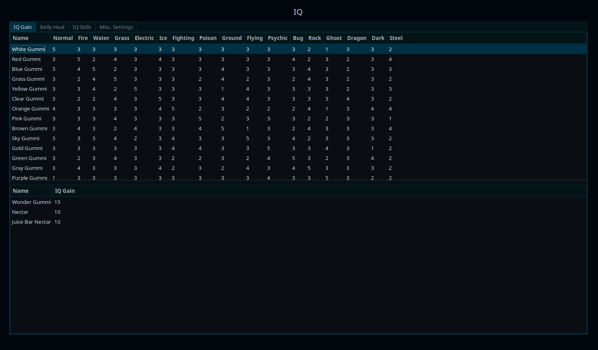
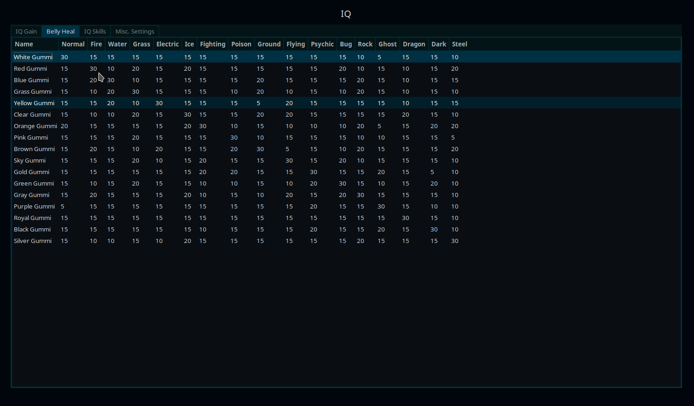
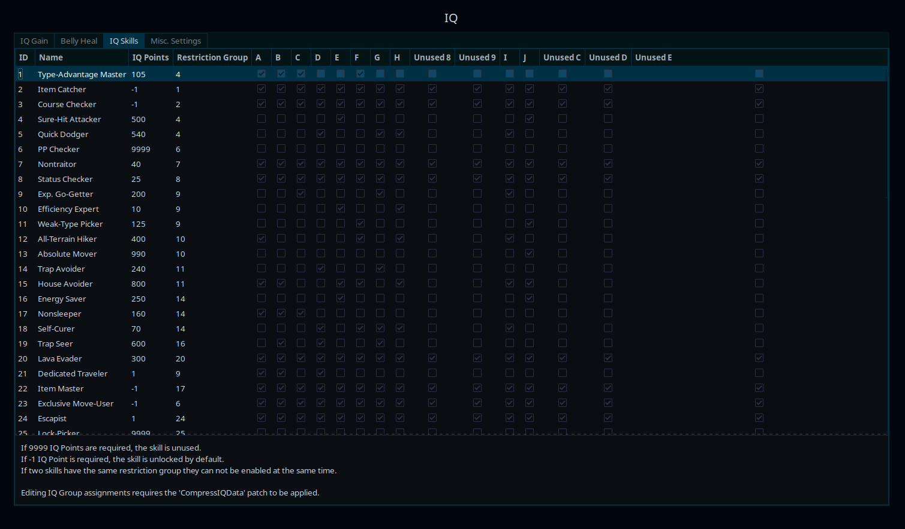
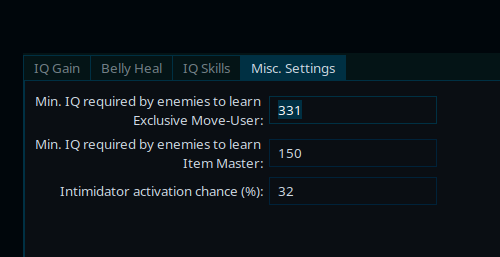

Title: PMD ROM Hacking Weekly - September 09th, 2021
Date: 2021-09-12
Description: TODO: description

*remember to check editors note. There are actual content for once !*

<h2 id="ToC">Table of Contents</h2>

TODO: content of the TOC

::: title 1 HackNews "Explorers ROM Hacking News"

::: title 2 HackNews-Hello "Explorers of Hell and Heaven bugfix release"

*By Babou in Babou's Discord server*

> Hi everyone! PMD Hell V1.3.1 and PMD Heaven 1.1.1 are available in rom-download! This is just a few bug fixes. If you don't have the Magic Cave in the dungeon selection, and you have already beaten Raikou, go talk to Lucario on the beach, after you beat Darkrai. It will give you access to the Magic Cave. The 1.4 and 1.2 will arrive in October, I'm still working on it, I hope you'll keep having fun on Hell and Heaven! :shyrouge:

[Explorers of Hell 1.3.1](https://www.mediafire.com/file/awvc1v44md2gnfp/PMD_Explorers_of_Hell.rar/file)

[Explorers of Heavens 1.1.1](https://www.mediafire.com/file/xnpd5c42nbp45es/PMD_Explorers_of_Heaven.rar/file)

[ProjectPokemon page](https://projectpokemon.org/home/forums/topic/59205-pokemon-mystery-dungeon-explorers-of-hell/)

::: title 2 NewAssets "New Community Assets"

Animated sprites in this section are animated PNG files. If animated sprites appear to be static images, make sure that your browser supports PNG animation. (Most modern browsers should display them just fine, though.)

::: title 3 NewAssets-Pokemon Pokemon
TODO

::: title 3 NewAssets-Graphics "Other Graphics"

::: title 2 SkyTemple "SkyTemple Changes"
*Parakoopa renamed himself to Capypara*

::: title 3 SkyTemple-NewRelease "Skytemple 1.3.0 released !"

Capypara released the 1.3.0 stable version !

There also is a complete changelog since 1.2.5 version ! You can find the changelog on the [GitHub release page](https://github.com/SkyTemple/skytemple/releases/tag/1.3.0). Here is the [download link](https://projectpokemon.org/home/files/file/4193-skytemple-pmd2-rom-edtior/).

::: title 3 SkyTemple-NewFeatures "New Features"

- included in 1.3.0 :
    - Commited by Capypara ([frontend](https://github.com/SkyTemple/skytemple/pull/330), [backend]https://github.com/SkyTemple/skytemple-files/pull/166)); UI for editing IQ data (see screenshot)
        - Commited by Capypara ([frontend](https://github.com/SkyTemple/skytemple/pull/332), [backend](https://github.com/SkyTemple/skytemple-files/pull/167)): "UI for editing IQ group assignments"
        - Commited by Capypara ([frontend](https://github.com/SkyTemple/skytemple/pull/331), [backend](https://github.com/SkyTemple/skytemple-files/pull/169)): UI to edit IQ skill restrictions

::: title 3 SkyTemple-Fixes Fixes

- included in 1.3.0:
    - [Commited by End45](https://github.com/SkyTemple/skytemple-files/pull/171): "Fix regression in end_asm_mods" ("Updates my patches repo to re-add ASM labels that were accidentally deleted")
    - [Commited by End45](https://github.com/SkyTemple/skytemple-files/pull/170): Fix CompressIQData
    - Commited by Capypara ([frontend](https://github.com/SkyTemple/skytemple/pull/327), [backend](https://github.com/SkyTemple/skytemple-files/pull/164)): "Fix IQ booster bytes for floor data"
    - [Commited by Capypara](https://github.com/SkyTemple/skytemple-files/issues/163): "Migrate old irdkwia repos to a backup repo" ("Since he left :face-sad: we need to migrate the submodules and the links in the UI.")

::: title 3 SkyTemple-Changes Changes

::: title 3 SkyTemple-Screenshots Screenshots

::: title 1 Rescue "Rescue Team Hacking News"

::: title 2 Rescue-Decomp "RRT Decompilation progress"
- [Commited by SethBarberee](https://github.com/pret/pmd-red/pull/52): "Thank You Mail and minor DungeonEnitity Work"
- [Commited by AnonymousRandomPerson](https://github.com/pret/pmd-red/pull/53): "Defined more in-dungeon structs and enums"

::: title 1 EditorNotes "Editor's Notes"

Hello. Made quite some time I wrote anything here. So, two (a bit more personal) things that I didn't feel enter the other categories :

1. Irdkwia, for some (unspecified) reason, left the Discord server (while deleting a bunch of GitHub repository. But that won't be too much of problem in itself, there are other copies). Irdkwia made an important part of the existing assembly patches in SkyTemple (as you can see in the ``1.3.0`` changelog). I would like to thank him for what he did, hoping Irdkwia isn't having any problem.

2. Following this, I figured it could be an appropriate time to share a project I've had. It concern long term (a.k.a as long as there is someone to host it) archiving of PMD rom-hacking related content. I've started by sharing a copy of all the published rom-hack I've collected (as of 06/09/2021). You can download it here : [https://marius851000-drive.mycozy.cloud/public?sharecode=JX4ddpznAGkL](https://marius851000-drive.mycozy.cloud/public?sharecode=JX4ddpznAGkL). This way, if a patch is being made unavailaible for any reason, it can be retrieved from this archive (or any other copy if it can't be downloaded from there). A limition of my archive is that it only copy the rom-hack patches, and so, don't include videos uploaded on youtube (nor code or document. In particular, those on google docs could be important to save).
In particular, I would ask if any reader know a good software/tool/method for archiving those kind of stuff. The current approch is using a folder per rom hack, with some metadata. Ideally, I would like to be able to expose that directly on the internet for easier searching/discovery (potentially in addition of allowing more people than just me to upload content). It should also be easy to share as a simple folder/group of folder, and shouldn't require specialized software to access the archived content from a local copy (other than a patching tools for applying patch/reading video file/opening documents, of course).
In case you know of any software/tools/source on how to do this, I'll be happy to hear about it (or any other input on this subject). Otherwise, I'll just probably write a software that does this.

Did I miss anything? Feel free to [open a github issue](https://github.com/marius851000/pmd_hack_weekly/issues), contact me on Discord at ``marius851000#2522``, send me an email at ``mariusdavid@laposte.net``, or send me a message from an ActivityPub-compatible service (Mastodon) at ``marius851000@framapiaf.org``. *Also, I think I may have ignored someone accidentaly... Sorry*.

**Newsletter Credits**

Written and formatted by ``marius851000#2522``.

---