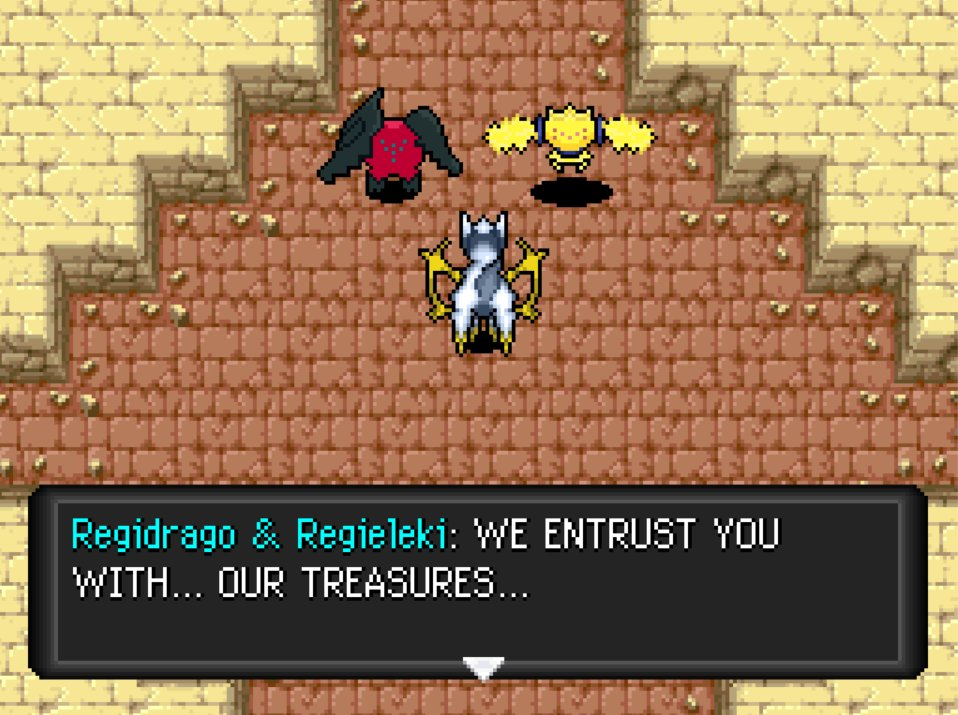

Title: PMD ROM Hacking Weekly - 14th november 2021
Date: 2021-11-14
Description: SkyTemple hack list, first major release of Explorers of the Unknown, progress on Alpha... and technical issue with sprites & portraits

<h2 id="ToC">Table of Contents</h2>

- [**Explorers ROM Hacking News**](#HackNews)
    - [**SkyTemple hack list avalaible !**](#HackNews-HackList)
    - [**First major release of Explorers of the Unknown !**](#HackNews-Unknown)
    - [**Progress on Explorers of Alpha**](#HackNews-Alpha)
    - [**Soulless disqualified**](#HackNews-Soulless)
    - [**New Community Assets**](#NewAssets)
        - [**(no)  Pokemon**](#NewAssets-Pokemon)
- [**Rescue Team Hacking News**](#Rescue)
    - [**RRT Decompilation progress**](#Rescue-Decomp)
- [**Other**](#Other)
    - [**Community highligth**](#Highlight)
- [**Editor's Notes**](#EditorNotes)

::: title 1 HackNews "Explorers ROM Hacking News"

::: title 2 HackNews-HackList "SkyTemple hack list avalaible !"

> There is now a public list of all ROM Hacks here: [https://hacks.skytemple.org/](https://hacks.skytemple.org/)
>
> If you want yours submitted, contact us via Modmail.

*Previously, there kinda were a list of hacks, in the form of a Discord channel.*

::: title 2 HackNews-Unknown "First major release of Explorers of the Unknown !"

> At long last, the first major update to PMD: Explorers of the Unknown is finally here! You can go play it right now at [https://skytemple.org/unknown](https://skytemple.org/unknown)! Oh, and one more thing: [https://discord.gg/ZX3EcEvWvj](https://discord.gg/ZX3EcEvWvj)
>
>
> 
> One day, a human wakes up in the middle of nowhere, having turned into a Pokémon.
>
> Not too long after, they stumble upon Team Basil, a friendly exploration team.
>
> What marvelous adventures await our recruited hero?
>
> Find out in Pokémon Mystery Dungeon: Explorers of the Unknown!

*[direct download link for the patch](https://hacknews.pmdcollab.org/archive/hacks/pokemon-mystery-dungeon-explorers-of-the-unknown/v0.2.zip)*

::: title 2 HackNews-Alpha "Progress on Explorers of Alpha"

*[On twitter](https://twitter.com/EoAlpha_off/status/1458004857961521153?t=GC3eyqAm75Agl3gYNcskfw) by @EoAlpha_off*

> Progress update about Alpha:
>
> Finished Special Episodes re-revamp (still have a game mode to do). Added two game segments: one is a small new segment, Split-Decision Aegis Cave, where you get a new boss gimmick during story (and no, you don't need stones to proceed in Alpha)

*and*

> Gen V Sturdy goes brrrrrrr
>
> Thanks End for the help during the development and Irdkwia for the extra needed information about Sturdy 👀

::: title 2 HackNews-Soulless "Soulless disqualified"

> Hi! We, the mods and the jury, have decided to **disqualify** the hack **The Soulless Life** from the hack jam.
>
> After a period of consideration we determined the hack is in violation of Rule 6. When submitting hacks, please make sure they don't violate any of our rules and please don't try to push the rules.
>
> Because of this, **if you voted for the hack, please change your vote now**. The hack will also not be listed in our hack list anymore.

*(last emphasis mine)*

::: title 2 NewAssets "New Community Assets"

::: title 3 NewAssets-Pokemon "(no)  Pokemon"

Due to a technical issue, I can't share with reasonable effort the new changes. I'll catch that as soon as I can (hopefully next week).

::: title 1 Rescue "Rescue Team Hacking News"

::: title 2 Rescue-Decomp "RRT Decompilation progress"

- [Commited by SethBarberee](https://github.com/pret/pmd-red/pull/72): "Fully decomp luminous cave" & "Decomp more of kecleon items and friend area action menu"
- [Commited by AnonymousRandomPerson](https://github.com/pret/pmd-red/pull/73): "Decomped DecideUseItem"

::: title 1 Other Other

::: title 2 Highlight "Community highligth"

Here are the 3 community highlight that were shared on reddit since I last wrote about them :

- [PMD Writers' Union: The community for PMD Writing!](https://www.reddit.com/r/MysteryDungeon/comments/qfty63/pmd_writers_union_the_community_for_pmd_writing)
- [The Explorers Guild: A Twitter community for all things Pokémon Mystery Dungeon!](https://www.reddit.com/r/MysteryDungeon/comments/qkv430/the_explorers_guild_a_twitter_community_for_all)
- [The Pokémon Mystery Dungeon Speedrunning Community! Go fast in the classics!](https://www.reddit.com/r/MysteryDungeon/comments/qpwllp/the_pok%C3%A9mon_mystery_dungeon_speedrunning)

::: title 1 EditorNotes "Editor's Notes"

Did I miss anything? Feel free to [open a github issue](https://github.com/marius851000/pmd_hack_weekly/issues), contact me on Discord at ``marius851000#2522``, send me an email at ``mariusdavid@laposte.net``, on reddit to ``u/marius851000`` or send me a message from an ActivityPub-compatible service (Mastodon) at ``marius851000@framapiaf.org``.

**Newsletter Credits**

Written and formatted by ``marius851000#2522``.

---
