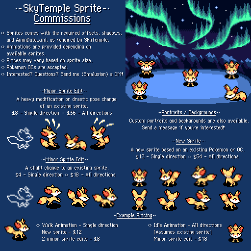

Title: Commission list
Slug: comm_list
Modified: 2021-06-04

This page contain a list of different commission by various author I have collected. If you figure something missing, incorrect or outdated, feel free to contact me.

# Emmuffin
> I've updated my commission sheet, let me know if you have any questions :cyndaheart: 
> 
> -Prices are in USD, I take Paypal
>
> -Link to my Twitter https://twitter.com/Ernmuffin
> 
> -Order via this form https://forms.gle/ELDgM5qHBgvQ6ZAw7

# Smalusion#3531
> Extra notes:
> 
> - Portraits for a Pokemon with an existing Normal portrait are $12 each. 
> 
> - Giving an existing Pokemon the full set of animations a normal starter has would be around $300. This includes all 22 animations, offsets, and the xml file. It's a lot of work!
> 
> - Questions? Feel free to message me

# DunkingDucks#9030 (aka DonkinDo)
*[https://twitter.com/DonkinDo/status/1415560034147241986](https://twitter.com/DonkinDo/status/1415560034147241986)*

> ixelart commission! Game insertion focusing, good at reproducing styles, those are my more experienced ones, still able of other things. If you have money to spend on this, of course. #Pokemon #pixelart #commissionsopen #FireEmblem #pokemonmysterydungeon

<video autoplay loop>
    <source src="../images/donkin-commission.mp4" type="video/mp4">
    Your browser does not support the video tag.
</video>

# Wyvernagon#8227 (aka Triss/Wyverna)
PMD Body Sprites 35$/ PMD Portrait Sprites $30
[twitter thread commision link](twitter.com/z_serpentriss/status/1331529371899727875?s=21#m)

*Editor's note: I was unable to find a commision sheet, so instead here you have one of her spritesheet*

