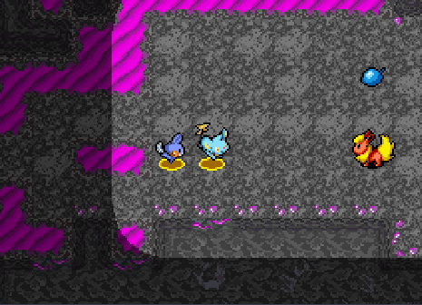
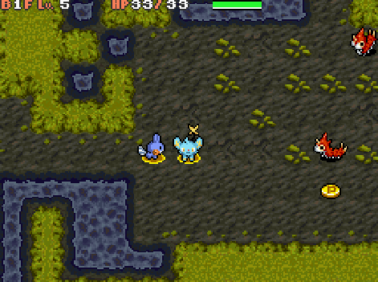
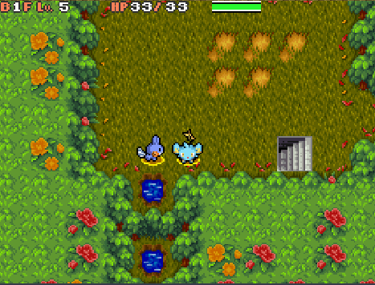
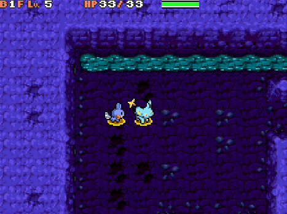

Title: Tilesets

This page aim to contain a list of custom tileset that can be imported in skytemple

# Staro's tileset
You need to credit Staro when using those tileset. Found in the #custom-ressources channel on his [Discord server](https://discord.gg/uTJPcg9sdZ).

## Nightfall Lake

[download](../tileset/Nightfall_Lake.zip)

## Sunny Beach

[download](../tileset/Sunny_Beach.zip)

## Basalt Karst
> This is the custom Tileset for Basalt Karst, one of the Far Away dungeons.

[download](../tileset/Basalt_Karst.zip)

## Galvanized Ruins

[download](../tileset/Galvanized_Ruins.zip)

## Infested Forest

[download](../tileset/Infested_Forest.zip)

## Draconic Ruins

[download](../tileset/Draconic_Ruins.zip)